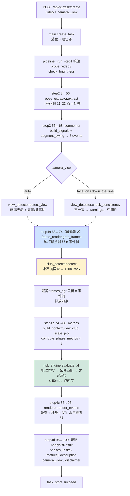
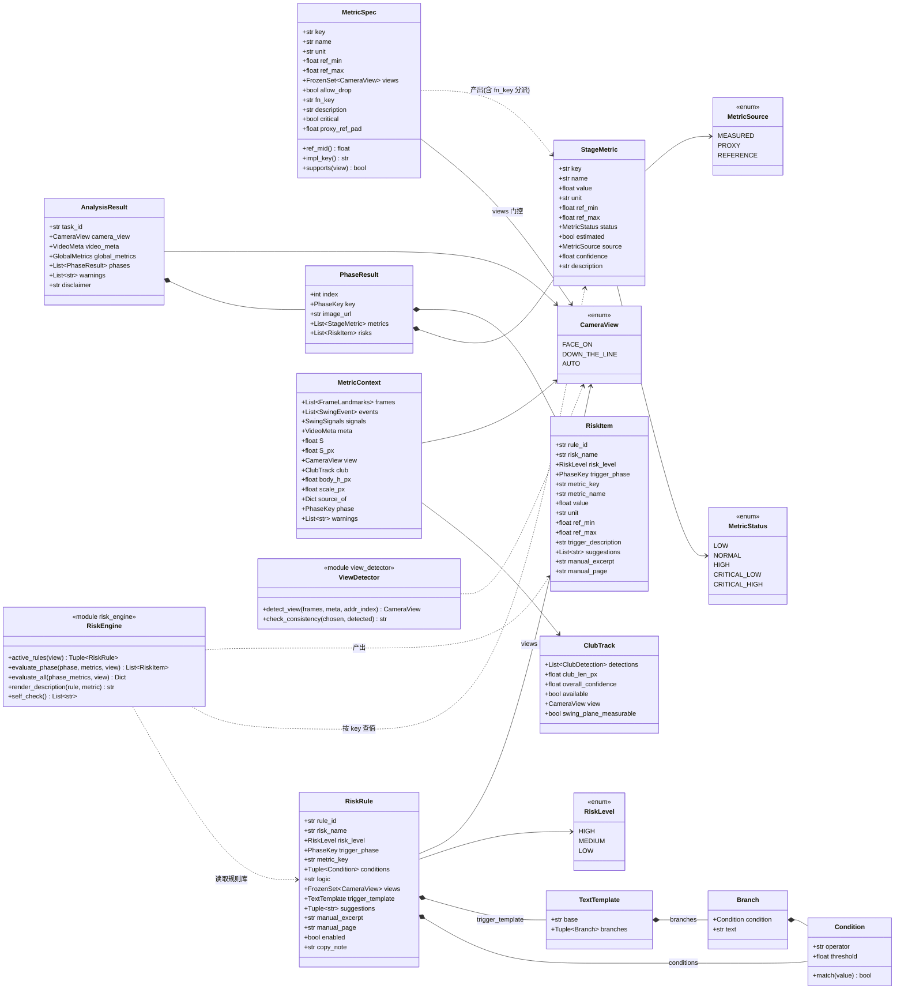
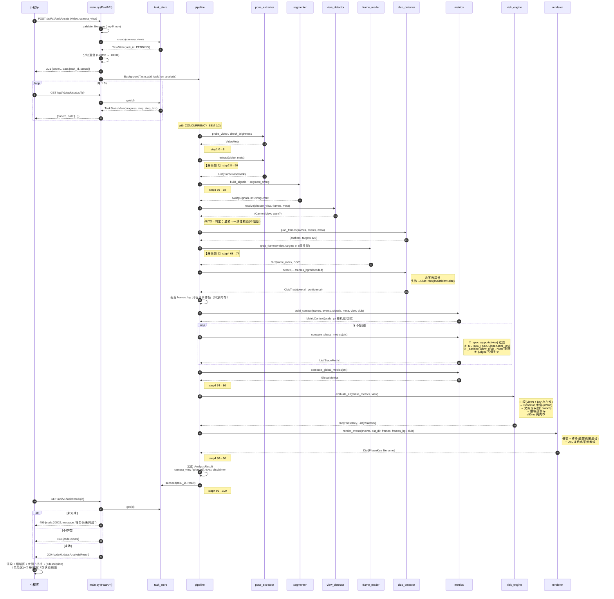
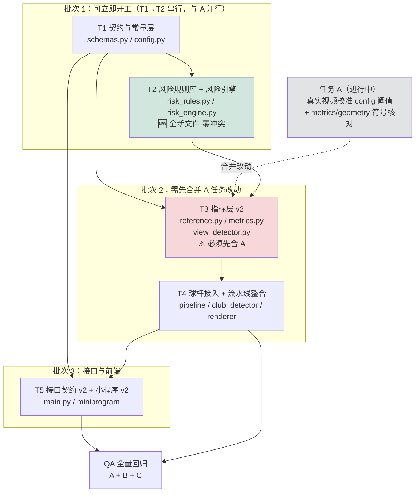

# 高尔夫挥杆分析 —— v2.0 增量架构设计（B 球杆接入 + C 风险引擎 + 侧面机位）

| 项 | 内容 |
|---|---|
| 文档版本 | v2.0-arch-delta |
| 撰写人 | 高见远（架构师） |
| 主要输入 | `docs/PRD-v2-risk-engine.md`（PM 许清楚）、`docs/ARCHITECTURE.md`、`docs/club-detection-design.md`、`docs/ADR-001-club-detection.md` |
| 代码基线 | `backend/app/` 13 模块、`backend/tests/` 8 模块、`miniprogram/` 原生 3 页 |
| 文档性质 | **增量**。只写相对 MVP 的变更；未提及处一律"保持现状"。 |
| 交付对象 | 工程师寇豆码（照此写文件） |

> **阅读顺序建议**：§1 总体方案 → §9 共享知识（命名/符号约定）→ §8 任务列表。
> §3~§7 是任务列表的展开依据，写代码时逐条对照。

---

## 0. 三条不可违反的前提（复述，便于工程师自查）

| # | 约束 | 违反后果 |
|---|---|---|
| 1 | Python 固定 `E:\project\golf\.tools\python312\python.exe`，无 venv；MediaPipe 锁 `0.10.14` legacy `mp.solutions.pose`；numpy `1.26.4`；OpenCV 编码 `mp4v` | 已验证的死路，重走一次损失一天 |
| 2 | 后端**单 worker**，任务状态在进程内字典。本期**不引入** Redis / DB / 消息队列 | 架构复杂度失控 |
| 3 | 小程序是**原生**的，零 npm 零构建。不引入任何需要编译的前端技术 | 部署链路断裂 |

**本期新增依赖包：0 个。** 风险引擎是纯 Python 数据 + `if` 判断；球杆检测复用已装的 `opencv-python-headless` / `numpy`。`requirements.txt` 不动。

---

## 1. 总体方案

### 1.1 一句话

在**不动**「解码 → MediaPipe → 切分 → 指标 → 渲染」这条已跑通主链路的前提下，做三件事：

1. **指标层做一次"对外 key 与 PDD 对齐"的重命名 + 机位归属落值**，把语义映射的复杂度全部收敛进 `reference.py` 的一张表（`MetricSpec.fn_key`），让下游（风险引擎、小程序）看到的 key 就是 PDD 的 key；
2. **在指标计算之后、结果装配之前，插入一个无状态的风险引擎**（`risk_engine.py`），输入是"已算出的 `StageMetric` 列表 + 机位"，输出是"每阶段 `RiskItem` 列表"，不回头重算任何几何量；
3. **在切分之后、指标之前，插入球杆检测**（已有 `club_detector.py`，897 行，零外抛异常），与 `renderer` **共享同一次解码**，产出一个**可失败、可剔除**的增强指标 `shaft_plane_dev`。

### 1.2 三个关键决策的架构落点

| 用户决策 | 架构落点 |
|---|---|
| **决策 1**：`swing_plane` 归 PDD 定义（④顶点·引导臂与水平面夹角·55~65°·侧面专属·零球杆依赖）；球杆那套改名 `shaft_plane_dev` 并行存在 | `swing_plane` 走**纯 MediaPipe** 路径（`m_swing_plane`，仅需 11→15），进 P0；`shaft_plane_dev` 走**球杆**路径（⑤下杆·杆头轨迹相对 base plane 偏差·−5~+10°），`allow_drop=True`，进 P1 增强。**B 任务从 C 的前置依赖降级为独立并行项。** |
| **决策 2**：本期放宽 AC-08，侧面允许某阶段 0~1 个指标 | 按 PDD §4.3 如实落 `MetricSpec.views`，不造指标；结果页**必须**实现"0 项 / 1 项"的空状态与单卡布局（§6.4）。 |
| **决策 3**：17 条规则逻辑全实现，仅 10 条文案完整的对用户可见 | `RiskRule.enabled: bool` 字段 + **导入期自检**（`enabled=True` 必须文案齐全）；补文案 → 填字段 → 翻开关，**零代码改动**（§4.3）。 |

### 1.3 改造后的数据流



**与 MVP 的差异只有三处插入点**（图中 `V`/`F`+`G`、`J`），其余节点行为不变。

### 1.4 依赖方向（严格单向，禁止回边）

```
config  ←  geometry  ←  metrics  ←  pipeline
   ↑          ↑           ↑           ↑
schemas  ←  reference ────┘           │
   ↑          ↑                       │
   └──── risk_rules ← risk_engine ────┘
   ↑
view_detector / club_detector / frame_reader / renderer
```

- `risk_rules.py` 只依赖 `schemas`（枚举）——**纯数据模块**，不 import `reference` / `metrics`。
- `risk_engine.py` 依赖 `risk_rules` + `schemas` + `config`，**不依赖 `metrics`**（它只消费 `StageMetric` 实例）。
- `reference.py` 不 import `metrics`（沿用现有 `fn` 与 `key` 解耦的做法，`fn_key` 也只是字符串）。

---

## 2. 文件清单

### 2.1 新增（5 个源文件 + 3 个测试 + 2 个图）

| 路径 | 行数量级 | 职责（一句话） |
|---|---|---|
| `backend/app/risk_rules.py` | ~520 | 17 条 `RiskRule` 静态数据 + `Condition` / `TextTemplate` / `Branch` 结构定义 + 导入期文案自检。**纯数据，改文案只改这里。** |
| `backend/app/risk_engine.py` | ~200 | 机位门控 → 条件求值 → 文案渲染（含条件分支）→ 按等级排序，产出 `List[RiskItem]`。无状态纯函数。 |
| `backend/app/view_detector.py` | ~90 | 机位自动判定（画幅先验 + Address 帧肩宽/身高比双特征投票）与"用户所选 vs 自动判定"一致性校验。 |
| `backend/tests/test_risk_engine.py` | ~380 | 17 条规则逐条边界用例 + 机位门控 + RISK-011 分支文案 + RISK-016 符号回归 + `enabled` 开关 + 排序 + 性能。 |
| `backend/tests/test_view_detector.py` | ~120 | 竖屏/横屏 × 正面/侧面四象限判定；一致性校验产出 warning。 |
| `docs/ARCHITECTURE-v2.md` | 本文 | 增量架构设计。 |
| `docs/v2-class-diagram.mermaid` | — | §3.6 类图独立文件。 |
| `docs/v2-sequence-diagram.mermaid` | — | §7 时序图独立文件。 |

> `shaft_plane_dev` 的测试并入现有 `backend/tests/test_club_detector.py`，不新建文件。

### 2.2 修改（后端 10 个 + 小程序 8 个 + 测试 4 个）

| 路径 | 改动摘要 | 与 A 任务冲突 |
|---|---|---|
| `backend/app/schemas.py` | `MetricStatus` +2 值；新增 `RiskLevel` / `RiskItem`；`StageMetric` +`description`；`PhaseResult` +`risks`；`AnalysisResult` +`camera_view`；`VideoMeta` +`total_frames`；`TaskStatusView` +`step_text`；`TaskState` +`camera_view`/`step_text` | 无 |
| `backend/app/config.py` | **新增第 9 区**（风险引擎 / v2 契约 / 标尺常量）；第 2 区放开 `.mov`；第 7 区替换 `DISCLAIMER`；第 8 区上提 `CLUB_MAX_DECODE_FRAMES` | ⚠️ **有**（A 改第 4 区阈值）。不同分区，手工合并即可 |
| `backend/app/reference.py` | `MetricSpec` +`fn_key`/`critical`/`proxy_ref_pad`/`description`；`METRIC_SPECS` 全表按 PDD key 重写并落 `views`；`judge()` → `judge5()`；`GLOBAL_SPECS` 改名 | 低（A 不改参考范围，只改 `config` 阈值与 `metrics` 公式） |
| `backend/app/metrics.py` | `MetricContext` +`view`/`club`/`scale_px`/`body_h_px`/`source_of`；`_build_metric` 走 `spec.fn_key`；`_sanitize` 为 `allow_drop` 豁免；新增 `m_swing_plane` / `m_shaft_plane_dev`；`m_spine_forward_tilt` 按机位分派投影面；位移类指标改用 `ctx.scale_px` | ⚠️ **高**。A 可能改公式符号。**必须先合 A 再动** |
| `backend/app/geometry.py` | 新增 `tilt_from_horizontal_xy()`（引导臂与图像水平线夹角，供 `swing_plane`） | ⚠️ 中。A 可能改符号函数 |
| `backend/app/pipeline.py` | 插入机位解析 → 共享解码 → 球杆检测 → 风险匹配；进度重新分段；`step_text` | 低 |
| `backend/app/renderer.py` | `render_events()` 新增可选入参 `frames_bgr` / `club`；新增 `_draw_club()` 与 `_draw_horizon()`（DTL 淡色水平参考线） | 无 |
| `backend/app/club_detector.py` | `plan_frames()` 增加 `meta` / 字节预算入参；`_MAX_DECODE_FRAMES` 改读 `config.CLUB_MAX_DECODE_FRAMES` | 无 |
| `backend/app/main.py` | PDD 三条新路径 + 旧路径别名；`camera_view` 入参；`video`/`file` 双字段名；`.mov`；`ApiError` +`pdd_code`；`err()` 走码表映射 | 无 |
| `backend/app/task_store.py` | `create()` 接收 `camera_view`；`set_progress()` 接收 `step_text` | 无 |
| `backend/tests/test_reference_metrics.py` | 全量跟随 key 改名；新增 `judge5` 与 `fn_key` 覆盖用例 | ⚠️ 中 |
| `backend/tests/test_api.py` | 新增双路径、`camera_view`、PDD 错误码用例 | 无 |
| `backend/tests/test_pipeline_e2e.py` | 断言 `phases[].risks` 存在、机位过滤生效 | 低 |
| `backend/tests/test_club_detector.py` | 新增 `shaft_plane_dev` 三级降级用例 | 无 |
| `miniprogram/utils/api.js` | 路径改 PDD 版；上传字段 `file`→`video`；带 `camera_view`；放开 `.mov` | 无 |
| `miniprogram/pages/index/index.js` `.wxml` `.wxss` | 机位互斥卡片 + 拍摄要求随机位切换 + `.mov` 放行 + 上传带机位 | 无 |
| `miniprogram/pages/analyzing/analyzing.js` | step4 文案改「计算姿态指标与风险」（优先用后端 `step_text`） | 无 |
| `miniprogram/pages/result/result.js` `.wxml` `.wxss` | 区域4 风险区 + 手册原文半屏弹窗 + 指标卡 `description` 行 + 5 态配色 + 机位标签 + **0/1 项空状态** + [查看完整报告] 占位 | 无 |

**合计：新增 8 个文件，修改 22 个文件。**

---

## 3. 数据结构与接口

### 3.1 `schemas.py` 变更

```python
# ---- 枚举 ----------------------------------------------------------------
class MetricStatus(str, Enum):
    LOW           = "low"
    NORMAL        = "normal"
    HIGH          = "high"
    CRITICAL_LOW  = "critical_low"    # 🆕
    CRITICAL_HIGH = "critical_high"   # 🆕

class RiskLevel(str, Enum):           # 🆕
    HIGH   = "high"
    MEDIUM = "medium"
    LOW    = "low"

# CameraView / MetricSource 保持不变（AUTO 仍只出现在请求入参与内部校验）

# ---- 对外响应 -------------------------------------------------------------
class RiskItem(BaseModel):            # 🆕
    rule_id: str                            # "RISK-001"
    risk_name: str                          # "髋部转动过度风险"
    risk_level: RiskLevel
    trigger_phase: PhaseKey
    # —— 指标上下文，前端渲染"触发原因"与跳转高亮用 ——
    metric_key: str                         # PDD key，如 "hip_turn"
    metric_name: str                        # "髋部转动角"
    value: float
    unit: str
    ref_min: float
    ref_max: float
    # —— 文案 ——
    trigger_description: str                # 已渲染完毕的成品文案（含分支）
    suggestions: List[str] = []
    manual_excerpt: Optional[str] = None    # None → 前端隐藏「查看手册原文」入口
    manual_page: Optional[str] = None       # str 而非 number（C2：存在 "P6/P11" 与缺失）

class StageMetric(BaseModel):
    ...                                     # 现有 10 字段全部保留
    description: str = ""                   # 🆕 术语解释行；"" → 前端不渲染该行

class PhaseResult(BaseModel):
    ...
    risks: List[RiskItem] = Field(default_factory=list)   # 🆕 空数组 = 本阶段无风险

class VideoMeta(BaseModel):
    ...
    frame_count: int                        # 保留（deprecated，小程序旧版仍读）
    total_frames: int = 0                   # 🆕 PDD 字段名，= frame_count
    camera_view: CameraView = CameraView.FACE_ON

class AnalysisResult(BaseModel):
    ...
    camera_view: CameraView = CameraView.FACE_ON          # 🆕 顶层，PDD 要求

class TaskStatusView(BaseModel):
    ...
    step: int                               # 保留 int（小程序 4 步进度条既有契约）
    step_text: str = ""                     # 🆕 PDD 的字符串 step
```

> **偏差声明（`step` 类型）**：PDD 要求 `step` 为字符串。现有小程序 4 步进度条按 `step: int` 驱动 UI，改类型会直接砸掉进度条且对用户零收益。**决定：`step` 保持 `int`，并列下发 `step_text: str`。** PDD 侧消费者读 `step_text` 即可。

### 3.2 `reference.py` —— `MetricSpec` 扩展（本次设计的核心）

```python
@dataclass(frozen=True)
class MetricSpec:
    key: str                    # 【对外 key】= PDD v2.0 的 key
    name: str
    unit: str
    ref_min: float
    ref_max: float
    views: FrozenSet[CameraView] = ALL_VIEWS
    allow_drop: bool = False
    # ---- 🆕 v2 新增 4 个字段 ----
    fn_key: str = ""            # 【计算实现 key】= METRIC_FUNCS 的键；"" 表示与 key 同名
    description: str = ""       # 卡片下方术语解释行（PDD §4.2 原文）
    critical: bool = True       # 是否参与 critical_low / critical_high 判定
    proxy_ref_pad: float = 0.0  # L1 代理降级时参考区间双向放宽量（球杆指标专用）

    @property
    def impl_key(self) -> str:
        return self.fn_key or self.key
```

**`fn_key` 是「PDD 指标 key → 现有实现 key」显式映射表的落地方式。** 它把映射关系钉在**每一条 spec 上**（而不是散落在风险引擎或响应层），带来三个好处：

1. **同名不同义的问题自动消解。** ⑦ 送杆的 spec 是 `MetricSpec("shoulder_turn", ..., 35, 60, fn_key="shoulder_open")` —— 对外 key 是 PDD 的 `shoulder_turn`，实际调用的是 `m_shoulder_open`（= −肩转，正值）。于是 **RISK-016 直接按 `shoulder_turn` 查表就拿到正确的正值**，`< 30` 不再恒真。**符号陷阱在数据层被一次性拆除，引擎侧零特判。**
2. **风险引擎不需要任何映射逻辑。** 它只做一件事：在 `phase_metrics[phase]` 里按 `StageMetric.key == rule.metric_key` 找。找到即评估，找不到即跳过。
3. **改机位归属 / 改映射 = 改数据。** 例如日后要把 RISK-014 放开到正面（§10 待明确 A3），只需把 ⑥ `spine_tilt_change` 的 `views` 与 RISK-014 的 `views` 同时改成 `ALL_VIEWS`，代码一行不动。

### 3.3 指标 key 映射总表（PDD key ↔ fn_key ↔ 阶段 ↔ 机位）⭐

> **工程师照此表逐行改写 `reference.METRIC_SPECS`。** `views` 列：`F` = face_on，`D` = down_the_line，`F/D` = 两者。
> `ref` 列与现有 `reference.py` **完全一致**（PM 已逐条比对，无一处冲突），不要顺手改数值。

| 阶段 | 对外 key（PDD） | 中文名 | fn_key（现有实现） | 单位 | ref | views | 备注 |
|---|---|---|---|---|---|---|---|
| ① | `spine_tilt_side` | 脊柱侧倾角 | `spine_lateral_tilt` | ° | 5~12 | **F** | ⚠️ **几何量变更**：由「肩线水平倾角」换成「脊柱侧倾角」。ref 沿用 5~12，**待标定**（§10 B8） |
| ① | `stance_width_ratio` | 站姿宽度比 | *(同名)* | — | 1.0~1.3 | **F** | |
| ① | `knee_flexion` | 膝部弯曲角 | `knee_flex` | ° | 160~172 | F/D | 仅改名 |
| ① | `spine_tilt_fwd` | 脊柱前倾角 | `spine_forward_tilt` | ° | 30~40 | **D** | 改名 + **收窄为侧面专属**；DTL 下投影面改 x-y（§5.4） |
| ② | `shoulder_turn` | 肩部转动角 | *(同名)* | ° | 25~35 | **F** | |
| ② | `hip_turn` | 髋部转动角 | *(同名)* | ° | 8~18 | **F** | |
| ② | `head_drift` | 头部位移 | `head_drift_pct` | % | 0~4 | F/D | 改名；DTL 标尺改图像身高（§5.3） |
| ② | `lead_arm_straightness` | 引导臂伸直度 | `lead_arm_straight` | ° | 165~178 | F/D | 仅改名 |
| ③ | `shoulder_turn` | 肩部转动角 | *(同名)* | ° | 55~72 | **F** | |
| ③ | `hip_turn` | 髋部转动角 | *(同名)* | ° | 25~38 | **F** | |
| ③ | `trail_arm_flexion` | 后臂弯曲角 | `trail_elbow_flex` | ° | 95~125 | F/D | 改名 + 与 ⑦ 合并为同一对外 key |
| ③ | `lead_arm_straightness` | 引导臂伸直度 | `lead_arm_straight` | ° | 155~175 | F/D | |
| ④ | `shoulder_turn` | 肩部转动角 | *(同名)* | ° | 70~88 | **F** | |
| ④ | `hip_turn` | 髋部转动角 | *(同名)* | ° | 45~60 | **F** | |
| ④ | `x_factor` | X-Factor(肩髋分离) | *(同名)* | ° | 20~35 | **F** | |
| ④ | `lead_arm_straightness` | 引导臂伸直度 | `lead_arm_straight` | ° | 150~172 | F/D | |
| ④ | **`swing_plane`** | 挥杆平面角 | **`swing_plane` 🆕** | ° | **55~65** | **D** | **全新**，纯 MediaPipe（11→15 与图像水平线夹角），`allow_drop=True` |
| ⑤ | `hip_turn` | 髋部转动角 | *(同名)* | ° | 10~30 | **F** | |
| ⑤ | `shoulder_turn` | 肩部转动角 | *(同名)* | ° | 45~65 | **F** | |
| ⑤ | `x_factor_retention` | X-Factor 保持率 | *(同名)* | % | 85~130 | **F** | `critical=False`（单边指标，C4） |
| ⑤ | `pelvis_shift` | 骨盆水平位移 | `pelvis_shift_pct` | % | 4~12 | **F** | 仅改名 |
| ⑤ | **`shaft_plane_dev`** | 杆面平面偏差 | **`shaft_plane_dev` 🆕** | ° | **−5~+10** | **D** | **全新·球杆增强**，`allow_drop=True`、`proxy_ref_pad=5.0`、`critical=False` |
| ⑥ | `hip_open_angle` | 髋部开放角 | `hip_open` | ° | 15~30 | **F** | 仅改名 |
| ⑥ | `shoulder_squareness` | 肩部方正度 | `shoulder_square` | ° | −5~12 | **F** | 仅改名；**ref_min 为负，乘法 critical 规则在此崩坏**（§3.5） |
| ⑥ | `pelvis_shift` | 骨盆水平位移 | `pelvis_shift_pct` | % | 10~20 | **F** | |
| ⑥ | `spine_tilt_change` | 脊柱前倾变化量(起身量) | `spine_tilt_delta` | ° | 0~8 | **D** | 改名 + 收窄侧面；**公式以现有 `max(0, addr − impact)` 为准**（PDD 写反）；`critical`：仅 high 侧有效 |
| ⑦ | `hip_open_angle` | 髋部开放角 | `hip_open` | ° | 40~60 | **F** | |
| ⑦ | **`shoulder_turn`** | 肩部转动角(开放) | **`shoulder_open`** ⚠️ | ° | 35~60 | **F** | 🚨 **RISK-016 符号陷阱在此拆除**：对外叫 `shoulder_turn`，实算 `m_shoulder_open = −肩转` |
| ⑦ | `trail_arm_flexion` | 后臂伸展度 | `trail_arm_extend` | ° | 150~172 | F/D | |
| ⑦ | `spine_tilt_side` | 脊柱侧倾 | `spine_lateral_tilt` | ° | 10~20 | **F** | 同一几何量，改名即可 |
| ⑧ | `hip_toward_target` | 髋部朝向目标角 | `hip_to_target` | ° | 75~95 | **F** | 仅改名；`description` 缺失（§10 B7） |
| ⑧ | `shoulder_total_open` | 肩部转动角(总开放) | `shoulder_open` | ° | 85~110 | **F** | 改名；与 ⑦ 共用 fn 但对外 key 不同 |
| ⑧ | `pelvis_shift` | 骨盆水平位移 | `pelvis_shift_pct` | % | 20~35 | **F** | |
| ⑧ | `balance_hold` | 收杆平衡保持时长 | `balance_hold_sec` | s | 0.8~3.0 | F/D | 改名；`critical=False`（单边） |
| 全程 | `tempo_ratio` | 节奏比 | *(同名)* | :1 | 2.5~3.5 | F/D | |
| 全程 | `swing_duration` | 挥杆总时长 | *(同名)* | s | 1.0~1.6 | F/D | |
| 全程 | `max_head_drift` | 头部最大位移 | `max_head_drift_pct` | % | 0~8 | F/D | 改名；`description` 缺失 |

**按机位统计（自检用）**

| 阶段 | face_on 项数 | down_the_line 项数 |
|---|---|---|
| ① address | 3 | 2 |
| ② takeaway | 4 | 2 |
| ③ backswing | 4 | 2 |
| ④ top | 4 | **2**（`lead_arm_straightness` + `swing_plane`） |
| ⑤ downswing | 4 | **0~1**（`shaft_plane_dev` 检出成功时 1） |
| ⑥ impact | 3 | 1 |
| ⑦ follow_through | 4 | 1 |
| ⑧ finish | 4 | 1 |

> 侧面 ⑤⑥⑦⑧ 的 0/1/1/1 是**用户已拍板接受的现状**（决策 2）。前端必须支持空状态，见 §6.4。

**被显式排除的 PDD 指标（不实现，理由见 §10）**

| key | 排除理由 |
|---|---|
| `spine_side_bend` | PDD 口径「顶点时脊柱在侧面投影的侧弯幅度」不可编码；且 **DTL 机位下脊柱侧弯方向近似平行于相机光轴，投影信息本质丢失**——与 `swing_plane` 之所以在 DTL 可测（edge-on）的论证恰好相反。强行实现只会产出物理无意义的数。→ A4 |
| `lead_hand_position` | 定性指标，无数值、无 ref、无阶段归属，套不进 `MetricSpec`；PDD §4.3 各阶段表本身也未引用。→ A5，建议本期删除 |

### 3.4 `risk_rules.py` —— 规则数据结构

**设计原则：规则数据与匹配引擎彻底分离。** `risk_rules.py` 里没有一行控制流，`risk_engine.py` 里没有一个阈值。

```python
@dataclass(frozen=True)
class Condition:
    """单个布尔条件。operator ∈ {'>', '<', '>=', '<=', '=='}。

    '==' 用 math.isclose(value, threshold, abs_tol=1e-6) 判定，禁止裸 ==。
    """
    operator: str
    threshold: float

@dataclass(frozen=True)
class Branch:
    """文案条件分支：命中 condition 时把 text 填进模板的 {branch} 占位符。"""
    condition: Condition
    text: str

@dataclass(frozen=True)
class TextTemplate:
    """触发原因模板。

    base 支持的占位符（白名单，缺失占位符原样保留、不抛异常）：
        {value} {unit} {ref_min} {ref_max} {threshold} {branch}
    branches 按声明顺序求值，取第一个命中的 text；全不命中则 {branch} → ""。
    """
    base: str
    branches: Tuple[Branch, ...] = ()

@dataclass(frozen=True)
class RiskRule:
    rule_id: str
    risk_name: str
    risk_level: RiskLevel
    trigger_phase: PhaseKey
    metric_key: str                       # 必须是 §3.3 的【对外 key】
    conditions: Tuple[Condition, ...]
    logic: str = "or"                     # "or" | "and"，解决 C1 双区间
    views: FrozenSet[CameraView] = ALL_VIEWS
    trigger_template: Optional[TextTemplate] = None
    suggestions: Tuple[str, ...] = ()
    manual_excerpt: Optional[str] = None
    manual_page: Optional[str] = None
    enabled: bool = True                  # 🔑 决策 3 的开关
    copy_note: str = ""                   # 缺文案的占位说明，仅供研发/PM 阅读，不出网

RISK_RULES: Tuple[RiskRule, ...] = (...)  # 17 条，顺序 = RISK-001 → RISK-017
```

**17 条规则的 `enabled` 落值**（对应用户决策 3）

| enabled=True（10 条，对用户可见） | enabled=False（7 条，仅逻辑存在） |
|---|---|
| RISK-001 / 002 / 005 / 006 / 007 / 010 / 011 / 014 / **016** / **017** | RISK-003 / 004 / 008 / 009 / 012 / 013 / 015 |

- RISK-016 / 017 虽缺 `manual_excerpt`，但 `trigger_description` 与 `suggestions` 齐全 → **开启**，前端隐藏「📖 查看手册原文」入口即可（B2）。
- 7 条关闭的规则**结构照写、条件照填**（`conditions` 必须正确），只把 `trigger_template=None, suggestions=(), manual_excerpt=None, enabled=False, copy_note="⛔ PDD 未提供触发原因/建议/手册原文"`。**严禁研发自行编造文案。**

**双区间规则的落法（C1）**

```python
# RISK-011 膝部过屈/过直（address, knee_flexion, 全机位）
RiskRule(
    rule_id="RISK-011", risk_level=RiskLevel.LOW,
    trigger_phase=PhaseKey.ADDRESS, metric_key="knee_flexion",
    conditions=(Condition("<", 156.0), Condition(">", 174.0)),
    logic="or",
    trigger_template=TextTemplate(
        base="你的膝部弯曲角为 {value}°，参考范围为 160°~172°。{branch}。",
        branches=(
            Branch(Condition("<", 156.0), "膝部弯曲过度，可能增加膝关节压力"),
            Branch(Condition(">=", 156.0), "膝部过于伸直，可能导致挥杆时重心不稳"),
        ),
    ),
    ...
)
```
同法适用 RISK-009（`<50 or >70`）、RISK-012（`<0.9 or >1.4`），二者 `enabled=False`，`branches` 留空元组等文案。

### 3.5 5 值状态判定（`judge5`）——**采用区间宽度倍数，不用 PDD 的乘法规则**

```python
def judge5(value, ref_min, ref_max, critical: bool = True) -> MetricStatus:
    """先判 critical、再判普通（否则 critical_low 永远走不到）。"""
    span = ref_max - ref_min
    if span <= 0:
        span = max(abs(ref_max), 1.0) * 0.3          # 与小程序 decorate() 同源
    pad = span * config.CRITICAL_SPAN_RATIO           # 默认 1.0
    if critical and value < ref_min - pad:  return MetricStatus.CRITICAL_LOW
    if critical and value > ref_max + pad:  return MetricStatus.CRITICAL_HIGH
    if value < ref_min:                     return MetricStatus.LOW
    if value > ref_max:                     return MetricStatus.HIGH
    return MetricStatus.NORMAL
```

**决策理由（PDD 乘法规则 `ref_min×0.7` / `ref_max×1.3` 被否决）**

| # | 乘法规则的缺陷 | 宽度倍数规则的表现 |
|---|---|---|
| 1 | `head_drift`(ref_min=0)、`spine_tilt_change`(0)、`max_head_drift`(0)：`0×0.7=0`，`critical_low` 永不可达 | `value < 0 − span` 自然不可达，**无需特判** |
| 2 | `shoulder_squareness`(ref_min=−5)：`−5×0.7=−3.5 > −5`，`value=−4`（**落在正常区间内**）会被判 `critical_low` → 直接产生错误红标 | `−5 − 17 = −22`，`value=−4` 判 `NORMAL`，正确 |
| 3 | PDD 未给 `critical_enabled` 白名单，20+ 指标无从判断 | 默认全开（= `MetricSpec.critical=True`），**与 `ARCHITECTURE.md` §8.4 现有前端判定公式完全同源**，行为连续、老用户看到的红标不发生跳变；单边指标（`x_factor_retention` / `balance_hold`）显式设 `critical=False` |

> **偏差声明**：本项与 PDD §6.4 的数值规则不同，需向用户方 PM 报备（§10 待明确 #2）。切换成本很低——若用户坚持乘法规则，只改 `judge5` 一个函数体。

### 3.6 类图



---

## 4. 风险引擎模块设计（C）

### 4.1 分层

```
risk_rules.py   【数据层】17 条规则 + 结构定义 + 导入期自检     ← 改文案只动这里
      ↓ import
risk_engine.py  【逻辑层】门控 → 求值 → 渲染 → 排序             ← 改逻辑只动这里
      ↓ 被调用
pipeline.py     【编排层】risk_engine.evaluate_all(...) 一行接入
```

### 4.2 匹配算法（对应 PDD §5.3 + §5.4）

```python
def evaluate_phase(phase, metrics, view) -> List[RiskItem]:
    by_key = {m.key: m for m in metrics}          # 只看"这一阶段实际下发了什么"
    out = []
    for rule in RISK_RULES:
        if rule.trigger_phase is not phase:            continue
        if not config.RISK_ENGINE_ENABLED:             continue
        if not _rule_enabled(rule):                    continue   # ← 开关，§4.3
        if view not in rule.views:                     continue   # ← 机位门控（声明式）
        metric = by_key.get(rule.metric_key)
        if metric is None:                             continue   # ← 机位门控（实证式）+ allow_drop 剔除
        try:
            if not _match(metric.value, rule):         continue
            out.append(_build_item(rule, metric))
        except Exception:
            logger.exception("risk rule failed: %s", rule.rule_id)   # 单条失败不影响整份报告
    out.sort(key=lambda r: (_LEVEL_ORDER[r.risk_level], r.rule_id))  # high > medium > low，同级按 ID 稳定
    return out
```

**机位门控是双保险，两道都必须有：**

| 门 | 位置 | 作用 |
|---|---|---|
| 声明式 | `rule.views` | 表达 PDD §5.4 的**产品意图**（如 RISK-009 仅侧面），可读、可审计 |
| 实证式 | `by_key.get(...) is None` | 表达**运行时真相**：该指标在本次分析里根本没算出来（机位不适用 / `allow_drop` 剔除 / 计算失败）→ "不评估"而非"不触发" |

> 两道门必须一致，否则是配置错误 → 由 §4.5 的导入期自检拦截。

**空结果语义**：某阶段无任何规则触发 → `risks: []`。前端渲染 `✅ 本阶段动作良好，无高风险项`（AC-19）。
**不设条数上限**（C3）：单阶段最多 5 条（④顶点），全部展开。

**性能**：17 条规则 × O(1) 字典查找，实测量级 < 1ms，AC-P5（≤50ms）无压力。禁止在引擎内做任何 I/O 或几何计算。

### 4.3 `enabled` 开关机制（决策 3 的落地）

**三层开关，从粗到细：**

| 层 | 载体 | 用途 |
|---|---|---|
| 全局 | `config.RISK_ENGINE_ENABLED: bool = True` | 一键关停整个风险区（线上出事时的止血阀） |
| 单条 | `RiskRule.enabled: bool` | 决策 3 的主开关。缺文案的 7 条设 `False` |
| 灰度 | `config.RISK_RULES_FORCE_ENABLE: FrozenSet[str] = frozenset()` | 内部自测/灰度时强开某几条（如 `{"RISK-003"}`），**不改代码** |

```python
def _rule_enabled(rule) -> bool:
    return rule.enabled or rule.rule_id in config.RISK_RULES_FORCE_ENABLE
```

**「补文案 → 上线」的完整操作路径（PM 视角，零代码）**

1. 打开 `backend/app/risk_rules.py`，找到 `RISK-003`；
2. 填 `trigger_template=TextTemplate(base="...")`、`suggestions=("...", "...")`、`manual_excerpt="..."`、`manual_page="6"`；
3. 把 `enabled=False` 改成 `enabled=True`，删掉 `copy_note`；
4. 重启服务。**若第 2 步漏填，服务启动即崩**（见 §4.5），不会静默上线一张空卡片。

### 4.4 文案渲染机制（含条件分支，解决 RISK-011 的内嵌 JS 三元）

```python
class _SafeDict(dict):
    def __missing__(self, key): return "{" + key + "}"      # 未知占位符原样保留，绝不 KeyError

def render_description(rule, metric) -> str:
    tmpl = rule.trigger_template
    if tmpl is None:
        return ""
    branch = ""
    for br in tmpl.branches:
        if br.condition.match(metric.value):
            branch = br.text
            break
    ctx = _SafeDict(
        value=_fmt(metric.value, metric.unit),      # 按单位定小数位：° % → 1 位，s → 2 位，无量纲 → 2 位
        unit=metric.unit,
        ref_min=_fmt(metric.ref_min, metric.unit),
        ref_max=_fmt(metric.ref_max, metric.unit),
        threshold=_fmt(rule.conditions[0].threshold, metric.unit),
        branch=branch,
    )
    return tmpl.base.format_map(ctx)
```

**三条硬约束：**

1. **禁止 `eval` / `exec` / f-string 动态求值。** 分支只能通过声明式的 `Branch(Condition, text)` 表达。这既是安全要求，也保证文案可被 PM 直接阅读与审校。
2. **占位符白名单固定为 6 个**（`value` / `unit` / `ref_min` / `ref_max` / `threshold` / `branch`）。新增占位符必须先改 `render_description` 并补单测。
3. **渲染在后端完成，下发的是成品字符串**。小程序不做任何模板解析（原生小程序没有安全的模板引擎，且 WXML 无法表达三元分支渲染）。

**RISK-011 的渲染结果验证（单测必须覆盖）**

| value | 期望输出 |
|---|---|
| 150.0 | `你的膝部弯曲角为 150.0°，参考范围为 160°~172°。膝部弯曲过度，可能增加膝关节压力。` |
| 178.0 | `你的膝部弯曲角为 178.0°，参考范围为 160°~172°。膝部过于伸直，可能导致挥杆时重心不稳。` |
| 165.0 | 规则不触发（`156 ≤ 165 ≤ 174`），不产出 `RiskItem` |

### 4.5 导入期自检（`risk_engine.self_check()`，模块加载时执行）

**四类检查，任一失败即 `raise RuntimeError`，让配置错误在服务启动瞬间暴露、而不是在用户面前。**

| # | 检查项 | 拦住的事故 |
|---|---|---|
| 1 | `enabled=True` 的规则必须有非空 `trigger_template` 与非空 `suggestions` | 翻了开关却忘了填文案 → 用户看到空白风险卡 |
| 2 | 每条规则的 `metric_key` 必须在 `METRIC_SPECS[trigger_phase]` 中存在同名 spec | 改 key 时漏改规则 → 规则静默永不触发 |
| 3 | 规则的 `views` 必须 ⊆ 该 spec 的 `views` | 声明式与实证式两道门不一致 → 规则在某机位声明可用但实际拿不到值 |
| 4 | `rule_id` 唯一；`operator` ∈ 白名单；`logic` ∈ {`and`,`or`}；`conditions` 非空 | 手滑复制粘贴 |

> ⚠️ 检查 2/3 需要 `risk_engine` import `reference`。这是**允许的单向依赖**（`risk_engine → reference → schemas`），不会成环——`reference` 不 import `risk_*`。
> 为避免 `risk_rules`（纯数据）被污染，自检代码放在 **`risk_engine.py`**，`risk_rules.py` 只做第 4 项的自身一致性检查。

### 4.6 RISK-016 回归防线（三层，缺一不可）

这是本期**最容易 100% 误报**的点，必须写死三层防护：

1. **数据层**：⑦ 的 spec 是 `MetricSpec("shoulder_turn", "肩部转动角(开放)", UNIT_DEG, 35, 60, views={FACE_ON}, fn_key="shoulder_open")` —— 值天然是正的开放角。
2. **自检层**：§4.5 检查 2 确认 `RISK-016.metric_key == "shoulder_turn"` 能在 `METRIC_SPECS[FOLLOW_THROUGH]` 里找到。
3. **测试层**：`test_risk_engine.py` 必须有一条用例——构造一次**正常挥杆**（⑦ 开放角 45°），断言 `RISK-016 不触发`；再构造 ⑦ 开放角 20°，断言 `触发`。同时 `test_reference_metrics.py` 断言 `METRIC_SPECS[FOLLOW_THROUGH]` 里 key 为 `shoulder_turn` 的 spec 其 `impl_key == "shoulder_open"`。

---

## 5. 球杆检测接入方案（B）

### 5.1 接入位置与解码预算

`club_detector.py`（897 行）与 `frame_reader.py`（134 行）都已实现且自带"永不外抛异常"的硬约束，**本期只需接线，不重写算法**。

**接入点：`pipeline._run()` 的 step3 之后、step4 指标计算之前。**

```python
# ---- step 4a：机位解析 + 共享解码 + 球杆检测 ----------------------------
task_store.set_progress(task_id, 4, 68, "正在检测球杆...", step_text="计算姿态指标与风险")

view = view_detector.resolve(state.camera_view, frames, meta, addr_index)   # AUTO → 判定；显式 → 校验
meta.camera_view = view

event_frames = [e.frame_index for e in events]
anchors, targets = club_detector.plan_frames(frames, events, meta=meta)
frames_bgr = frame_reader.grab_frames(video_path, sorted(set(targets) | set(event_frames)))   # 【解码趟 2】

club = club_detector.detect(
    video_path, frames, signals, view, meta, events, frames_bgr=frames_bgr
)   # 永不抛异常

# 🔑 立刻释放非渲染帧，把内存峰值压回 8 帧
frames_bgr = {k: v for k, v in frames_bgr.items() if k in set(event_frames)}
```

**解码趟数仍为 2 趟**（趟 1 = `pose_extractor.extract`，趟 2 = 上面这次），球杆检测的 I/O 增量 = **0**。`renderer.render_events()` 改为接收 `frames_bgr`，不再自开 `VideoCapture`。

### 5.2 内存与耗时评估（单 worker 必须算清楚）

| 项 | 数值 | 说明 |
|---|---|---|
| 1080×1920 单帧 BGR | 6.2 MB | `w × h × 3` |
| 现有渲染解码帧数 | 8 | 峰值 ~50 MB |
| **球杆检测锚点帧数（改造后）** | **≤ 28** | 8 事件帧 + 各自前一帧 + Top→Impact 窗口采样，原 `_MAX_DECODE_FRAMES=48` **下调为 28** |
| 峰值内存（单任务） | **~174 MB** | 28 × 6.2MB；释放后回落到 ~50MB |
| `MAX_CONCURRENT_TASKS = 2` 时峰值 | **~348 MB** | 两个任务同时处于解码窗口的概率低，且窗口只有 ~1s |
| 字节预算护栏 | `config.DECODE_BYTES_BUDGET = 192 MiB` | `plan_frames()` 按 `w*h*3` 估算单帧字节，超预算时自动削减窗口采样点，**下限保留 8 个事件帧**（保证 renderer 恒 8 张） |
| 球杆检测 CPU 耗时 | **0.4 ~ 1.1 s** | 28 帧 × (CLAHE + Canny + ROI 内 HoughLinesP / absdiff) ≈ 15~40 ms/帧 |
| 额外 `retrieve()` 开销 | ~0.16 s | 比现状多解码 20 帧 × ~8ms |
| **端到端净增量** | **≤ 1.5 s** | 相对现有 MediaPipe 提取（480 帧，20~50 s）**占比 < 5%** |

**结论：单 worker 下不会拖垮响应。** 依据：
1. 分析本就是 `BackgroundTasks` 后台任务 + 1.5s 轮询，**HTTP 层从不阻塞**；
2. `CONCURRENCY_SEM = MAX_CONCURRENT_TASKS = 2` 已做软限流；
3. `TASK_TIMEOUT_SEC = 120` 守卫仍在，新增 1.5s 不改变超时风险画像；
4. 若线上仍嫌重，`config.CLUB_ENABLED = False` 一键关停，主链路零影响。

### 5.3 `swing_plane`（P0，纯 MediaPipe，**不依赖球杆**）

按用户决策 1，`swing_plane` 走 PDD 定义，与球杆检测**完全解耦**：

```python
def m_swing_plane(ctx) -> float:
    """④ 顶点时引导臂（左肩 11 → 左腕 15）与图像水平线的夹角。

    - 用【图像像素坐标】而非 world：PDD 口径是"与水平面的夹角"，
      DTL 机位下图像水平线即地平线代理（club-detection-design §4.3 #3：
      DTL 双踝前后重叠，不能用踝连线定地平线，只能用图像水平线，
      因此拍摄指引必须强制"手机保持水平"）。
    - 结果落在 [0, 180)，取锐角侧：value > 90 时用 180 − value。
    """
    top = ctx.frame_of(PhaseKey.TOP)
    a = _img_pt(ctx, top, geometry.L_SHOULDER)
    b = _img_pt(ctx, top, geometry.L_WRIST)
    ang = geometry.line_angle_from_horizontal(a, b)     # 已有函数，[0,180)
    if not math.isfinite(ang):
        return float("nan")
    return 180.0 - ang if ang > 90.0 else ang
```

- `views={DOWN_THE_LINE}`、`allow_drop=True`（关键点缺失/遮挡时**整项剔除**，绝不填 `ref_mid` 造绿色假"正常"）。
- 关键点可见度守卫：若 `top.visibility[11] < 0.5` 或 `[15] < 0.5` → 返回 `nan` → 剔除 + `ctx.warn()`。
- RISK-009 依赖它，但 RISK-009 `enabled=False`（缺文案），本期只显示指标卡、不出风险卡。

### 5.4 `shaft_plane_dev`（P1 增强，依赖球杆）

```python
def m_shaft_plane_dev(ctx) -> float:
    """⑤ 下杆段杆头轨迹拟合直线的倾角，相对 base plane 的偏差。

    正 = steep / over the top；负 = shallow。参考 −5 ~ +10°。
    仅 DTL 机位；club 不可用时返回 nan（allow_drop 剔除）。
    """
```

**计算步骤（L0 measured）**
1. `base_angle` = ① Address 帧 `line_angle_from_horizontal(grip, head)`（原始平面 / base plane）；
2. 取 Top→Impact 窗口内所有 `detection.valid` 的 `head` 点 → `geometry.fit_line_2d(points)` → 方向向量 → 与水平线夹角 `traj_angle`；
3. `shaft_plane_dev = traj_angle − base_angle`；
4. 有效点 < 4 个 → `nan`。

**三级降级路径（沿用 `club-detection-design.md` §4.5，判据 = `ClubTrack.overall_confidence`）**

| 级别 | 触发条件 | 行为 | `StageMetric` 字段 | 用户可见 |
|---|---|---|---|---|
| **L0 measured** | `conf ≥ CLUB_CONF_MIN (0.55)` 且 `view is DTL` 且 `track.available` | 用真实杆头轨迹 | `estimated=False`, `source=MEASURED`, `confidence=conf` | 正常卡片 |
| **L1 proxy** | `0.25 ≤ conf < 0.55` | 回退**引导腕–肩连线**代理：base = ① 帧 `line_angle(肩11, 腕15)`；轨迹 = Top→Impact 各帧腕点拟合。参考区间**双向放宽 `proxy_ref_pad=5.0`**（−10 ~ +15） | `estimated=True`, `source=PROXY`, `confidence=conf` | 卡片 + **"估算"角标**；`warnings` 追加 `config.WARN_CLUB_PROXY` |
| **L2 dropped** | `conf < 0.25` 或 `not track.available` 或 `view is FACE_ON` | **整项从 metrics 列表剔除**（`allow_drop=True` 生效） | — | 该项**不出现**；仅当 `view is DTL` 时 `warnings` 追加 `config.WARN_CLUB_UNAVAILABLE`（正面机位本就不适用，**不提示**，避免无谓噪音） |

**降级绝不失败整个任务。** `club_detector.detect()` 的模块级硬约束（异常内部吞掉 → `ClubTrack(available=False)`）已实现，本期只需在 `metrics` 侧正确消费。

**`source` / `confidence` 的回传机制**：指标函数通过副作用写入 `ctx.source_of[spec.key] = (MetricSource.PROXY, conf)`，`_build_metric()` 在调用完函数后读取该字典填充 `StageMetric`。这是最小改动方案，避免把所有指标函数的返回类型都改成元组。

### 5.5 `_sanitize` 为 `allow_drop` 豁免（产品级的坑，必须改）

现状：`_sanitize()` 遇 `NaN` 一律填 `spec.ref_mid` → `judge()` 必然返回 `NORMAL` → **用户看到一个绿色的"正常"假值**。对已跑通的 23 个指标这是合理兜底（失败概率极低），但 `swing_plane` / `shaft_plane_dev` 的失败概率**本质上就高**，沿用会直接伤害产品信任。

```python
def _sanitize(value, spec, ctx) -> Optional[float]:
    ...
    if math.isnan(result) or math.isinf(result):
        if spec.allow_drop:
            ctx.warn(...)          # 只告警
            return None            # ← 🆕 整项剔除
        result = spec.ref_mid      # 现有 23 指标行为完全不变
        ctx.warn(...)
    ...

def _build_metric(spec, ctx) -> Optional[StageMetric]: ...
def compute_phase_metrics(ctx) -> List[StageMetric]:
    return [m for m in (_build_metric(s, ctx) for s in _specs_for(ctx)) if m is not None]
```

其中 `_specs_for(ctx)` = `[s for s in reference.METRIC_SPECS[ctx.phase] if s.supports(ctx.view)]` —— **机位过滤在这里发生**，是 AC-09 / AC-10 的唯一实现点。

### 5.6 DTL 标尺问题（A6）与前倾角投影面（A7）——架构裁决

| # | 问题 | 裁决 | 实现 |
|---|---|---|---|
| **A6** | DTL 下双肩与光轴近似共线，投影肩宽被严重压缩，"%肩宽"标尺失真 → `head_drift` 在侧面会误报 | **改用图像身高换算的等效肩宽** | `MetricContext.scale_px`：`face_on` → `S_px`（现有 Address 帧图像肩宽）；`DTL` → `body_h_px × config.SHOULDER_TO_HEIGHT_RATIO`（默认 0.25，依据"肩宽 ≈ 0.25×身高"人体测量先验）。这样 `head_drift` 的 ref `0~4` 与 `max_head_drift` 的 `0~8` **不用改**，量纲与正面可比。`geometry.body_height_px()` 已存在。<br>⚠️ `SHOULDER_TO_HEIGHT_RATIO` 是**新引入的经验常量，必须用 A 任务那 6 段真实侧面视频回归校准**，见 §10 待明确 #6 |
| **A7** | `spine_tilt_fwd` 在 DTL 的投影平面：现有实现用 world y-z 面 | **按机位分派投影面** | MediaPipe world 坐标轴与相机对齐（x 右 / y 下 / z 远离相机）。`face_on` 下前倾发生在 **y-z 面**（现有 `tilt_from_vertical_yz` 正确）；`DTL` 下球手侧对相机，前倾发生在 **图像 x-y 面** → 改用 `abs(tilt_from_vertical_xy(spine_vec))`。<br>`_spine_forward_tilt_at(frame, view)` 增加 `view` 入参并分派；`m_spine_tilt_change`（= 起身量）复用同一 helper，机位一致自动生效 |

### 5.7 机位判定（`view_detector.py`，B6）

```python
def detect_view(frames, meta, addr_index=0) -> CameraView:
    """双特征投票（club-detection-design §4.6）：
       1) 画幅先验（弱）：width > height（横持）→ 倾向 DTL
       2) 肩宽压缩比（强）：Address 帧 图像肩宽 / 图像身高
          face_on ≈ 0.22~0.28；DTL 因双肩前后重叠 < config.VIEW_SHOULDER_RATIO_DTL (0.13)
       两特征一致 → 采信；冲突 → 以强特征为准。
    """

def resolve(chosen, frames, meta, addr_index) -> Tuple[CameraView, Optional[str]]:
    """- chosen is AUTO      → 采信 detect_view()
       - chosen 是显式机位   → 采信 chosen，但跑一次 detect_view() 做一致性校验；
                              不一致时返回 config.WARN_VIEW_MISMATCH 提示，**不阻断**
    """
```
- 对外接口：`camera_view` **必填二选一**（PDD）；为兼容线上旧版小程序，后端缺省按 `face_on` 处理并加 warning，**不返回 400**。
- `AUTO` 保留在 `CameraView` 枚举里，仅作为**内部校验/兼容**用途，不在拍摄指引里向用户暴露。

---

## 6. 接口契约方案（最终决定）

### 6.1 路径：**双注册，PDD 为主、旧路径为兼容别名**

FastAPI 支持一个 handler 挂多个 path，成本为零。

| 用途 | **主路径（PDD，对外契约）** | 兼容别名（deprecated，保留至下个版本） |
|---|---|---|
| 创建任务 | `POST /api/v1/task/create` | `POST /api/v1/tasks` |
| 查询状态 | `GET /api/v1/task/status/{task_id}` | `GET /api/v1/tasks/{task_id}` |
| 获取结果 | `GET /api/v1/task/result/{task_id}` | `GET /api/v1/tasks/{task_id}/result` |
| 健康检查 | `GET /api/v1/health` | *(不变)* |
| 静态图 | `GET /static/{task_id}/{NN}_{key}.jpg` | *(不变)* |

**为什么不直接切换而要保留别名**：线上已有小程序版本在跑，微信小程序发版有审核延迟，**灰度期必须双活**；且 QA 可以用同一套用例跑两条路径做等价性回归。成本 = 每个 handler 多一行装饰器。

### 6.2 请求字段

| 项 | 决定 |
|---|---|
| 文件字段名 | **`video`（PDD）为主，`file`（现有）兼容**。`create_task(video: UploadFile = File(None), file: UploadFile = File(None))`，取非 None 者；两者都为 None → `10002` |
| `camera_view` | 新增 `Form` 参数，取值 `face_on` / `down_the_line`（`auto` 内部可接受）。**缺省 `face_on`** 并加 warning，不硬拒 |
| 视频格式 | 放开 `.mov`：`ALLOWED_VIDEO_EXTS = {".mp4", ".mov"}`，`ALLOWED_CONTENT_TYPES` 增加 `video/quicktime`；落盘文件名按原扩展名（`upload.mp4` / `upload.mov`） |
| 成功包 message | `"ok"` → **`"success"`**（对齐 PDD，零影响） |

### 6.3 错误码：**对外用 PDD 码，内部保留现有语义，响应层映射**

**不解析 message 做细分**（脆弱），改为在抛异常时显式携带 PDD 码：

```python
class ApiError(Exception):
    def __init__(self, code: int, message: str, pdd_code: Optional[int] = None):
        self.code = code                 # 内部语义码（0/4001/4004/4009/5000），日志与 HTTP 状态用
        self.pdd_code = pdd_code or code # 对外码
        self.message = message

def err(code, message, pdd_code=None):
    out_code = pdd_code if config.API_CODE_STYLE == "pdd" else code
    return JSONResponse(status_code=_CODE_TO_HTTP.get(code, 500),
                        content={"code": out_code, "data": None, "message": message})
```

| 场景 | 内部码 | **对外码（PDD）** | HTTP | message |
|---|---|---|---|---|
| 成功 | 0 | 0 | 200/201 | `success` |
| 文件过大（>20MB） | 4001 | **10001** | 400 | 视频大小超过 20MB |
| 格式不支持 | 4001 | **10002** | 400 | 只支持 mp4 / mov 格式的视频 |
| 时长超范围 | 4001 | **10003** | 400 | 视频时长需在 2~15 秒之间 |
| 服务繁忙 / 内部错误 | 5000 | **10004** | 500 | 服务器内部错误 |
| 任务不存在或已过期 | 4004 | **20001** | 404 | 任务不存在或已过期 |
| **任务尚未完成** | 4009 | **20002** ⚠️ | 409 | 任务尚未完成 |
| 分析业务失败 | 0 | 0 | 200 | `data.status="failed"` + `data.error_code="NO_PERSON"` 等（**已对齐，不动**） |

> ⚠️ **`20002` 是我方在 PDD 的 2xxxx 结果域内顺延的暂定值**（PDD 未覆盖"任务尚未完成"）。以 `config.PDD_CODE_TASK_PENDING: Final[int] = 20002` 单常量承载，用户方给出正式码后改一行。→ §10 待明确 #1
> `config.API_CODE_STYLE: Final[str] = "pdd"`（可切 `"legacy"`）是**线上出事时的回滚开关**。

### 6.4 响应字段

| 项 | 决定 |
|---|---|
| `step` | **保持 `int`**（小程序 4 步进度条既有契约）；**并列新增 `step_text: str`**（PDD 的字符串语义）。step4 文案 = 「计算姿态指标与风险」 |
| `video_meta.total_frames` | **新增**，值 = `frame_count`；`frame_count` 保留（deprecated） |
| `camera_view` | `AnalysisResult` **顶层新增**（PDD 位置）；`video_meta.camera_view` 保留 |
| `PhaseResult.risks` | 新增，恒为数组（无风险 = `[]`） |
| `StageMetric.description` | 新增，缺失时为 `""`（前端不渲染该行） |
| `RiskItem.manual_page` | `Optional[str]`（C2：存在 `"P6/P11"` 双页与 `"-"` 缺失） |

### 6.5 小程序端同步改动

| 文件 | 改动 |
|---|---|
| `utils/api.js` | 三条 URL 改 PDD 路径；`uploadVideo(filePath, cameraView, onProgress)` —— `name: 'video'`、`formData: { camera_view: cameraView }`；本地 `.mov` 放行 |
| `pages/index/*` | 机位互斥卡片（正面/侧面）+ 副文案 + 拍摄要求随机位切换；`_validate()` 放开 `.mov`；提交时带 `camera_view`；机位选择持久化到 `app.globalData.cameraView` |
| `pages/analyzing/analyzing.js` | 优先展示后端 `step_text`，缺省回落本地 4 步文案；step4 本地文案改「计算姿态指标与风险」 |
| `pages/result/*` | 见下 |

**结果页（`pages/result`）改动清单**

1. **区域3 指标卡**：新增 `description` 行（`wx:if="{{item.description}}"`）；`STATUS_TEXT` 扩到 5 值（`低/正常/高/严重偏低/严重偏高`，注意现有 `normal` 文案 `标准` → 改 `正常`）；`.status--critical_low` / `.status--critical_high` 配红色 `#EF4444`。
2. **🆕 区域4 风险与改进建议区**：按 `cur.risks` 渲染卡片；等级配色 `high #EF4444` / `medium #F59E0B` / `low #3B82F6`（B5：以 PDD §6.5 为准取蓝，避免与"正常绿"语义冲突；`medium` 色值为我方取值待确认）；`risks.length === 0` → `✅ 本阶段动作良好，无高风险项`。
3. **🆕 手册原文半屏弹窗**：仅当 `manual_excerpt` 非空时显示「📖 查看手册原文」入口；弹窗展示 `manual_excerpt` +（`manual_page` 非空时）页码行。用 `wx:if` + 遮罩实现，**不引入组件库**。
4. **🆕 机位标签**：顶部显示「正面机位」/「侧面机位」+ 分析日期。
5. **⚠️ 空状态（用户决策 2 的硬要求）**：某阶段 `metrics.length` 为 **0 或 1** 时页面不得塌掉。
   - `metrics.length === 0` → 渲染占位卡：`该机位在本阶段暂无可测指标`（副行：`换正面机位可查看更多指标`）；
   - `metrics.length === 1` → 正常单卡，`section__sub` 显示 `共 1 项`；
   - 侧面机位 ⑤⑥⑦⑧ 会稳定命中此分支，**QA 必须逐阶段点一遍**。
6. **🆕 [查看完整报告] 占位按钮**：置灰 + `wx.showToast({title:'即将上线', icon:'none'})`，不发请求。
7. **切换联动**：点缩略图时大图 / 指标卡 / **风险区**三者同步刷新（AC-14）——现有 `_select()` 已通过 `cur` 统一驱动，`risks` 挂在 `cur` 上即自动生效，**不需要额外逻辑**。

---

## 7. 程序调用时序图



---

## 8. 任务列表（交给工程师寇豆码）

> **总则**
> - 每完成一个任务，先跑 `E:\project\golf\.tools\python312\python.exe -m pytest backend/tests -q` 全绿再进下一个。
> - 任何"改哪个文件"里出现 `metrics.py` / `geometry.py` / `config.py` 的，**必须先把 A 任务的改动合进来**再动手，见每条任务的 ⚠️ 标注。
> - 严禁编造 PDD 没有的阈值或医疗文案。缺文案处一律留 `enabled=False` + `copy_note`。

### 批次 1 —— 可立即开工，与 A 任务零/低冲突（T1 / T2 可并行）

---

#### **T1 · 契约与常量层**

| 项 | 内容 |
|---|---|
| **优先级** | P0 |
| **依赖** | 无 |
| **改哪些文件** | `backend/app/schemas.py`、`backend/app/config.py` |
| **⚠️ 冲突** | `config.py` 与 A 任务共存（A 改第 4 区阈值，本任务改 2/7/8 区 + 新增第 9 区）。**分区不重叠，手工合并即可** |

**做什么**

1. `schemas.py`
   - `MetricStatus` 增加 `CRITICAL_LOW = "critical_low"`、`CRITICAL_HIGH = "critical_high"`；
   - 新增 `RiskLevel(str, Enum)`：`HIGH/MEDIUM/LOW`；
   - 新增 `RiskItem(BaseModel)`，字段严格照 §3.1；
   - `StageMetric` 增加 `description: str = ""`；
   - `PhaseResult` 增加 `risks: List[RiskItem] = Field(default_factory=list)`；
   - `VideoMeta` 增加 `total_frames: int = 0`；
   - `AnalysisResult` 增加 `camera_view: CameraView = CameraView.FACE_ON`；
   - `TaskStatusView` 增加 `step_text: str = ""`；`TaskState` 增加 `camera_view: CameraView = FACE_ON` 与 `step_text: str = ""`，`to_view()` 透传。
2. `config.py`
   - 第 2 区：`ALLOWED_VIDEO_EXTS = frozenset({".mp4", ".mov"})`；`ALLOWED_CONTENT_TYPES` 增加 `"video/quicktime"`；新增 `def upload_filename(ext: str) -> str`；
   - 第 7 区：替换 `DISCLAIMER` 为 PDD §3.4.4 全文（PM 已抄录），新增 `DISCLAIMER_DTL_SUFFIX = "挥杆平面角为投影角估算，非真实空间角。"`（**我方补充，非 PDD 原文，需报备**）；新增 `WARN_VIEW_MISMATCH`；
   - 第 8 区：新增 `CLUB_MAX_DECODE_FRAMES: Final[int] = 28`、`DECODE_BYTES_BUDGET: Final[int] = 192 * 1024 * 1024`、`SHOULDER_TO_HEIGHT_RATIO: Final[float] = 0.25`；
   - **新增第 9 区「v2 风险引擎与接口契约」**：`RISK_ENGINE_ENABLED = True`、`RISK_RULES_FORCE_ENABLE = frozenset()`、`CRITICAL_SPAN_RATIO = 1.0`、`API_CODE_STYLE = "pdd"`、`PDD_CODE_FILE_TOO_LARGE = 10001`、`PDD_CODE_BAD_FORMAT = 10002`、`PDD_CODE_BAD_DURATION = 10003`、`PDD_CODE_INTERNAL = 10004`、`PDD_CODE_TASK_NOT_FOUND = 20001`、`PDD_CODE_TASK_PENDING = 20002`、`STEP_TEXTS: Dict[int, str]`（step4 = `"计算姿态指标与风险"`）。

**完成标志**
- `python -c "from app import schemas, config"` 无报错；
- 现有 8 个测试模块**全部仍然通过**（本任务只做加法，不改任何既有字段语义）；
- `RiskItem` 能被 `model_dump(mode="json")` 正常序列化（含 `manual_page=None`）。

---

#### **T2 · 风险规则库 + 风险引擎（全新文件，与 A 完全隔离）**

| 项 | 内容 |
|---|---|
| **优先级** | P0 |
| **依赖** | T1 |
| **改哪些文件** | 新建 `backend/app/risk_rules.py`、`backend/app/risk_engine.py`、`backend/tests/test_risk_engine.py` |
| **⚠️ 冲突** | 无 |

**做什么**

1. `risk_rules.py`
   - 定义 `Condition` / `Branch` / `TextTemplate` / `RiskRule`（照 §3.4）；`Condition.match(value)` 实现 5 个运算符，`==` 用 `math.isclose(abs_tol=1e-6)`；
   - 落 17 条 `RISK_RULES`，**数据源 = `PRD-v2-risk-engine.md` §3.2 总表 + §3.3 逐条文案，逐字抄录**；
   - `metric_key` 一律填 §3.3 映射表的**对外 key**（特别注意 RISK-016 填 `shoulder_turn`、RISK-004 填 `head_drift`、RISK-006 填 `lead_arm_straightness`、RISK-008 填 `trail_arm_flexion`、RISK-011 填 `knee_flexion`、RISK-013 填 `hip_open_angle`、RISK-014 填 `spine_tilt_change`、RISK-015 填 `pelvis_shift`、RISK-017 填 `balance_hold`）；
   - RISK-009/011/012 用 `conditions=(Condition(...), Condition(...)), logic="or"`；
   - RISK-011 的 `branches` 照 §3.4 示例落；
   - `enabled` 落值严格照 §3.4 的 10/7 划分；7 条关闭项写 `copy_note="⛔ PDD 未提供 trigger_description / suggestions / manual_excerpt"`；
   - RISK-002 的 `manual_excerpt` 取 **§5.2.2 完整版**、`manual_page="6"`（B3）；
   - `manual_page` 全部用字符串（`"6"` / `"P6/P11"` / `None`）。
2. `risk_engine.py`
   - `active_rules(view)` / `evaluate_phase(phase, metrics, view)` / `evaluate_all(...)` / `render_description(rule, metric)` / `_match` / `_fmt` / `_SafeDict`（照 §4.2 / §4.4）；
   - `self_check()` 四项检查（照 §4.5），模块底部调用，失败 `raise RuntimeError`；
   - 单条规则求值用 `try/except` 包裹并 `logger.exception`，**绝不让引擎异常冒泡到 pipeline**。
3. `test_risk_engine.py`（必须覆盖）
   - 17 条规则各 2 例（刚好触发 / 刚好不触发，取阈值 ±0.1）；
   - **RISK-016 符号回归**：⑦ `shoulder_turn=45` 不触发、`=20` 触发；
   - **RISK-011 三分支文案**：value 150 / 178 / 165 的三种输出（照 §4.4 表逐字断言）；
   - 机位门控：`view=FACE_ON` 时 RISK-009 / 014 不参与；`view=DTL` 时 RISK-001/002/003/005/007/010/012/013/015/016 不参与；
   - `enabled` 开关：默认只有 10 条可触发；`config.RISK_RULES_FORCE_ENABLE={"RISK-003"}` 时 11 条；
   - 指标缺失（模拟 `allow_drop` 剔除）→ 规则跳过、不抛异常；
   - 排序：同阶段多风险按 high→medium→low；
   - 性能：8 阶段全量 `evaluate_all` < 50ms。

**完成标志**
- `pytest backend/tests/test_risk_engine.py -q` 全绿；
- 故意把 RISK-003 的 `enabled` 改成 `True` 而不填文案 → **导入即 `RuntimeError`**（这条要写成一个用例，用 `importlib.reload` + `monkeypatch` 验证）。

---

### 批次 2 —— 需与 A 任务合并后开工（T3 → T4 顺序执行）

---

#### **T3 · 指标层 v2：key 对齐 + 机位归属 + 5 值状态 + 术语解释**

| 项 | 内容 |
|---|---|
| **优先级** | P0 |
| **依赖** | T1、T2（自检需要 `reference` 就位，故 T3 完成后 T2 的 `self_check` 才真正生效——**T3 完成后必须重跑 T2 的测试**） |
| **改哪些文件** | `backend/app/reference.py`、`backend/app/metrics.py`、`backend/app/geometry.py`、新建 `backend/app/view_detector.py`、`backend/tests/test_reference_metrics.py`、新建 `backend/tests/test_view_detector.py` |
| **⚠️ 冲突** | 🔴 **高**。`metrics.py` / `geometry.py` 与 A 任务重叠。**先 `git merge` A 的改动，确认 A 的符号校准结论已落地，再开始本任务。** 若 A 改了 `m_spine_tilt_delta` / `m_shoulder_open` 的符号，**以 A 的实测结论为准**，本任务只改 key 与分派、不改公式 |

**做什么**

1. `reference.py`
   - `MetricSpec` 增加 `fn_key` / `description` / `critical` / `proxy_ref_pad` 四字段 + `impl_key` 属性（照 §3.2）；
   - **按 §3.3 映射表逐行重写 `METRIC_SPECS` 与 `GLOBAL_SPECS`**（key / name / ref / views / fn_key 一一对齐，ref 数值一个都不许改）；
   - 新增 ④ `swing_plane`（DTL，55~65，`allow_drop=True`）与 ⑤ `shaft_plane_dev`（DTL，−5~+10，`allow_drop=True`，`proxy_ref_pad=5.0`，`critical=False`）——**T3 阶段先只加 `swing_plane`；`shaft_plane_dev` 留到 T4**（避免 `METRIC_FUNCS` 自检失败）；
   - `judge()` → 新增 `judge5(value, ref_min, ref_max, critical)`（照 §3.5），保留 `judge()` 作为薄封装供旧测试用；
   - 新增 `DESCRIPTIONS: Dict[str, str]`（PDD §4.2 的 20 条逐字抄录）并在构造 `MetricSpec` 时填入 `description`；`hip_toward_target` / `shoulder_total_open` / `max_head_drift` **留空字符串**，严禁编造；
   - `all_metric_keys()` 改为返回 `impl_key` 集合（自检用）。
2. `geometry.py`
   - 复核 `line_angle_from_horizontal()` 已可用（已存在），**无需新增函数**；若 A 任务改了符号常量，确认 `tilt_from_vertical_xy` / `tilt_from_vertical_yz` 语义未变。
3. `metrics.py`
   - `MetricContext` 增加 `view: CameraView = FACE_ON`、`club: Optional[ClubTrack] = None`、`body_h_px: float = 0.0`、`scale_px: float = 1.0`、`source_of: Dict[str, Tuple[MetricSource, float]]`；
   - `build_context()` 增加 `view` 入参，计算 `body_h_px`（Address 帧 `geometry.body_height_px`）与 `scale_px`（照 §5.6 A6）；
   - **位移类指标改用 `ctx.scale_px`**（`m_head_drift_pct` / `m_pelvis_shift_pct` / `m_max_head_drift_pct`），不再直接用 `ctx.S_px`；
   - `_spine_forward_tilt_at(frame, view)` 按机位分派投影面（照 §5.6 A7）；`m_spine_forward_tilt` / `m_spine_tilt_delta` 同步传 `view`；
   - 新增 `m_swing_plane`（照 §5.3，含 visibility 守卫）并注册进 `METRIC_FUNCS`；
   - `_build_metric()` 改走 `METRIC_FUNCS[spec.impl_key]`；status 改用 `reference.judge5(..., spec.critical)`；填 `description=spec.description`；从 `ctx.source_of` 读 `source`/`confidence`/`estimated`；L1 时按 `spec.proxy_ref_pad` 放宽 ref；
   - `_sanitize()` 返回 `Optional[float]`，`allow_drop` 时返回 `None`（照 §5.5）；`_build_metric()` 返回 `Optional[StageMetric]`；
   - `compute_phase_metrics()` 增加 `spec.supports(ctx.view)` 过滤 + `None` 过滤；
   - `compute_global_metrics()` 里 `by_key` 的三个 key 跟随改名（`max_head_drift`）。
4. 新建 `view_detector.py`（照 §5.7），~90 行。
5. 测试
   - `test_reference_metrics.py`：全量跟随改名；新增 —— 每个 spec 的 `impl_key` 必在 `METRIC_FUNCS`；⑦ `shoulder_turn.impl_key == "shoulder_open"`；`judge5` 对 `shoulder_squareness(−5~12, value=−4)` 返回 `NORMAL`（乘法规则回归）；机位过滤后各阶段项数符合 §3.3 统计表；
   - 新建 `test_view_detector.py`：竖屏正面 / 横屏侧面 / 冲突场景。

**完成标志**
- 全量 `pytest backend/tests -q` 全绿（含 T2 的风险引擎自检真正生效）；
- 用 A 任务的 9 段真实视频跑 `pipeline`，正面视频结果里**不出现** `swing_plane` / `spine_tilt_fwd` / `spine_tilt_change`（AC-09）；侧面视频里**出现** `swing_plane` / `spine_tilt_change`（AC-10）；
- 侧面视频 ⑤ 阶段 `metrics == []` 且不报错（决策 2 的空状态数据侧验证）。

---

#### **T4 · 球杆接入 + 流水线整合 + 渲染增强**

| 项 | 内容 |
|---|---|
| **优先级** | P1（`shaft_plane_dev` 是增强项，即使全部降级为 L2 也不影响 P0 交付） |
| **依赖** | T3 |
| **改哪些文件** | `backend/app/pipeline.py`、`backend/app/club_detector.py`、`backend/app/renderer.py`、`backend/app/metrics.py`、`backend/app/reference.py`、`backend/app/task_store.py`、`backend/tests/test_club_detector.py`、`backend/tests/test_pipeline_e2e.py` |
| **⚠️ 冲突** | 中（`metrics.py` / `reference.py` 已在 T3 改过，本任务只做追加） |

**做什么**

1. `club_detector.py`
   - `_MAX_DECODE_FRAMES` 改读 `config.CLUB_MAX_DECODE_FRAMES`；
   - `plan_frames(landmarks, events, meta=None, budget_bytes=None)`：按 `meta.width*meta.height*3` 估算单帧字节，超 `config.DECODE_BYTES_BUDGET` 时按比例削减窗口采样点，**下限保留 8 个事件帧**。
2. `reference.py`：追加 ⑤ `shaft_plane_dev` spec。
3. `metrics.py`：新增 `m_shaft_plane_dev`（照 §5.4，含 L0/L1/L2 三级降级 + 写 `ctx.source_of`），注册进 `METRIC_FUNCS`；L1/L2 时 `ctx.warn(config.WARN_CLUB_PROXY / WARN_CLUB_UNAVAILABLE)`，**L2 且 `view is FACE_ON` 时不加 warning**。
4. `renderer.py`
   - `render_events(video_path, events, out_dir, frames, frames_bgr=None, club=None, view=FACE_ON)`；`frames_bgr` 为 `None` 时保持现有自解码行为（向后兼容 + 测试友好）；
   - 新增 `_draw_club(img, detection, scale)`：亮黄 `config.CLUB_COLOR` 杆身线 + 杆头实心圆；`detection.confidence < CLUB_CONF_MIN` 时画虚线且标签追加 `~club`；
   - 新增 `_draw_horizon(img)`：`view is DTL` 时画一条淡色水平参考线（供用户自查手机是否倾斜）。
5. `pipeline.py`
   - 按 §5.1 插入机位解析 → 共享解码 → 球杆检测 → 裁剪 `frames_bgr`；
   - `metrics.build_context(..., view=view, club=club)`；
   - 指标算完后调 `risk_engine.evaluate_all(phase_metrics, view)`，装进 `PhaseResult.risks`；
   - 进度重新分段：`step1 0→8` / `step2 8→56` / `step3 56→68` / `step4 68→74 球杆 → 86 指标与风险 → 96 渲染 → 100 报告`；`set_progress` 传 `step_text`；
   - `AnalysisResult` 填 `camera_view`；`disclaimer = config.DISCLAIMER + (DTL 时追加 DISCLAIMER_DTL_SUFFIX)`；`video_meta.total_frames = frame_count`。
6. `task_store.py`：`create(camera_view=...)`、`set_progress(..., step_text="")`。
7. 测试
   - `test_club_detector.py` 追加：L0/L1/L2 三级降级各一例（构造不同 `overall_confidence` 的 `ClubTrack`）；`view=FACE_ON` 时 `shaft_plane_dev` 被剔除且**不产生 warning**；`plan_frames` 在 4K 尺寸下自动削减到预算内；
   - `test_pipeline_e2e.py` 追加：`phases[].risks` 字段存在；`frame_reader.stats()["opens"] <= 2`（**解码趟数回归，这是本任务最重要的断言**）。

**完成标志**
- 全量 `pytest backend/tests -q` 全绿；
- 用 6 段真实侧面视频跑通，记录：球杆 `overall_confidence` 分布、`shaft_plane_dev` 的 L0/L1/L2 命中比例、端到端耗时增量（**要求 ≤ 1.5s**）、峰值内存；
- `CLUB_ENABLED=False` 时全链路仍正常出结果（只是少一个指标），**这条必须实测**。

---

### 批次 3 —— 接口与前端

---

#### **T5 · 接口契约 v2 + 小程序 v2**

| 项 | 内容 |
|---|---|
| **优先级** | P0 |
| **依赖** | T1（后端部分可与 T3/T4 并行）、T4（联调） |
| **改哪些文件** | `backend/app/main.py`、`backend/tests/test_api.py`、`miniprogram/utils/api.js`、`miniprogram/pages/index/{index.js,index.wxml,index.wxss}`、`miniprogram/pages/analyzing/analyzing.js`、`miniprogram/pages/result/{result.js,result.wxml,result.wxss}` |
| **⚠️ 冲突** | 无 |

**做什么（后端）**

1. `main.py`
   - 三个 handler 各加一条 PDD 路径装饰器（双注册，照 §6.1）；
   - `create_task(background_tasks, video=File(None), file=File(None), camera_view=Form("face_on"))`；两者都空 → `10002`；
   - `ApiError` 增加 `pdd_code`；`err()` 按 `config.API_CODE_STYLE` 输出（照 §6.3）；各抛出点补 `pdd_code`；
   - 时长校验：现在时长在 `probe_video` 里（走 `BAD_VIDEO`）。**上传接口层不新增时长校验**，`10003` 暂只由小程序本地校验兜住；后端 `BAD_VIDEO` 仍走 `data.status=failed + error_code`（已对齐 PDD）——在测试里明确这一点，避免 QA 误判；
   - `ok()` 的 `message` 改 `"success"`；
   - `_validate_filename` 放开 `.mov`，文案改「只支持 mp4 / mov 格式的视频」。
2. `test_api.py`：新旧两套路径等价性；`camera_view` 缺省与非法值；`.mov` 放行；`10001/10002/20001/20002` 码值；`API_CODE_STYLE="legacy"` 时回落旧码。

**做什么（小程序）**

3. `utils/api.js`：三条 URL 改 PDD 路径；`uploadVideo(filePath, cameraView, onProgress)` 用 `name:'video'` + `formData:{camera_view}`。
4. `pages/index`：机位互斥卡片（正面/侧面，默认正面）+ 副文案 + **拍摄要求随机位切换**（通用 6 条 + 机位专属 3 条，文案照 PRD §6.1）；`_validate()` 放开 `.mov`；提交带机位。
5. `pages/analyzing`：优先用 `step_text`，回落本地文案；step4 本地文案改「计算姿态指标与风险」。
6. `pages/result`：照 §6.5 的 7 条清单全部实现。**空状态（第 5 条）是硬要求，不得跳过。**

**完成标志**
- 微信开发者工具真机预览：正面视频与侧面视频各跑一次，8 个阶段逐个点开**都不塌页**；
- 侧面机位 ⑤ 阶段显示占位文案而非空白；
- 至少 1 条风险卡出现，「📖 查看手册原文」弹窗能开能关；RISK-016 / 017 的卡片**不显示**该入口（无原文）；
- 正面结果页不出现 `swing_plane` / `spine_tilt_change`（AC-09）；侧面出现（AC-10）；
- 旧版小程序（走 `/tasks` 旧路径 + `file` 字段）仍能正常跑通（灰度兼容验证）。

---

### 8.1 任务依赖图



**关键路径**：`T1 → T2 → T3 → T4 → T5`。
**可并行的两处**：① T5 的后端部分（`main.py`）只依赖 T1，可与 T3/T4 并行；② A 任务与 T1/T2 完全无冲突，可同时进行。

---

## 9. 共享知识（工程师必读）

### 9.1 命名约定

| 概念 | 约定 | 例 |
|---|---|---|
| **对外指标 key** | 一律使用 **PDD v2.0 的 key**，出现在 `MetricSpec.key` / `StageMetric.key` / `RiskRule.metric_key` / 小程序 | `shoulder_turn` / `lead_arm_straightness` |
| **实现指标 key** | 现有 `METRIC_FUNCS` 的键，只出现在 `MetricSpec.fn_key` 与 `metrics.py` 内部 | `shoulder_open` / `lead_arm_straight` |
| 指标函数 | `m_<fn_key>`，签名恒为 `(ctx: MetricContext) -> float`，返回 `nan` 表示失败 | `m_swing_plane` |
| 规则 ID | `RISK-0NN`，三位补零，与 PDD 一一对应，**不得新增或重排** | `RISK-016` |
| 风险常量 | `config.py` 第 9 区，全大写 + `Final` | `RISK_ENGINE_ENABLED` |
| 新模块 | 单文件、单一职责、模块顶部写清依赖方向 | `risk_engine.py` |

### 9.2 常量归属（放错地方会造成循环导入或污染）

| 常量类型 | 归属 | 反例 |
|---|---|---|
| 对外可调的业务参数（开关、阈值倍数、预算、错误码） | `config.py` | ❌ 不要塞进 `risk_engine.py` |
| 风险规则的**阈值与文案** | `risk_rules.py` | ❌ 不要放 `config.py`（那是规则数据，不是配置） |
| 指标参考范围 / 机位归属 / 术语解释 | `reference.py` | ❌ 不要硬编码进 `metrics.py` |
| 算法内部调参（ROI 半径系数、Canny 档位） | 所属模块内 `_` 前缀私有常量 | ❌ 不要上提 `config.py`（已在 `club_detector.py` 有明确注释） |

### 9.3 错误处理约定（三层，逐层收敛）

| 层 | 规则 |
|---|---|
| **指标函数** | 失败返回 `float("nan")`，**不抛异常**。`_build_metric` 已有 `try/except` 兜底 |
| **增量特性模块**（`club_detector` / `risk_engine` / `view_detector`） | **模块级硬约束：绝不外抛异常**。内部 `try/except` + `logger.exception` + 返回"不可用"值。理由：主链路（已跑通的核心指标）不能被增量特性拖垮 |
| **pipeline / main** | 只有 `AnalysisError`（业务）与兜底 `Exception`（→ `5000`/`10004`）两种出口；**绝不把 traceback 返回前端** |

### 9.4 数值与量纲约定

- 角度统一 `°`，出口 `round(1)` 并夹到 `±180`（`_sanitize` 已实现）；
- 位移统一 `%`，标尺 = `ctx.scale_px`（face_on = 图像肩宽；DTL = 图像身高 × 0.25）；
- 时间统一 `s`，`round(2)` 由前端负责；
- 比值无量纲，前端显示 2 位小数；
- **`==` 比较浮点一律用 `math.isclose`**，禁止裸 `==`。

### 9.5 机位相关的三条铁律

1. `CameraView.AUTO` **只允许**出现在请求入参与 `view_detector` 内部，**进入 `metrics` / `risk_engine` 之前必须已解析成 `FACE_ON` / `DOWN_THE_LINE` 之一**。`MetricSpec.supports(AUTO)` 恒返回 `True` 是兜底，不是设计意图。
2. **机位过滤只有一个实现点**：`metrics.compute_phase_metrics()` 里的 `spec.supports(ctx.view)`。风险引擎的门控是**消费结果**，不是第二个过滤器。
3. DTL 机位下**禁止**使用图像肩宽做任何归一化（双肩前后重叠，投影肩宽被全片压缩，`image_shoulder_width_px()` 的"低于 90 分位就回落"守卫救不了，因为 90 分位本身就是压缩值）。

### 9.6 文案与合规

- **研发不得编造任何风险文案、手册原文、医疗建议或 PDD 未给出的阈值。** 缺失一律 `None` / `""` + `enabled=False` + `copy_note`。
- 免责声明必须常驻结果页底部；DTL 机位追加投影角说明。
- 手册原文缺失时前端**隐藏**「查看手册原文」入口，而不是显示空弹窗。

### 9.7 与 A 任务的合并纪律

- **T3 开工前必须先把 A 的改动合进来**，并 `pytest` 全绿；
- 若 A 改了 `config.py` 第 4 区阈值或 `metrics.py` / `geometry.py` 的公式符号，**以 A 的真实视频实测结论为准**，T3 只改 key、分派与机位，**一行公式都不要动**；
- 冲突高发文件（按风险降序）：`metrics.py` > `config.py` > `geometry.py` > `reference.py`。

---

## 10. 待明确事项（需要主理人/用户方拍板）

> 已被用户三个决策解决的（A8 `swing_plane` 归属、A1 侧面指标缺口、B1 缺文案 7 条）不再列出。
> 下列各项**均已给出可执行的默认方案**，不阻塞开工；括号内是"日后改主意的成本"。

| # | 事项 | 我方默认方案 | 需谁定 | 改主意成本 |
|---|---|---|---|---|
| **1** | **PDD 未定义"任务尚未完成"的错误码**（现有 4009） | 暂定 `20002`，以 `config.PDD_CODE_TASK_PENDING` 单常量承载 | 用户方 PM | 改一行常量 |
| **2** | **5 值状态判定规则**：我方用「区间宽度倍数」替代 PDD 的「`ref_min×0.7` / `ref_max×1.3`」（理由见 §3.5，乘法规则在 `ref_min ≤ 0` 与 `ref_min < 0` 两类指标上数学失效） | 采用宽度倍数，`CRITICAL_SPAN_RATIO=1.0`，与现有前端逻辑同源 | 用户方 PM 报备 | 改 `judge5` 一个函数体 |
| **3** | **A3：RISK-014（起身，high 级）被 PDD 限定为侧面专属，正面主力机位拿不到最高价值风险之一**（现有实现在正面本就能算） | 本期**遵从 PDD**，保持侧面专属 | 用户方 PM | 把 ⑥ `spine_tilt_change` 的 `views` 与 `RISK-014.views` 同改为 `ALL_VIEWS`，**零代码改动**（这是 `fn_key`/`views` 数据化设计换来的） |
| **4** | **A4：`spine_side_bend` 本期不实现** | 不实现。理由：口径「顶点时脊柱在侧面投影的侧弯幅度」不可编码；且 **DTL 下脊柱侧弯方向近似平行于相机光轴，投影信息本质丢失**（与 `swing_plane` 之所以在 DTL 可测的 edge-on 论证正好相反），强行实现只会产出物理无意义的数 | 用户方 PM 给精确向量口径 | 新增 1 条 spec + 1 个指标函数 |
| **5** | **A5：`lead_hand_position` 本期删除** | 删除。定性指标无数值/无 ref/无阶段归属，套不进 `MetricSpec`；PDD §4.3 各阶段表本身也未引用 | 用户方 PM | — |
| **6** | **`SHOULDER_TO_HEIGHT_RATIO = 0.25`（DTL 等效肩宽标尺）是新引入的经验常量** | 用 A 任务的 6 段真实侧面视频回归校准后再定稿 | 工程师实测 + 架构师 | 改一行常量 |
| **7** | **B8：① `spine_tilt_side` 的几何量由「肩线水平倾角」换成「脊柱侧倾角」，但 ref 仍沿用 5~12** | 本期沿用 5~12，标注 `待标定`。**该 key 不被任何风险规则引用**，最坏后果仅为指标卡状态色偏差，风险可控 | 用户方 PM 复核 + 真实视频回归 | 改 2 个数 |
| **8** | **B5：低风险配色** | 取 PDD §6.5 的蓝 `#3B82F6`（绿已被"正常状态"占用，避免语义冲突）。**`medium` 的色值 PDD 未给，我方取琥珀 `#F59E0B`** | 用户方 PM | 改 CSS 变量 |
| **9** | **B7：3 条指标缺 `description`**（`hip_toward_target` / `shoulder_total_open` / `max_head_drift`），违反 AC-16 | 下发空串，前端不渲染该行。**严禁研发编造** | 用户方 PM 补文案 | 填 3 条字符串 |
| **10** | **B2：RISK-016 / 017 缺 `manual_excerpt`**（有页码 P8 / P10） | 规则**照常开启**，前端隐藏「查看手册原文」入口 | 用户方 PM 按页码补录 | 填 2 条字符串 |
| **11** | **B4：RISK-014 手册原文（"脊柱过度侧屈…肋部骨折"）与风险名（起身/Early Extension）语义关联弱，疑似 PDD 引错** | 照 PDD 原文实现，不改 | 用户方 PM 复核 | 换一段字符串 |
| **12** | **`shaft_lean_impact`（⑥ 击球杆身前倾）未实现**，若实现可让 DTL ⑥ 从 1 项变 2 项 | 本期不做（PDD 无参考区间，`club-detection-design` 的 `+5~+15°` 是建议值未经用户方确认），避免范围膨胀 | 用户方 PM 定参考区间 | 1 条 spec + 1 个函数（球杆数据已现成） |

---

## 11. 与 PDD / 既有文档的偏差声明（汇总，便于评审）

| # | 偏差 | 理由 |
|---|---|---|
| 1 | `step` 保持 `int`，另加 `step_text: str` | 小程序 4 步进度条是既有契约，改类型砸 UI 且零用户收益 |
| 2 | 旧接口路径保留为兼容别名，不直接切换 | 微信小程序发版有审核延迟，灰度期必须双活 |
| 3 | `judge5` 用区间宽度倍数而非乘法 | 乘法规则在 `ref_min ≤ 0` / `< 0` 指标上数学失效（§3.5） |
| 4 | `frame_count` 与 `total_frames` 并存 | 灰度兼容 |
| 5 | `manual_page` 类型 `Optional[str]` 而非 `number` | 实际出现 `"P6/P11"` 与 `"-"`（C2） |
| 6 | `club-detection-design.md` §4.3 的 `swing_plane` 改名 `shaft_plane_dev` 并移为 P1 增强 | 用户决策 1 |
| 7 | `spine_side_bend` / `lead_hand_position` 本期不实现 | §10 #4 / #5 |
| 8 | 侧面 ⑤⑥⑦⑧ 指标数 0/1/1/1，不满足 AC-08 | 用户决策 2 已放宽 |
| 9 | `club_detector._MAX_DECODE_FRAMES` 由 48 下调至 28 并加字节预算 | 单 worker 内存护栏（§5.2） |

---

**文档结束** · 本设计不改动 MVP 已跑通的核心链路；所有增量能力（球杆检测、风险引擎、侧面指标）均可通过单个配置开关关停并回落到 MVP 行为。
</content>
</invoke>
