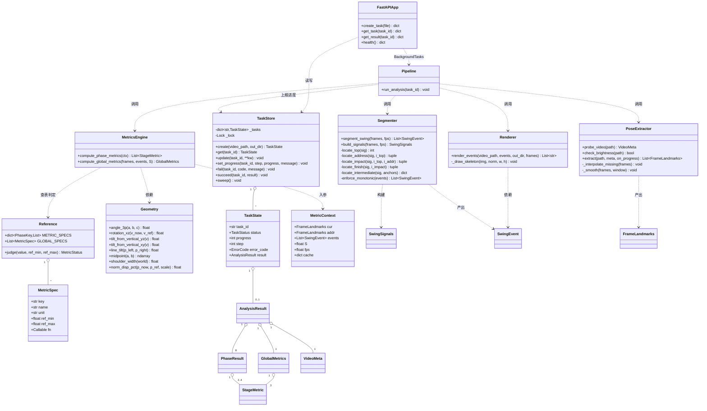
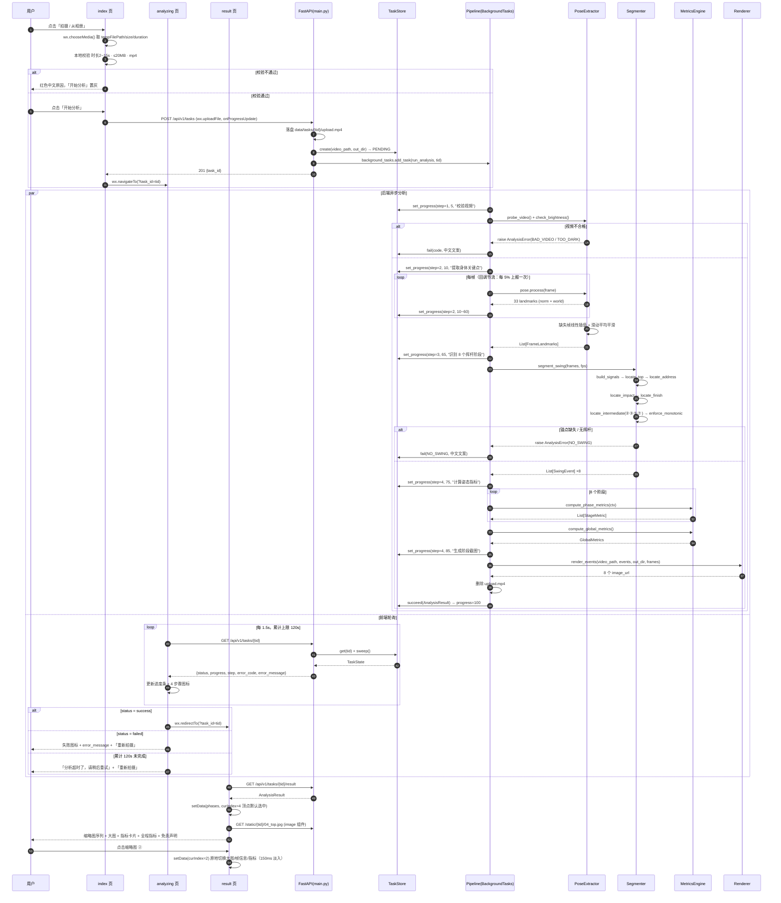
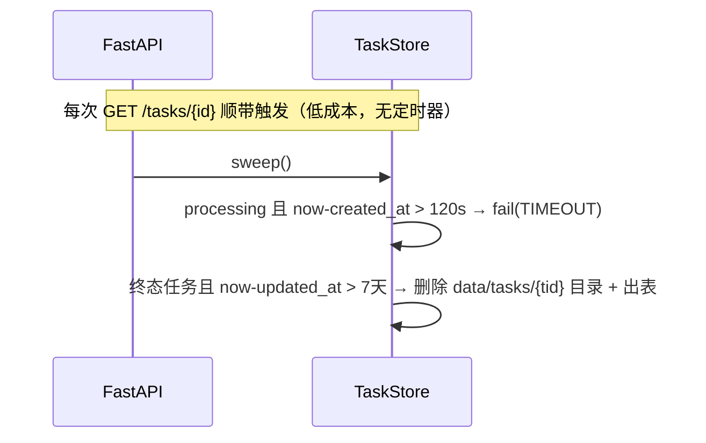
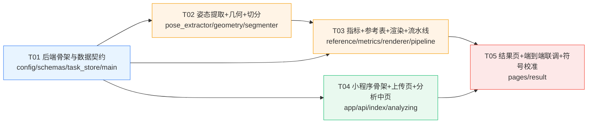

# 高尔夫挥杆分析小程序 MVP —— 系统架构设计与任务分解

| 项 | 内容 |
|---|---|
| 文档版本 | v1.0 |
| 架构师 | 高见远 |
| 上游输入 | `docs/PRD.md` v1.0（许清楚） |
| 项目代号 | `golf_swing_analyzer` |
| 后端 | Python 3.12.9（便携版）+ FastAPI + MediaPipe Pose 0.10.14（legacy solutions API） |
| 前端 | 原生微信小程序（无构建、无 npm） |
| 文档状态 | 可直接交付工程实现 |

> **本文档是工程实现的唯一权威依据。** PRD 定义"做什么"，本文档定义"怎么做、做在哪个文件里、按什么顺序做"。
> 与 PRD 有出入之处，已在 §11 显式列出并说明理由。

---

## 1. 实现方案与选型说明

### 1.1 核心技术难点与对策

| # | 难点 | 对策 | 落点 |
|---|---|---|---|
| D1 | **MediaPipe 环境极其脆弱**：新版移除 legacy API、Tasks API 需下载国内不可达的 `.task` 模型 | 锁死 Python 3.12.9 便携版 + `mediapipe==0.10.14`，**只用 `mp.solutions.pose`**（完整 wheel 内置 `pose_landmark_full.tflite`，零外网依赖） | §10.1 硬约束 |
| D2 | **8 阶段切分**是产品核心价值，但不能上深度学习 | 基于引导手腕轨迹的**四锚点 + 区间穿越**启发式算法：先定 ①④⑥⑧（速度/高度极值），再在区间内按解剖高度阈值插值定 ②③⑤⑦ | §7 全章 |
| D3 | **单目 3D 精度有限**，转动角需要相对量而非绝对量 | 所有转动角一律**相对 Address 基准帧**计算（差分抵消系统性偏差）；位移一律**以肩宽归一化**（抵消距离/身高差异） | §8 |
| D4 | **30s 端到端预算**（PRD AC-P1），CPU 单核推理 360 帧 | ①推理前帧缩放到短边 480；②`model_complexity=1`；③`static_image_mode=False` 启用帧间跟踪；④帧数 > `MAX_INFER_FRAMES(480)` 时等间隔降采样 | §6.2 |
| D5 | 关键帧截图需要原图，但全帧缓存会爆内存（360×720×1280×3 ≈ 1GB） | **两趟解码**：第一趟只做推理不留原图；切分出 8 个帧号后，第二趟顺序解码，命中帧号即渲染写盘（2~15s 视频，二次解码 < 2s） | §6.4 |
| D6 | 异步任务但不许引入 Celery/Redis/DB | FastAPI `BackgroundTasks` + 进程内 `dict` + `threading.Lock`，配 `sweep()` 清理过期任务 | §5.4 |

### 1.2 架构模式

- 后端：**分层管道（Layered Pipeline）**。`API 层 → 编排层(pipeline) → 能力层(pose/segmenter/metrics/renderer) → 工具层(geometry)`。能力层各模块**纯函数化、无状态、可独立单测**（这是 D2 算法能被反复调参的前提）。
- 前端：小程序原生 **Page + 全局 store**。3 个页面，跨页只传 `task_id`，结果数据放 `app.globalData` 兜底 + 结果页自行拉取。

### 1.3 部署形态（回应 PRD Q9）

单机单进程：`python.exe -m uvicorn app.main:app --host 0.0.0.0 --port 8000`。
MVP 并发预期 < 3，**不上任务队列、不上容器、不上数据库**。任务并发数由 `config.MAX_CONCURRENT_TASKS=2` 用信号量软限制，超出则任务排队在 `pending`。

---

## 2. 完整文件列表

> 约定：小程序一个页面的 `.js/.wxml/.wxss/.json` 四件套算 **1 个源文件单元**。全部合计 **18 个源文件单元**。

### 2.1 后端 `backend/`（12 个）

| # | 路径 | 职责（一句话） |
|---|---|---|
| 1 | `backend/app/__init__.py` | 空包标记文件 |
| 2 | `backend/app/config.py` | 全部可调常量：目录路径、算法阈值、参考基准、超时、符号约定开关 |
| 3 | `backend/app/schemas.py` | Pydantic/dataclass 数据契约 + `TaskStatus` / `PhaseKey` / `MetricStatus` / `ErrorCode` 四个枚举 |
| 4 | `backend/app/task_store.py` | 进程内任务表：创建/查询/更新进度/置失败/超时扫描/过期目录清理 |
| 5 | `backend/app/geometry.py` | 纯几何工具：三点夹角、水平面投影转动角、铅垂夹角、肩宽归一化位移、关键点索引常量 |
| 6 | `backend/app/pose_extractor.py` | 视频解码 + 元信息/亮度探测 + MediaPipe 逐帧 33 关键点提取 + 缺失插值 + 滑动平均平滑 |
| 7 | `backend/app/segmenter.py` | **8 阶段切分算法**：信号构建 → 四锚点定位 → 区间插值 → 单调性校正 → `NO_SWING` 判定 |
| 8 | `backend/app/reference.py` | 8 阶段 × 2~4 指标的**参考范围表**（PRD §6.3 的数据化）+ 三态状态判定 |
| 9 | `backend/app/metrics.py` | 各阶段指标计算函数 + 指标注册表 + 全程指标（节奏比/总时长/头部位移） |
| 10 | `backend/app/renderer.py` | 第二趟解码，在 8 个事件帧上叠加骨架连线并导出 JPG |
| 11 | `backend/app/pipeline.py` | 分析流水线编排：串起 6→7→9→10，逐步上报 progress，异常转 `ErrorCode` |
| 12 | `backend/app/main.py` | FastAPI 应用：4 个接口 + `StaticFiles` 挂载 + CORS + 统一响应包与异常处理 |
| — | `backend/requirements.txt` | 依赖锁定清单（见 §9） |

运行时目录（非源文件，程序自建）：`backend/data/tasks/{task_id}/`。

### 2.2 小程序 `miniprogram/`（6 个）

| # | 路径 | 职责（一句话） |
|---|---|---|
| 13 | `miniprogram/app.js` + `app.json` + `app.wxss` | 全局入口：`globalData`（task_id / result 缓存）、页面路由注册、全局样式变量 |
| 14 | `miniprogram/project.config.json` | 项目配置：**`urlCheck: false`**（关闭域名校验，必需）、appid 占位 |
| 15 | `miniprogram/utils/api.js` | 请求封装：`BASE_URL`、`request()`、`uploadVideo()`、`getTaskStatus()`、`getResult()`、错误码→中文文案映射 |
| 16 | `miniprogram/pages/index/*` | 首页：拍摄引导图文 + `wx.chooseMedia` + 本地三项校验 + 上传（带百分比）→ 跳分析中页 |
| 17 | `miniprogram/pages/analyzing/*` | 分析中页：1.5s 轮询、进度条、4 步骤态、120s 超时、失败文案 + 重拍入口 |
| 18 | `miniprogram/pages/result/*` | 结果页：8 阶段横向缩略图 + 大图 + 指标卡片（含迷你区间条）+ 全程指标条 + 免责声明 |

---

## 3. 核心数据结构

### 3.1 枚举（`schemas.py`）

```python
class TaskStatus(str, Enum):
    PENDING = "pending"; PROCESSING = "processing"
    SUCCESS = "success"; FAILED = "failed"

class PhaseKey(str, Enum):
    ADDRESS = "address"; TAKEAWAY = "takeaway"; BACKSWING = "backswing"; TOP = "top"
    DOWNSWING = "downswing"; IMPACT = "impact"; FOLLOW_THROUGH = "follow_through"; FINISH = "finish"

class MetricStatus(str, Enum):
    LOW = "low"; NORMAL = "normal"; HIGH = "high"

class ErrorCode(str, Enum):
    NO_PERSON = "NO_PERSON"; NO_SWING = "NO_SWING"; TOO_DARK = "TOO_DARK"
    LOW_QUALITY = "LOW_QUALITY"; BAD_VIDEO = "BAD_VIDEO"
    TIMEOUT = "TIMEOUT"; INTERNAL = "INTERNAL"

class AnalysisError(Exception):
    def __init__(self, code: ErrorCode, detail: str = ""): ...
```

**8 阶段静态元信息表**（`PHASE_META: Dict[PhaseKey, PhaseMeta]`，含 `index / name_cn / name_en`）：

| index | key | name_cn | name_en |
|---|---|---|---|
| 1 | `address` | 准备 | Address |
| 2 | `takeaway` | 起杆 | Takeaway |
| 3 | `backswing` | 上杆 | Backswing |
| 4 | `top` | 顶点 | Top |
| 5 | `downswing` | 下杆 | Downswing |
| 6 | `impact` | 击球 | Impact |
| 7 | `follow_through` | 送杆 | Follow-through |
| 8 | `finish` | 收杆 | Finish |

### 3.2 内部数据结构（dataclass，不出网）

```python
@dataclass
class FrameLandmarks:
    frame_index: int          # 在【原视频】中的帧号（已还原降采样）
    timestamp: float          # 秒 = frame_index / fps
    detected: bool            # 该帧 MediaPipe 是否检出人体（False 表示由插值填补）
    norm:  np.ndarray         # (33,3) 归一化图像坐标 x,y∈[0,1] 原点左上，y 向下；z 相对深度
    world: np.ndarray         # (33,3) world 3D，米制，原点=双髋中点；x 右+ / y 下+ / z 远离相机+
    visibility: np.ndarray    # (33,) 0~1

@dataclass
class SwingSignals:           # segmenter 内部信号包，全部长度 = n
    n: int; fps: float; dt: float
    S: float                  # 肩宽标尺（归一化图像坐标下的距离），全片中位数
    wrist_x: np.ndarray       # 引导手腕(左腕 15) 归一化 x
    wrist_y: np.ndarray       # 引导手腕 归一化 y（越小越高）
    shoulder_mid_y: np.ndarray
    hip_mid_y: np.ndarray
    h: np.ndarray             # 手腕相对髋中点的高度 = (hip_mid_y - wrist_y) / S，向上为正
    speed: np.ndarray         # 手腕速率，单位 肩宽/秒

@dataclass
class SwingEvent:
    index: int                # 1~8
    key: PhaseKey
    frame_index: int
    timestamp: float
    estimated: bool           # True = 未精确定位，按区间比例兜底

@dataclass
class VideoMeta:
    fps: float; duration: float; width: int; height: int
    frame_count: int; sample_step: int; low_fps: bool   # low_fps = fps < 30
```

### 3.3 对外响应结构（Pydantic BaseModel）

```python
class StageMetric(BaseModel):
    key: str; name: str
    value: float                 # 已 round(1)
    unit: str                    # "°" | "%" | ":1" | "s" | ""
    ref_min: float; ref_max: float
    status: MetricStatus

class PhaseResult(BaseModel):
    index: int; key: PhaseKey; name_cn: str; name_en: str
    frame_index: int; timestamp: float
    estimated: bool
    image_url: str               # 绝对 URL
    metrics: List[StageMetric]

class GlobalMetrics(BaseModel):
    tempo_ratio: float           # 上杆帧数 / 下杆帧数
    swing_duration: float        # 秒
    max_head_drift_pct: float    # % 肩宽
    metrics: List[StageMetric]   # 上面 3 项的带参考范围版本，供前端统一渲染

class AnalysisResult(BaseModel):
    task_id: str
    status: TaskStatus           # 固定 success
    video_meta: VideoMeta
    global_metrics: GlobalMetrics
    phases: List[PhaseResult]    # 恒定 8 个，按 index 升序
    warnings: List[str]          # 如「帧率偏低，击球阶段定位可能不准」
    disclaimer: str              # PRD §6.5 固定文案
```

### 3.4 任务状态（`task_store.py`）

```python
@dataclass
class TaskState:
    task_id: str
    status: TaskStatus = TaskStatus.PENDING
    progress: int = 0            # 0~100
    step: int = 1                # 1上传 2提取关键点 3识别阶段 4计算指标
    message: str = "排队中"
    error_code: Optional[ErrorCode] = None
    error_message: Optional[str] = None      # 中文可读
    result: Optional[AnalysisResult] = None
    video_path: Optional[str] = None
    out_dir: Optional[str] = None
    created_at: float = 0.0
    updated_at: float = 0.0
```

### 3.5 类图



---

## 4. HTTP 接口定义

### 4.1 通用约定

- 前缀：`/api/v1`
- **统一响应包**：`{"code": 0, "data": {...}, "message": "ok"}`；`code != 0` 时 `data` 为 `null`
- `code` 取值：`0` 成功；`4001` 参数/文件非法；`4004` 任务不存在；`4009` 任务未完成；`5000` 服务器内部错误
- HTTP 状态码与 `code` 同步（0→200/201，4001→400，4004→404，4009→409，5000→500）
- 所有时间戳单位为**秒（float）**，角度单位为**度**

### 4.2 `POST /api/v1/tasks` —— 上传视频并创建任务

| 项 | 内容 |
|---|---|
| Content-Type | `multipart/form-data` |
| 字段 | `file`：视频文件，必填。服务端二次校验：大小 ≤ 20MB、扩展名/`content_type` 为 mp4 |
| 成功 | `201` |

```jsonc
// 响应
{ "code": 0, "message": "ok",
  "data": { "task_id": "8f3c1a2b4d5e", "status": "pending" } }
```

```jsonc
// 失败（文件过大）
{ "code": 4001, "message": "视频大小超过 20MB", "data": null }
```

### 4.3 `GET /api/v1/tasks/{task_id}` —— 查询任务状态（前端 1.5s 轮询）

```jsonc
// processing
{ "code": 0, "message": "ok", "data": {
    "task_id": "8f3c1a2b4d5e",
    "status": "processing",       // pending | processing | success | failed
    "progress": 62,               // 0~100
    "step": 3,                    // 1上传 2提取关键点 3识别阶段 4计算指标
    "message": "正在识别挥杆阶段...",
    "error_code": null,
    "error_message": null } }
```

```jsonc
// failed
{ "code": 0, "message": "ok", "data": {
    "task_id": "8f3c1a2b4d5e", "status": "failed",
    "progress": 55, "step": 3, "message": "分析失败",
    "error_code": "NO_SWING",
    "error_message": "没有识别到完整的挥杆动作，请拍摄从站位到收杆的完整过程" } }
```

> 后端**直接下发中文 `error_message`**（PRD §5.3 对照表内置于 `config.ERROR_MESSAGES`）；小程序侧 `api.js` 保留同一份映射作为兜底，二者取其一即可，前端优先用后端下发值。

### 4.4 `GET /api/v1/tasks/{task_id}/result` —— 获取完整分析结果

- `status != success` → `409 / code=4009 / message="任务尚未完成"`
- 成功返回 `AnalysisResult`（结构见 §3.3），示例：

```jsonc
{ "code": 0, "message": "ok", "data": {
  "task_id": "8f3c1a2b4d5e",
  "status": "success",
  "video_meta": { "fps": 60.0, "duration": 6.2, "width": 720, "height": 1280,
                  "frame_count": 372, "sample_step": 1, "low_fps": false },
  "global_metrics": {
    "tempo_ratio": 2.1, "swing_duration": 1.28, "max_head_drift_pct": 6.0,
    "metrics": [
      { "key": "tempo_ratio", "name": "节奏比", "value": 2.1, "unit": ":1",
        "ref_min": 2.5, "ref_max": 3.5, "status": "low" },
      { "key": "swing_duration", "name": "挥杆总时长", "value": 1.28, "unit": "s",
        "ref_min": 1.0, "ref_max": 1.6, "status": "normal" },
      { "key": "max_head_drift_pct", "name": "头部最大位移", "value": 6.0, "unit": "%",
        "ref_min": 0.0, "ref_max": 8.0, "status": "normal" } ] },
  "phases": [
    { "index": 4, "key": "top", "name_cn": "顶点", "name_en": "Top",
      "frame_index": 37, "timestamp": 0.62, "estimated": false,
      "image_url": "http://127.0.0.1:8000/static/8f3c1a2b4d5e/04_top.jpg",
      "metrics": [
        { "key": "shoulder_turn", "name": "肩部转动角", "value": 78.0, "unit": "°",
          "ref_min": 70.0, "ref_max": 88.0, "status": "low" },
        { "key": "hip_turn", "name": "髋部转动角", "value": 56.0, "unit": "°",
          "ref_min": 45.0, "ref_max": 60.0, "status": "normal" },
        { "key": "x_factor", "name": "X-Factor(肩髋分离)", "value": 22.0, "unit": "°",
          "ref_min": 20.0, "ref_max": 35.0, "status": "normal" },
        { "key": "lead_arm_straight", "name": "引导臂伸直度", "value": 162.0, "unit": "°",
          "ref_min": 150.0, "ref_max": 172.0, "status": "normal" } ] }
    /* ... 其余 7 个 ... */ ],
  "warnings": [],
  "disclaimer": "以上数据基于单目视频姿态估算，仅供动作参考，存在测量误差，不构成专业教学建议。" } }
```

### 4.5 `GET /static/{task_id}/{NN}_{key}.jpg` —— 结果图片

- `app.mount("/static", StaticFiles(directory=config.DATA_DIR), name="static")`
- 文件名固定：`01_address.jpg` `02_takeaway.jpg` `03_backswing.jpg` `04_top.jpg` `05_downswing.jpg` `06_impact.jpg` `07_follow_through.jpg` `08_finish.jpg`
- `image_url` 由后端用 `config.PUBLIC_BASE_URL` 拼成**绝对 URL** 返回，前端不做拼接

### 4.6 `GET /api/v1/health`

`{"code":0,"data":{"status":"ok","mediapipe":"0.10.14"},"message":"ok"}`

### 4.7 错误码总表

| ErrorCode | 触发条件（后端判据） | 用户可见文案 |
|---|---|---|
| `NO_PERSON` | 未检出人体的帧占比 > 50% | 没有检测到人物，请确保全身在画面内后重拍 |
| `LOW_QUALITY` | 未检出人体的帧占比 10%~50%，或核心 13 点平均 visibility < 0.5 的帧 > 30% | 人物识别不稳定，请固定手机、避免遮挡后重拍 |
| `TOO_DARK` | 等间隔抽 10 帧灰度均值 < 40 | 画面过暗，建议在光线充足的环境下拍摄 |
| `NO_SWING` | §7.6 六条判据任一命中 | 没有识别到完整的挥杆动作，请拍摄从站位到收杆的完整过程 |
| `BAD_VIDEO` | cv2 无法打开 / fps 或帧数非法 / 时长越界 | 视频无法解析，请换一段 mp4 视频重试 |
| `TIMEOUT` | 任务处理超过 120s | 分析超时了，请稍后重试 |
| `INTERNAL` | 其他未捕获异常 | 分析失败了，请稍后重试 |

---

## 5. 程序调用时序图

### 5.1 全链路：上传 → 异步分析 → 轮询 → 出结果



### 5.2 任务超时与清理



---

## 6. 分析流水线工程细节

### 6.1 进度与步骤映射（对齐 PRD §5.3 四步 UI）

| step | 文案 | progress 区间 | 对应模块 |
|---|---|---|---|
| 1 | 上传完成 | 0 → 8 | `main.py` 落盘 + `probe_video` |
| 2 | 提取身体关键点 | 8 → 60 | `pose_extractor.extract` |
| 3 | 识别 8 个挥杆阶段 | 60 → 72 | `segmenter.segment_swing` |
| 4 | 计算姿态指标 | 72 → 100 | `metrics` + `renderer` |

> `set_progress` 内做**单调不回退**保护：新值 < 旧值时忽略。

### 6.2 姿态提取（`pose_extractor.py`）

```python
POSE_KW = dict(static_image_mode=False, model_complexity=1,
               smooth_landmarks=True, enable_segmentation=False,
               min_detection_confidence=0.5, min_tracking_confidence=0.5)

def probe_video(path) -> VideoMeta
    # cv2.VideoCapture → fps / frame_count / w / h
    # 非法(fps<=0 或 frame_count<=0) → BAD_VIDEO
    # duration 不在 [1.5, 20] → BAD_VIDEO（前端已拦 2~15，服务端放宽容差）
    # sample_step = max(1, ceil(frame_count / MAX_INFER_FRAMES))   # MAX_INFER_FRAMES=480
    # low_fps = fps < 30

def check_brightness(path) -> None
    # 等间隔抽 10 帧 → cvtColor GRAY → mean；10 帧均值 < 40 → raise TOO_DARK

def extract(path, meta, on_progress) -> List[FrameLandmarks]
    # 顺序解码；i % sample_step != 0 则 skip（不解码 landmark，仍需 grab()）
    # 推理前 cv2.resize 到短边 <= 480（等比），推理用 RGB
    # detected=False 的帧：landmark 置 NaN
    # 退出循环后：
    #   miss_ratio = 未检出帧 / 总采样帧
    #   miss_ratio > 0.5              → NO_PERSON
    #   0.1 < miss_ratio <= 0.5       → LOW_QUALITY
    #   核心13点 mean visibility<0.5 的帧占比 > 0.3 → LOW_QUALITY
    # _interpolate_missing(): 对 NaN 段按帧号线性插值；首尾用最近有效帧外推
    # _smooth(): 对 norm 与 world 的 (33,3) 全量做滑动平均，窗口 W（见 §7.1）
```

**关键点索引常量**（`geometry.py`，MediaPipe BlazePose 33 点）：

```python
NOSE=0; L_SHOULDER=11; R_SHOULDER=12; L_ELBOW=13; R_ELBOW=14
L_WRIST=15; R_WRIST=16; L_HIP=23; R_HIP=24
L_KNEE=25; R_KNEE=26; L_ANKLE=27; R_ANKLE=28
CORE_IDS = [0,11,12,13,14,15,16,23,24,25,26,27,28]   # 13 个核心点
```

### 6.3 并发与超时

- `pipeline.run_analysis` 顶部 `with CONCURRENCY_SEM:`（`threading.Semaphore(2)`）
- 每个 step 结束后检查 `time.time() - task.created_at > 120` → `raise AnalysisError(TIMEOUT)`
- `run_analysis` 整体包在 `try/except AnalysisError → TS.fail(code)` / `except Exception → TS.fail(INTERNAL)` + `logging.exception`

### 6.4 渲染（`renderer.py`）

```python
SKELETON_EDGES = [  # 只画躯干+四肢，剔除面部，正面机位更清爽
    (11,12),(11,23),(12,24),(23,24),          # 躯干
    (11,13),(13,15),(12,14),(14,16),          # 双臂
    (23,25),(25,27),(24,26),(26,28),          # 双腿
]
def render_events(video_path, events, out_dir, frames) -> Dict[PhaseKey, str]
    # 建 targets = {frame_index: (phase_index, phase_key)}
    # 第二趟顺序解码，命中即：
    #   1) 长边缩放到 <= 720
    #   2) 画 SKELETON_EDGES 线（BGR (0,255,180)，粗 3px）
    #   3) 画 13 个核心关键点（实心圆 半径4，白色描边）
    #   4) 左上角写 "④ 顶点 · f37 · 0.62s"（用 cv2.putText 只写英文/数字，
    #      中文阶段名改为在小程序端叠加文本，避免 OpenCV 中文乱码）
    #   5) cv2.imwrite(f"{NN}_{key}.jpg", img, [IMWRITE_JPEG_QUALITY, 85])
```

> ⚠️ **OpenCV 无法直接绘制中文**。MVP 采用：图上只写 `#4 f37 0.62s`，中文阶段名由小程序端在大图下方以文本展示（PRD §5.4 本就有独立的「④ 顶点 第37帧·0.62s」文本行）。**禁止**为此引入 PIL 字体依赖。

---

## 7. 8 阶段切分算法工程化设计 ⭐（核心）

> 对应 PRD §6.2。本章是本文档最重要的部分，工程师需**逐条实现**。全部实现于 `segmenter.py`，**纯函数、无 IO**，便于用 20 段真实视频反复调参（PRD Q5 的验证前提）。

### 7.1 信号构建 `build_signals(frames, fps) -> SwingSignals`

| 步骤 | 做法 | 理由 |
|---|---|---|
| S1 | 引导手腕 = **左腕 `L_WRIST(15)`**（右手球手，引导手=左手） | PRD Q2 只支持右手球手 |
| S2 | 轨迹分析一律用 **归一化图像坐标 `norm`**，不用 `world` | `world` 原点跟随双髋中点，会把身体平移抵消掉，不适合做轨迹极值检测 |
| S3 | 标尺 `S = median_t(‖norm[t][L_SHOULDER] - norm[t][R_SHOULDER]‖₂)`；若 `S < 1e-6` → `NO_SWING` | 用全片中位肩宽做归一化，抗单帧抖动 |
| S4 | 平滑窗口 `W = max(3, odd(round(fps * 0.08)))`（60fps→5，30fps→3） | 约 80ms 窗口，既压抖动又不糊掉击球瞬间 |
| S5 | 滑动平均：`np.convolve(a, ones(W)/W, mode='same')`，**首尾各 W//2 帧用边缘值填充后再卷积**（避免边缘塌陷） | 边缘塌陷会污染 Address / Finish 的静止判定 |
| S6 | 高度信号 `h[t] = (hip_mid_y[t] - wrist_y[t]) / S`，向上为正 | 图像 y 向下，取差值后翻正；除以 S 做体型归一化 |
| S7 | 速度：中心差分 `v[t] = (p[t+1]-p[t-1]) / (2*dt) / S`，两端用前/后向差分；`speed[t] = ‖v[t]‖₂`，单位 **肩宽/秒** | 归一化后阈值与视频分辨率、人物远近无关 |
| S8 | 对 `speed` 再做一次窗口 `W` 的滑动平均 | 差分会放大噪声 |

`dt = sample_step / fps`（注意降采样后的真实时间间隔）。

### 7.2 四锚点定位（顺序：④ → ① → ⑥ → ⑧）

#### ④ 顶点 Top —— `locate_top(sig) -> int`

```
1. 搜索区间 R = [round(0.05*n), round(0.95*n)]（排除首尾各 5%）
2. i_y   = argmin(wrist_y[R])                      # 图像最高点
3. 在 [i_y - round(0.10*fps), i_y + round(0.10*fps)] ∩ R 内
   i_top = argmin(speed[...])                       # 速度反向点，比纯几何最高点更稳
4. 返回 i_top
```

#### ① 准备 Address —— `locate_address(sig, i_top) -> (int, bool)`

```
1. 在 [0, i_top) 上求所有满足 speed[t] < V_STILL 的极大连续段
   V_STILL = 0.25 (肩宽/秒)，最短长度 L_MIN = max(2, round(0.10*fps))
2. 取【最后一段】的【末帧】作为 i_addr   → estimated=False
   （取最后一段可天然跳过预摆 waggle 之前的静止期）
3. 兜底：若无合格段 → i_addr = argmin(speed[0 : i_top])，estimated=True
4. 硬约束：i_top - i_addr < max(3, round(0.15*fps)) → 抛 NO_SWING
   （顶点离起始太近 = 视频没拍到站位）
```

#### ⑥ 击球 Impact —— `locate_impact(sig, i_top, i_addr) -> (int, bool)`

```
1. y_addr = wrist_y[i_addr]
2. 在 (i_top, n) 内找【首个】满足 wrist_y[t] >= y_addr - 0.15*S 的帧 i_cross
   （手腕回落到 Address 高度附近）
3. 若 i_cross 存在：
     窗口 Wc = [i_cross - round(0.05*fps), i_cross + round(0.05*fps)] ∩ (i_top, n)
     i_impact = argmax(speed[Wc])                    # 窗口内速度峰值
     estimated = False
   否则（手腕从未回落，如半挥/收杆前截断）：
     i_impact = argmax(speed[i_top+1 : n])
     estimated = True
4. 硬约束：i_impact - i_top < max(2, round(0.06*fps)) → 抛 NO_SWING
```

> **为何"先找回落交叉、再在窗口内取速度峰"而不是直接取全局速度峰**：业余视频里送杆阶段手腕速度常常也很高，直接取全局 argmax 会把 Impact 判到 Follow-through 上。高度交叉先把范围锁死，再用速度峰做亚阶段精定位，这是准确率的关键。

#### ⑧ 收杆 Finish —— `locate_finish(sig, i_impact) -> (int, bool)`

```
1. 在 (i_impact, n) 内找【首个】满足 speed < V_STILL 且长度 >= max(2, round(0.15*fps))
   的连续段，取其【首帧】 → i_finish，estimated=False
2. 兜底 A：若无合格段但 (n-1) - i_impact >= round(0.10*fps)
     i_finish = argmin(speed[i_impact+1 : n])，estimated=True
3. 兜底 B：否则 i_finish = n-1，estimated=True（视频在收杆前就结束）
```

### 7.3 中间四帧插值定位 `locate_intermediate(sig, anchors) -> Dict[PhaseKey, (int,bool)]`

统一用**解剖高度穿越**判据（比固定像素阈值更抗体型差异）：

| 阶段 | 搜索区间 | 判据（首个满足的帧） | 兜底比例位置 |
|---|---|---|---|
| ② 起杆 Takeaway | `[i_addr, i_top]` | `h[t] >= H_HIP`，`H_HIP = 0.10`（手腕首次上穿髋线，≈ 球杆平行地面） | `i_addr + 0.35*(i_top - i_addr)` |
| ③ 上杆 Backswing | `[i_takeaway, i_top]` | `wrist_y[t] <= shoulder_mid_y[t]`（手腕首次升过肩线，≈ 引导臂平行地面） | `i_addr + 0.70*(i_top - i_addr)` |
| ⑤ 下杆 Downswing | `[i_top, i_impact]` | `wrist_y[t] >= shoulder_mid_y[t]`（手腕首次回落穿过肩线） | `i_top + 0.50*(i_impact - i_top)` |
| ⑦ 送杆 Follow-through | `[i_impact, i_finish]` | `h[t] >= H_HIP`（手腕再次上穿髋线） | `i_impact + 0.35*(i_finish - i_impact)` |

- 命中判据 → `estimated=False`；走兜底比例 → `estimated=True`（PRD §6.2 明确要求）
- ②③ 的搜索有先后依赖：先定 ②，③ 从 ② 之后开始搜，防止倒序

### 7.4 单调性校正 `enforce_monotonic(events) -> List[SwingEvent]`

```
按 index 1..8 遍历，若 f[k] <= f[k-1]:
    f[k] = f[k-1] + 1，并置 estimated=True
若校正后 f[8] > n-1:
    从后向前反向挤压（f[k] = f[k+1] - 1），任何一步 f[k] <= f[k-1] 仍冲突 → 抛 NO_SWING
```

保证输出**恒 8 个、帧号严格递增、均在 `[0, n-1]` 内**（PRD AC-04 的硬保证）。

### 7.5 主入口

```python
def segment_swing(frames: List[FrameLandmarks], fps: float) -> List[SwingEvent]:
    sig = build_signals(frames, fps)
    _guard_no_swing(sig)                       # §7.6 前置判据 1~3
    i_top             = locate_top(sig)
    i_addr, e_addr    = locate_address(sig, i_top)
    i_imp,  e_imp     = locate_impact(sig, i_top, i_addr)
    i_fin,  e_fin     = locate_finish(sig, i_imp)
    mid               = locate_intermediate(sig, (i_addr, i_top, i_imp, i_fin))
    events            = _assemble(...)          # 组装 8 个 SwingEvent（frame_index 需 ×sample_step 还原）
    return enforce_monotonic(events)
```

### 7.6 `NO_SWING` 判定条件汇总（任一命中即抛）

| # | 判据 | 拦截的场景 |
|---|---|---|
| 1 | `S < 1e-6` 或 `n < max(10, round(0.5*fps))` | 肩宽异常 / 帧数过少 |
| 2 | `max(speed) < V_PEAK_MIN`（`V_PEAK_MIN = 1.5` 肩宽/秒） | **静止站立视频**（PRD AC-10 用例） |
| 3 | 手腕垂直行程 `(percentile(wrist_y, 95) - min(wrist_y)) < 0.60 * S` | 只有小幅动作，没有真正上杆 |
| 4 | `i_top - i_addr < max(3, round(0.15*fps))` | 视频起点已在挥杆中，缺 Address |
| 5 | `i_impact - i_top < max(2, round(0.06*fps))` | 下杆时长异常，多为误检 |
| 6 | `enforce_monotonic` 反向挤压后仍冲突 | 帧序无法自洽 |

### 7.7 可调参数集中表（全部放 `config.py`，工程师照此调参）

| 常量 | 默认值 | 单位 | 作用 |
|---|---|---|---|
| `SMOOTH_WIN_SEC` | 0.08 | 秒 | 滑动平均窗口时长 |
| `V_STILL` | 0.25 | 肩宽/秒 | 静止判定速度阈值 |
| `V_PEAK_MIN` | 1.5 | 肩宽/秒 | 判定"存在挥杆"的最小速度峰值 |
| `STILL_MIN_SEC_ADDR` | 0.10 | 秒 | Address 静止段最短时长 |
| `STILL_MIN_SEC_FINISH` | 0.15 | 秒 | Finish 静止段最短时长 |
| `IMPACT_Y_TOL` | 0.15 | 肩宽 | Impact 高度回落容差 |
| `IMPACT_WIN_SEC` | 0.05 | 秒 | Impact 速度峰搜索半窗 |
| `H_HIP` | 0.10 | 肩宽 | 手腕过髋线判据 |
| `MIN_WRIST_TRAVEL` | 0.60 | 肩宽 | 最小垂直行程 |
| `FALLBACK_RATIO` | (0.35, 0.70, 0.50, 0.35) | — | ②③⑤⑦ 兜底比例 |
| `MAX_INFER_FRAMES` | 480 | 帧 | 降采样上限 |

### 7.8 Plan B（回应 PRD Q5）

`config.ANCHOR_ONLY_MODE = False`。若 20 段视频实测 ②③⑤⑦ 准确率不达标，把该开关置 `True`：
`_assemble` 仍输出 8 个阶段（保证 AC-04 与前端结构不变），但 ②③⑤⑦ 一律走兜底比例并 `estimated=True`，前端在这些阶段的截图角标显示「估算位置」。**前后端接口零改动**。

---

## 8. 指标计算设计

### 8.1 几何工具函数（`geometry.py`，全部纯函数、入参为 `np.ndarray`）

| 函数 | 签名 | 定义 |
|---|---|---|
| 三点夹角 | `angle_3p(a, b, c) -> float` | `degrees(arccos(clip(dot(u,v)/(‖u‖‖v‖), -1, 1)))`，`u=a-b, v=c-b`；返回 0~180 |
| 水平面转动角 | `rotation_xz(v_now, v_ref) -> float` | 取两向量的 (x,z) 分量；`cross = x1*z2 - z1*x2`，`dot = x1*x2 + z1*z2`；`degrees(atan2(cross, dot)) * ROTATION_SIGN`；返回 −180~180 |
| 铅垂夹角(前倾) | `tilt_from_vertical_yz(v) -> float` | `degrees(atan2(abs(v[2]), abs(v[1])))`，躯干向量在 y-z 面与铅垂线夹角 |
| 铅垂夹角(侧倾) | `tilt_from_vertical_xy(v) -> float` | `-TARGET_DIR_X * degrees(atan2(v[0], -v[1]))`；向**远离目标**为正 |
| 连线水平倾角 | `line_tilt(p_left, p_right) -> float` | `degrees(atan2(p_right[1]-p_left[1], abs(p_right[0]-p_left[0])))`；右侧低于左侧为正 |
| 中点 | `midpoint(a, b) -> ndarray` | `(a+b)/2` |
| 肩宽 | `shoulder_width(world) -> float` | `‖world[11]-world[12]‖₂` |
| 归一化位移 | `norm_disp_pct(p_now, p_ref, scale, axes=(0,1)) -> float` | `‖(p_now-p_ref)[axes]‖₂ / scale * 100` |
| 带符号水平位移 | `signed_shift_pct(p_now, p_ref, scale) -> float` | `TARGET_DIR_X * (p_now[0]-p_ref[0]) / scale * 100`；向目标为正 |

> `ROTATION_SIGN` / `TARGET_DIR_X` 定义见 §10.3，**符号需用一段真实右手挥杆视频校准**，校准后只改 `config.py` 一处。

### 8.2 派生量（`metrics.py` 内部 helper，结果缓存进 `MetricContext.cache`）

```python
shoulder_turn(cur, addr)  = rotation_xz(cur.world[11]-cur.world[12], addr.world[11]-addr.world[12])
hip_turn(cur, addr)       = rotation_xz(cur.world[23]-cur.world[24], addr.world[23]-addr.world[24])
x_factor(cur, addr)       = shoulder_turn - hip_turn
lead_arm_straight(cur)    = angle_3p(cur.world[11], cur.world[13], cur.world[15])   # 左肩-左肘-左腕
trail_elbow_flex(cur)     = angle_3p(cur.world[12], cur.world[14], cur.world[16])   # 右肩-右肘-右腕
knee_flex(cur)            = mean(angle_3p(23,25,27), angle_3p(24,26,28))
spine_vec(f)              = midpoint(f.world[11],f.world[12]) - midpoint(f.world[23],f.world[24])
spine_forward_tilt(f)     = tilt_from_vertical_yz(spine_vec(f))
spine_lateral_tilt(f)     = tilt_from_vertical_xy(spine_vec(f))
head_drift_pct(cur, addr, S)   = norm_disp_pct(cur.world[0], addr.world[0], S, axes=(0,1))
pelvis_shift_pct(cur, addr, S) = signed_shift_pct(midpoint(cur.world[23],cur.world[24]),
                                                  midpoint(addr.world[23],addr.world[24]), S)
```

- 这里的 `S` 是 **world 肩宽（米）**，与 §7 中的归一化图像肩宽是两个量，不要混用。`metrics` 用 world 肩宽，`segmenter` 用图像肩宽。
- **开放角**（PRD §6.3 符号约定：背向目标为正）：`hip_open = -hip_turn`，`shoulder_open = -shoulder_turn`，`shoulder_square = -shoulder_turn`。

### 8.3 参考范围表（`reference.py`，PRD §6.3 的完整数据化）

```python
@dataclass(frozen=True)
class MetricSpec:
    key: str; name: str; unit: str
    ref_min: float; ref_max: float
    fn: Callable[["MetricContext"], float]

METRIC_SPECS: Dict[PhaseKey, List[MetricSpec]] = { ... }
```

| 阶段 | key | 名称 | 单位 | ref_min | ref_max |
|---|---|---|---|---|---|
| ① address | `spine_forward_tilt` | 脊柱前倾角 | ° | 30 | 40 |
| ① | `stance_width_ratio` | 站姿宽度比 | — | 1.0 | 1.3 |
| ① | `shoulder_line_tilt` | 肩线水平倾角 | ° | 5 | 12 |
| ① | `knee_flex` | 膝部弯曲角 | ° | 160 | 172 |
| ② takeaway | `shoulder_turn` | 肩部转动角 | ° | 25 | 35 |
| ② | `hip_turn` | 髋部转动角 | ° | 8 | 18 |
| ② | `head_drift_pct` | 头部位移 | % | 0 | 4 |
| ② | `lead_arm_straight` | 引导臂伸直度 | ° | 165 | 178 |
| ③ backswing | `shoulder_turn` | 肩部转动角 | ° | 55 | 72 |
| ③ | `hip_turn` | 髋部转动角 | ° | 25 | 38 |
| ③ | `trail_elbow_flex` | 后臂弯曲角 | ° | 95 | 125 |
| ③ | `lead_arm_straight` | 引导臂伸直度 | ° | 155 | 175 |
| ④ top | `shoulder_turn` | 肩部转动角 | ° | 70 | 88 |
| ④ | `hip_turn` | 髋部转动角 | ° | 45 | 60 |
| ④ | `x_factor` | X-Factor(肩髋分离) | ° | 20 | 35 |
| ④ | `lead_arm_straight` | 引导臂伸直度 | ° | 150 | 172 |
| ⑤ downswing | `hip_turn` | 髋部转动角 | ° | 10 | 30 |
| ⑤ | `shoulder_turn` | 肩部转动角 | ° | 45 | 65 |
| ⑤ | `x_factor_retention` | X-Factor 保持率 | % | 85 | 130 |
| ⑤ | `pelvis_shift_pct` | 骨盆水平位移 | % | 4 | 12 |
| ⑥ impact | `hip_open` | 髋部开放角 | ° | 15 | 30 |
| ⑥ | `shoulder_square` | 肩部方正度 | ° | −5 | 12 |
| ⑥ | `spine_tilt_delta` | 起身量(脊柱倾角变化) | ° | 0 | 8 |
| ⑥ | `pelvis_shift_pct` | 骨盆水平位移 | % | 10 | 20 |
| ⑦ follow_through | `hip_open` | 髋部开放角 | ° | 40 | 60 |
| ⑦ | `shoulder_open` | 肩部转动角(开放) | ° | 35 | 60 |
| ⑦ | `trail_arm_extend` | 后臂伸展度 | ° | 150 | 172 |
| ⑦ | `spine_lateral_tilt` | 脊柱侧倾 | ° | 10 | 20 |
| ⑧ finish | `hip_to_target` | 髋部朝向目标角 | ° | 75 | 95 |
| ⑧ | `shoulder_open` | 肩部转动角(总开放) | ° | 85 | 110 |
| ⑧ | `pelvis_shift_pct` | 骨盆水平位移 | % | 20 | 35 |
| ⑧ | `balance_hold_sec` | 收杆平衡保持时长 | s | 0.8 | 3.0 |
| 全程 | `tempo_ratio` | 节奏比 | :1 | 2.5 | 3.5 |
| 全程 | `swing_duration` | 挥杆总时长 | s | 1.0 | 1.6 |
| 全程 | `max_head_drift_pct` | 头部最大位移 | % | 0 | 8 |

**特殊计算说明**

| key | 计算式 |
|---|---|
| `x_factor_retention` | `x_factor(⑤) / x_factor(④) * 100`；分母 `abs < 1e-3` 时取 100 并加 warning |
| `spine_tilt_delta` | `spine_forward_tilt(addr) - spine_forward_tilt(⑥)`（前倾角**减小**为起身，故取正差值）；负值裁剪为 0 |
| `balance_hold_sec` | 从 `i_finish` 起连续满足 `speed < V_STILL` 的帧数 × `dt`；若到视频末仍连续，加 warning「视频在收杆后过早结束」 |
| `tempo_ratio` | `(i_top - i_addr) / max(1, i_impact - i_top)` |
| `swing_duration` | `(i_finish - i_addr) / fps` |
| `max_head_drift_pct` | `max_t norm_disp_pct(f[t].world[0], addr.world[0], S)`，t ∈ [i_addr, i_finish] |
| `stance_width_ratio` | `abs(world[27][0] - world[28][0]) / S` |

### 8.4 状态判定与数值卫生

```python
def judge(value, ref_min, ref_max) -> MetricStatus:
    if value < ref_min: return LOW
    if value > ref_max: return HIGH
    return NORMAL
```

**数值卫生（保障 PRD AC-06：无 NaN / null / 越界）**——每个指标出口统一过一遍：

```python
def sanitize(value, key) -> float:
    if value is None or math.isnan(value) or math.isinf(value):
        value = (ref_min + ref_max) / 2          # 兜底取参考区间中值
        warnings.append(f"{name} 计算异常，已按参考中值填充")
    if unit == "°": value = clamp(value, -180.0, 180.0)
    return round(float(value), 1)
```

> PRD §5.4 提到的「严重偏离 ✗ 红色」由**前端**按 `|value - 最近边界| / (ref_max - ref_min) > 1.0` 自行判定，后端仍只下发三态，与 PRD §7 数据结构保持一致。

---

## 9. 依赖包列表

`backend/requirements.txt`（**版本必须锁死**）：

```
mediapipe==0.10.14
numpy==1.26.4
opencv-python-headless==4.11.0.86
fastapi==0.115.6
uvicorn[standard]==0.34.0
python-multipart==0.0.20
pydantic==2.10.4
```

| 包 | 锁定理由 |
|---|---|
| `mediapipe==0.10.14` | **唯一可用版本**。1.0.0 已移除 `mp.solutions`；3.13 的 wheel 是精简包只有 `tasks` 子模块。0.10.14 完整 wheel 内置 `pose_landmark_full.tflite`，零外网依赖 |
| `numpy==1.26.4` | **必须 < 2**。MediaPipe 0.10.14 与 NumPy 2.x ABI 不兼容 |
| `opencv-python-headless` | 无 GUI 依赖，服务端更轻；解码 + 绘制 + JPG 编码全靠它 |
| `python-multipart` | FastAPI `UploadFile` 必需 |

**安装命令（唯一正确写法）**：

```bash
E:/project/golf/.tools/python312/python.exe -m pip install -r backend/requirements.txt \
  -i https://pypi.tuna.tsinghua.edu.cn/simple
```

**启动命令**：

```bash
cd E:/project/golf/backend && \
E:/project/golf/.tools/python312/python.exe -m uvicorn app.main:app --host 0.0.0.0 --port 8000
```

小程序端：**零依赖**（原生，无 npm，无构建）。

---

## 10. 共享知识（工程师必读）

### 10.1 环境硬约束（已实测验证，**禁止推翻、禁止重新验证**）

| # | 约束 |
|---|---|
| E1 | Python 解释器**固定**为便携版：`E:\project\golf\.tools\python312\python.exe`（3.12.9 embeddable）。**没有 venv**，直接用该 `python.exe` 运行与 `pip install`。系统 Python（3.13 / 3.10-32bit）**不可用** |
| E2 | `mediapipe==0.10.14` + **legacy API `mp.solutions.pose`**。**严禁**设计或使用 `mediapipe.tasks` / `PoseLandmarker` / 下载 `.task` 模型（Google 存储国内不可达） |
| E3 | `numpy` 必须 `<2`（锁 1.26.4） |
| E4 | pip 安装一律加 `-i https://pypi.tuna.tsinghua.edu.cn/simple` |
| E5 | **沙箱写文件限制**：`curl` 写文件会报 `(23) client returned ERROR on write`。需要下载文件时用 Python `urllib` |
| E6 | 前端为**原生微信小程序**，无构建步骤、无 npm 依赖 |
| E7 | 微信开发者工具需勾选 **「不校验合法域名、web-view、TLS 版本以及 HTTPS 证书」**，否则 `wx.uploadFile` / `wx.request` / `<image src="http://...">` 全部失败。同时 `project.config.json` 里 `setting.urlCheck = false` |

### 10.2 坐标系与标尺约定

| 项 | 约定 |
|---|---|
| `norm`（归一化图像坐标） | `x, y ∈ [0,1]`，原点**左上角**，**y 向下为正**（所以"位置高" = `y` 小）。用于**轨迹分析与渲染** |
| `world`（world landmarks） | 米制，原点 = **双髋中点**；`x` 向图像右为正，`y` 向下为正，`z` **远离相机为正**。用于**所有角度与位移指标** |
| 图像肩宽 `S_img` | `‖norm[11]-norm[12]‖₂` 的全片中位数。`segmenter` 专用 |
| world 肩宽 `S_world` | `‖world[11]-world[12]‖₂`（Address 帧）。`metrics` 专用 |
| 两者不可混用 | 混用会导致所有百分比指标数量级错误 |

### 10.3 左右手与符号约定

| 项 | 约定 |
|---|---|
| 球手 | **仅支持右手球手**（PRD Q2）。**引导手 = 左手**，引导臂 = 左臂（`11-13-15`）；后手 = 右手，后臂 = 右臂（`12-14-16`） |
| 引导手腕 | `L_WRIST = 15`，所有轨迹信号基于它 |
| 目标方向 | face-on 机位下，右手球手的目标（球洞）在其左手侧 = **图像 x 增大方向**。`config.TARGET_DIR_X = +1` |
| 转动角符号 | **背对目标方向为正**（上杆为正，过击球后转向目标为负=开放）。`config.ROTATION_SIGN = +1` |
| **符号校准（必做）** | 首次跑通后，用一段真实右手挥杆视频检查：顶点 `shoulder_turn` 应为 **+70~+90**。若为负 → 把 `ROTATION_SIGN` 改为 `-1`；若骨盆位移方向反了 → 把 `TARGET_DIR_X` 改为 `-1`。**只改 `config.py` 这两个常量，不要改算法代码** |
| 开放角展示 | `hip_open / shoulder_open / shoulder_square / hip_to_target` 均为 `-turn`，即向目标打开为正 |

### 10.4 目录与命名规范

| 项 | 规范 |
|---|---|
| 任务目录 | `backend/data/tasks/{task_id}/`，`task_id = uuid4().hex[:12]` |
| 原视频 | `{task_dir}/upload.mp4`，**分析成功后立即删除**（PRD Q6） |
| 结果图 | `{task_dir}/{NN}_{key}.jpg`，`NN` 为两位阶段序号，如 `04_top.jpg` |
| 保留期 | 结果目录保留 `config.RESULT_TTL_HOURS = 168`（7 天），由 `TaskStore.sweep()` 清理 |
| Python 风格 | 模块级常量全大写；私有函数 `_` 前缀；全部函数带类型注解；`logging` 而非 `print` |
| 小程序风格 | 页面数据用 `setData` 批量提交；样式单位统一 `rpx`；网络逻辑一律走 `utils/api.js`，页面内**禁止**裸调 `wx.request` |

### 10.5 后端统一响应与异常处理

```python
def ok(data): return {"code": 0, "data": data, "message": "ok"}
def err(code, message): return {"code": code, "data": None, "message": message}

@app.exception_handler(AnalysisError)   # 转成 4001/5000
@app.exception_handler(Exception)       # 兜底 5000 + logging.exception，绝不把 traceback 返回前端
```

**CORS**：`allow_origins=["*"]`（MVP 阶段；小程序本身不受 CORS 约束，此项为浏览器调试便利）。

### 10.6 小程序侧关键实现要点

| 项 | 要点 |
|---|---|
| `BASE_URL` | `utils/api.js` 顶部常量，默认 `http://127.0.0.1:8000`。真机调试需改为局域网 IP |
| 上传 | `wx.uploadFile({url: BASE_URL+'/api/v1/tasks', filePath, name:'file'})`；`task.onProgressUpdate` 拿百分比；**返回值是字符串，必须 `JSON.parse(res.data)`** |
| 本地校验 | 时长 `2 <= duration <= 15`；大小 `size <= 20*1024*1024`；`tempFilePath` 以 `.mp4` 结尾（`wx.chooseMedia` 部分机型返回 `.mov`，一并拦截并提示） |
| 轮询 | `setInterval` 1500ms；**页面 `onUnload` 必须 `clearInterval`**；累计 80 次（120s）未完成前端主动判超时 |
| 跳转 | index→analyzing 用 `navigateTo`；analyzing→result 用 **`redirectTo`**（避免返回时回到 loading）；result→index「再分析一次」用 `redirectTo` |
| 结果页默认选中 | `curIndex = 4`（顶点），PRD §5.4 明确要求 |
| 指标区间条位置 | `pos = clamp((value - ref_min) / (ref_max - ref_min), 0, 1) * 100`，越界贴边 |
| 状态标签配色 | `low/high` → 橙 `#FF8C1A` ⚠；`normal` → 绿 `#1FBF75` ✓；严重偏离 → 红 `#F5483B` ✗ |
| 免责声明 | 结果页底部常驻，文案取 `result.disclaimer` |
| `low_fps` 提示 | `video_meta.low_fps === true` 时，结果页顶部黄条提示「帧率偏低，击球阶段定位可能不准」（PRD Q3） |

---

## 11. 与 PRD 的偏差声明 / 待确认

| # | 事项 | 架构决策 | 需谁确认 |
|---|---|---|---|
| A1 | PRD §6.3 ① Address 的「脊柱倾角」同时给了前倾 30~40 与侧倾 5~10 两组范围 | **采用前倾角 30~40** 作为 Address 展示指标。理由：⑥ 击球的「起身量」必须以前倾角为基准，二者复用同一派生量；侧倾单独在 ⑦ 送杆阶段作为 `spine_lateral_tilt` 展示 | 产品经理 |
| A2 | PRD §5.4 有「严重偏离 ✗ 红色」四态，但 §7 数据结构只有三态 | **后端只下发三态**（与 §7 一致），红色由前端按偏离幅度自行判定，接口不变 | 产品经理（无需改 PRD） |
| A3 | PRD §6.4 节奏比"业余常见 2.0~2.5，职业 3.0" | 参考范围取 **2.5~3.5**（以职业标准为参考带，业余偏低即判 `low`，这正是 PRD 想传达的"业余下杆过急"诊断） | 产品经理 |
| A4 | 结果图上的中文标注 | OpenCV 无法绘制中文，**图上只写 `#4 f37 0.62s`**，中文阶段名由小程序端文本展示（PRD §5.4 本就有该文本行）。不引入 PIL 字体 | 已自洽 |
| A5 | PRD Q5 切分准确率风险 | 已内置 Plan B 开关 `config.ANCHOR_ONLY_MODE`（§7.8），前后端接口零改动即可降级 | 架构已兜底 |
| A6 | PRD Q9 并发形态 | 单进程 + `Semaphore(2)` 软限流，**不引入队列/DB/容器** | 架构已定 |
| A7 | 真机联调 `BASE_URL` | MVP 假定后端跑在开发机，小程序在开发者工具内以 `127.0.0.1` 访问。真机测试需改局域网 IP，且微信真机**不支持 http 明文**，需内网穿透或 HTTPS。**MVP 验收以开发者工具为准** | 需 team-lead 与产品确认验收环境 |

---

## 12. 有序任务列表

> 5 个任务，按依赖顺序排列。每个任务产出一组完整可运行的文件，工程师可照此批量写代码。

### 任务总览

| ID | 任务名 | 产出文件 | 依赖 | 优先级 |
|---|---|---|---|---|
| **T01** | 后端骨架与数据契约 | `config.py` `schemas.py` `task_store.py` `main.py` `__init__.py` `requirements.txt` | — | P0 |
| **T02** | 姿态提取 + 几何工具 + 阶段切分 | `pose_extractor.py` `geometry.py` `segmenter.py` | T01 | P0 |
| **T03** | 指标计算 + 参考表 + 渲染 + 流水线 | `reference.py` `metrics.py` `renderer.py` `pipeline.py` | T01, T02 | P0 |
| **T04** | 小程序骨架 + 上传页 + 分析中页 | `app.js/json/wxss` `project.config.json` `utils/api.js` `pages/index/*` `pages/analyzing/*` | T01（仅需接口契约） | P0 |
| **T05** | 结果页 + 端到端联调与符号校准 | `pages/result/*` + 全量联调修正 | T03, T04 | P0 |

### T01 —— 后端骨架与数据契约

**产出**：`backend/app/__init__.py`、`config.py`、`schemas.py`、`task_store.py`、`main.py`、`backend/requirements.txt`

**验收**：
1. `pip install -r requirements.txt` 用 §9 命令成功
2. `uvicorn app.main:app` 启动无报错，`GET /api/v1/health` 返回 `{"code":0,...,"mediapipe":"0.10.14"}`
3. `POST /api/v1/tasks` 上传一个 mp4 → 返回 `task_id`，文件落在 `data/tasks/{tid}/upload.mp4`
4. `GET /api/v1/tasks/{tid}` 能查到 `pending`；查不存在的 id 返回 4004
5. `pipeline.run_analysis` 本任务内先写**桩函数**（sleep 3s 后 `TS.fail(INTERNAL,"未实现")`），T03 替换为真实实现
6. `config.py` 必须包含 §7.7 全部可调参数、§10.3 两个符号常量、`ERROR_MESSAGES` 中文映射表

### T02 —— 姿态提取 + 几何工具 + 阶段切分

**产出**：`backend/app/geometry.py`、`pose_extractor.py`、`segmenter.py`

**验收**：
1. 用 `.tools/_probe/t.mp4` 跑 `extract()`，打印帧数 / 缺失率 / 平均 visibility，无异常
2. `segment_swing()` 对真实挥杆视频输出 8 个严格递增帧号，打印 `(index, key, frame, timestamp, estimated)`
3. 对**静止站立视频**必须抛 `AnalysisError(NO_SWING)`；对**无人视频**在 `extract()` 阶段抛 `NO_PERSON`
4. 提供一个 `if __name__ == "__main__":` 的 CLI 自测入口（`python -m app.segmenter <video>`），便于用 20 段视频批量调参

### T03 —— 指标计算 + 参考表 + 渲染 + 流水线

**产出**：`backend/app/reference.py`、`metrics.py`、`renderer.py`、`pipeline.py`（并替换 T01 的桩）

**验收**：
1. `METRIC_SPECS` 严格覆盖 §8.3 表格全部 32 项 + 3 项全程指标，一项不缺
2. 8 个阶段各返回 4 个 `StageMetric`，全部无 `NaN`/`None`，角度落在 −180~180
3. `render_events` 在 `data/tasks/{tid}/` 生成 8 张 JPG，骨架线贴合人体
4. `GET /api/v1/tasks/{tid}/result` 返回的 JSON 与 §4.4 示例结构完全一致
5. 6s/60fps 视频端到端 ≤ 30s（PRD AC-P1）；进度条从 0 单调增至 100

### T04 —— 小程序骨架 + 上传页 + 分析中页

**产出**：`miniprogram/app.js`、`app.json`、`app.wxss`、`project.config.json`、`utils/api.js`、`pages/index/*`、`pages/analyzing/*`

**验收**：
1. `project.config.json` 中 `setting.urlCheck = false`
2. 首页完整展示 PRD §5.2 的 6 条拍摄要求 + 机位示意（用 CSS 画简易示意图，不引入图片资源）
3. 相册选择与现场拍摄两条路径均能取到文件（AC-01）
4. 上传 >15s / >20MB / 非 mp4 均被拦截并给出中文提示，「开始分析」置灰（AC-02）
5. 分析中页 4 步骤态随 `step` 字段联动，进度条平滑；失败展示 `error_message` + 「重新拍摄」；120s 前端超时生效

### T05 —— 结果页 + 端到端联调与符号校准

**产出**：`miniprogram/pages/result/*` + 全链路联调修正

**验收**：
1. 8 张缩略图横向可滑，默认选中 ④ 顶点，选中态加粗边框 + 阶段名高亮（AC-04/AC-08）
2. 点击缩略图，大图 / 帧信息 / 指标卡片三者同步更新且无上一阶段残留（AC-08）
3. 指标卡片含名称、大字号数值、状态标签、参考范围文字、迷你区间条 `●` 位置正确（AC-09）
4. 全程指标条常驻底部；免责文案可见（AC-11）
5. **符号校准**：用真实右手挥杆视频核对顶点 `shoulder_turn` 为正且约 70~90；不符则按 §10.3 调 `config.ROTATION_SIGN` / `TARGET_DIR_X`
6. 全流程连续跑 10 次不中断（AC-03）；三类异常视频返回正确中文文案、不白屏（AC-10）

### 任务依赖图



> **并行建议**：T02/T03（后端算法）与 T04（小程序）在 T01 交付接口契约后可**并行开工**，T05 汇合联调。

---

**文档结束** · 任何实现层面的歧义，以本文档 §7（切分算法）、§8（指标）、§4（接口）三章为准；产品边界歧义回退 PRD §3.1。
