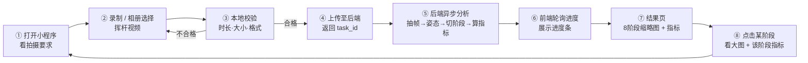
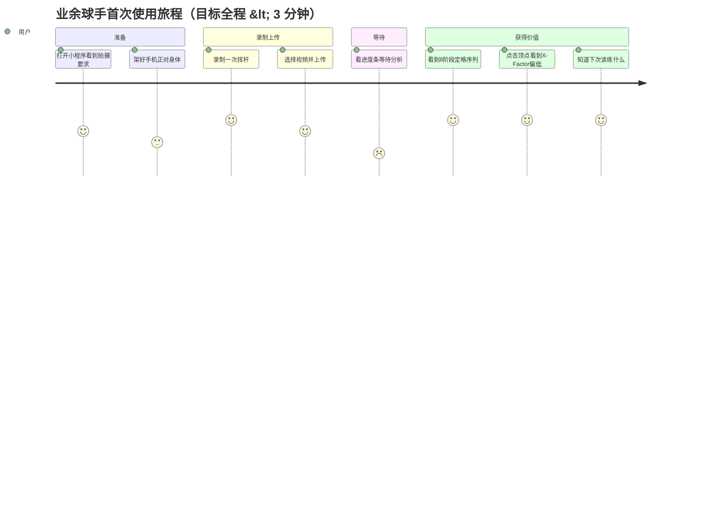
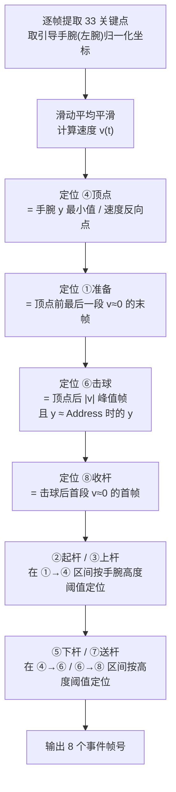

# 高尔夫挥杆分析小程序 —— MVP 产品需求文档 (PRD)

| 项 | 内容 |
|---|---|
| 文档版本 | v1.0 |
| 产品经理 | 许清楚 |
| 项目代号 | `golf_swing_analyzer` |
| 文档语言 | 简体中文 |
| 前端技术栈 | 原生微信小程序（WXML / WXSS / JS，无构建步骤） |
| 后端技术栈 | Python + MediaPipe Pose（BlazePose，33 关键点，CPU 推理） |
| 阶段模型 | 经典 8 阶段 |
| 文档状态 | 待架构师评审 |

> **本文档的第一原则：这是 MVP。**
> 本文档的核心职责不是"列出能做什么"，而是**明确不做什么**。
> 任何未出现在 P0 表格中的功能，本期一律不做。

---

## 1. 产品目标

### 1.1 一句话定义

> 用户用手机拍一段自己的挥杆视频，上传后 30 秒内拿到一份**按 8 个挥杆阶段拆解的姿态数据报告**——每个阶段一张定格图 + 2~4 个关键身体角度指标 + 与业余球手参考范围的对比。

### 1.2 MVP 要验证的三件事

| # | 待验证假设 | 验证方式 | 成功信号 |
|---|---|---|---|
| G1 | **技术可行性**：单目手机视频 + MediaPipe，能否稳定切出 8 个阶段并算出可信的身体角度 | 用 20 段真实业余挥杆视频跑通 | 阶段切分人工目视正确率 ≥ 70%，指标无明显离谱值 |
| G2 | **价值感知**：把"挥杆"从一段模糊的视频变成"8 张定格图 + 数字"，用户是否觉得有用 | 用户看完结果页后的主观反馈 | 用户能说出"原来我在顶点时肩膀只转了 X 度" |
| G3 | **闭环体验**：上传→分析→看结果这条链路的耐受度 | 埋点/观察完成率 | 从选视频到看到结果的流失率 < 30%，等待时长可接受 |

### 1.3 明确的非目标（本期不验证）

- ❌ 不验证商业化（不做付费、不做会员）
- ❌ 不验证留存（不做历史记录、不做进步曲线）
- ❌ 不验证社交（不做分享、不做排行榜）
- ❌ 不追求专业级测量精度（不对标 TrackMan / GEARS，定位是"方向性参考"）

### 1.4 设计参考

| 参考产品 | 借鉴的核心交互 | 本期是否采纳 |
|---|---|---|
| **GolfSwings** | 结果页顶部**横向阶段缩略图序列**，点击缩略图切换下方大图与指标 | ✅ 采纳，作为结果页主交互 |
| **GolfSwings** | 每个定格帧上叠加**骨架线 + 角度标注** | ⚠️ 简化采纳：仅叠加骨架线，角度以文字卡片展示（P0）；帧上画角度弧线推 P1 |
| **AI Golf** | 上传前的**拍摄引导**（人形轮廓框、机位提示） | ⚠️ 简化采纳：仅做静态图文提示，不做实时轮廓框（P0）；实时引导推 P1 |
| **AI Golf** | 与职业球手同屏对比 | ❌ 本期不做，推 P1（需要职业样本库） |

---

## 2. 核心用户故事

| # | 用户故事 | 对应闭环环节 | 优先级 |
|---|---|---|---|
| **US-1** | 作为一名**业余高尔夫球手**，我想要**用手机拍下或从相册选择我的挥杆视频并上传**，以便**不需要任何额外硬件就能开始分析** | 录制/选择 → 上传 | P0 |
| **US-2** | 作为一名**业余球手**，我想要**系统自动把我的挥杆切分成 8 个标准阶段并给我每个阶段的定格画面**，以便**我能看清自己在每个关键节点的身体形态，而不用自己一帧帧拖进度条** | 分析 → 展示 | P0 |
| **US-3** | 作为一名**看不懂自己动作的球手**，我想要**每个阶段都给出具体的身体角度数字（如顶点时肩转 78°、X-Factor 24°）**，以便**把"感觉不对"变成可量化的问题** | 分析 → 展示 | P0 |
| **US-4** | 作为一名**没有教练的自学球手**，我想要**知道我的每个数字相对业余球手参考范围是偏高、偏低还是正常**，以便**判断哪个阶段最该优先改进** | 展示 | P0 |
| **US-5** | 作为一名**首次使用的用户**，我想要**在拍摄前就知道机位该怎么放、拍多长**，以便**一次拍对，不因为视频不合格白等一轮分析** | 录制/选择 | P0 |

---

## 3. MVP 最小闭环定义

### 3.1 闭环链路（这条线之外的一切都不做）



### 3.2 闭环边界表

| 环节 | 做什么（P0 范围内） | **明确不做** |
|---|---|---|
| ① 引导 | 一屏静态图文说明机位与拍摄要求 | 实时人形轮廓框、AR 引导、教学视频 |
| ② 录制/选择 | `wx.chooseMedia` 拍摄或选相册，单个视频 | 多视频批量、视频裁剪、慢动作录制控制 |
| ③ 校验 | 时长 / 大小 / 格式 前端拦截 | 画质检测、光线检测、人物是否入镜检测 |
| ④ 上传 | 单文件上传，返回 `task_id` | 断点续传、分片上传、后台上传 |
| ⑤ 分析 | 全帧姿态提取 → 8 阶段切分 → 指标计算 → 关键帧截图 | 球杆检测、球路追踪、多人物区分、左手球手适配 |
| ⑥ 等待 | 轮询任务状态 + 进度百分比 | 分析完成推送通知、后台静默分析 |
| ⑦⑧ 展示 | 8 阶段横向缩略图（带骨架叠加）+ 点击查看该阶段指标卡片 | 视频回放、逐帧拖动、双人对比、慢放、导出报告 |

### 3.3 用户旅程



---

## 4. 需求池

### 4.1 P0 —— 必须有（闭环必需，缺任一项则闭环断裂）

| ID | 需求 | 说明 | 验收要点 |
|---|---|---|---|
| **P0-01** | 拍摄引导页 | 静态图文：**正面机位（face-on）**、手机竖持、全身入镜、距离 2~3m、建议 60fps | 首页可见，不可跳过阅读区域 |
| **P0-02** | 视频选择/录制 | `wx.chooseMedia`，支持相册选择与现场拍摄 | 两种来源均可成功取到本地临时路径 |
| **P0-03** | 本地视频校验 | 时长 2~15s、大小 ≤ 20MB、格式 mp4 | 不合格给出明确中文提示并阻止上传 |
| **P0-04** | 视频上传 + 任务创建 | 上传成功后端返回唯一 `task_id` | 弱网下有失败提示与重试按钮 |
| **P0-05** | 逐帧姿态提取 | MediaPipe Pose 提取 33 关键点（含 world 3D 坐标） | 关键点缺失率 < 10% 的视频判为可分析 |
| **P0-06** | 关键点平滑 | 对关键点序列做滑动平均滤波，抑制抖动 | 指标曲线无明显毛刺 |
| **P0-07** | **8 阶段自动切分** | 基于手腕轨迹/速度的启发式规则定位 8 个事件帧 | 见 §6.2 切分规则；人工目视正确率 ≥ 70% |
| **P0-08** | **阶段姿态指标计算** | 按 §6.3 表格，为 8 个阶段各算 2~4 个指标 | 每个阶段返回完整指标数组 |
| **P0-09** | 全程指标计算 | 节奏比、总时长、头部最大位移（§6.4） | 3 项全部返回 |
| **P0-10** | 关键帧截图 + 骨架叠加 | 8 个事件帧各导出 1 张 JPG，叠加骨架连线 | 图片可通过 URL 访问 |
| **P0-11** | 异步任务与状态查询 | 任务状态机：`pending / processing / success / failed`，带 progress | 前端可轮询获取 |
| **P0-12** | 分析中页 | 进度条 + 文案，失败时给出可读原因 | 超时（>120s）自动判失败 |
| **P0-13** | **结果页 - 阶段序列** | 顶部横向可滑动的 8 阶段缩略图，当前选中态高亮 | 点击切换，默认选中「顶点」 |
| **P0-14** | **结果页 - 大图区** | 展示当前选中阶段的骨架叠加大图 + 阶段名 + 帧序号/时间 | 切换缩略图时同步更新 |
| **P0-15** | **结果页 - 指标卡片** | 展示当前阶段 2~4 个指标：名称、实测值、参考范围、状态标签 | 状态标签三态：偏低 / 正常 / 偏高 |
| **P0-16** | 结果页 - 全程指标条 | 底部展示节奏比、总时长、头部最大位移 | 常驻显示 |
| **P0-17** | 异常兜底 | 未检测到人 / 未检测到有效挥杆 / 视频过暗 → 明确文案 + 重拍入口 | 不出现白屏或英文报错 |

> **P0 克制说明**：本期**不做微信登录**。`task_id` 保存在小程序内存/`storage` 中，关掉即失效——这是刻意的取舍，因为"留存"不在 MVP 验证目标内。不做登录省去了账号体系、鉴权、数据归属三块工作量。

### 4.2 P1 —— 应该有（下一迭代）

| ID | 需求 | 推迟理由 |
|---|---|---|
| P1-01 | 微信登录 + 历史记录列表 | 留存不是 MVP 验证目标，但是第二迭代的基础 |
| P1-02 | 骨架叠加的**完整慢放视频**回放 | 闭环靠 8 张定格图已成立，视频渲染增加后端耗时与存储 |
| P1-03 | 定格帧上直接绘制**角度弧线与数值** | 文字卡片已能传达信息，帧上绘制是体验增强 |
| P1-04 | 与**职业球手基准**同屏对比 | 需先建职业样本库，成本高 |
| P1-05 | 拍摄时**实时人形轮廓引导框** | 静态图文已能保证大部分用户拍对 |
| P1-06 | **左手球手**支持（关键点镜像归一化） | 右手球手覆盖绝大多数用户 |
| P1-07 | **侧面机位（down-the-line）**支持 + 挥杆平面分析 | 需要第二套指标体系，本期只支持正面 |
| P1-08 | 阶段切分**手动微调**（用户拖动修正事件帧） | 依赖 P0 切分准确率的实测结果再决定 |
| P1-09 | 使用 SwingNet / 时序模型替换启发式切分 | 需训练数据与模型部署，先用启发式验证价值 |
| P1-10 | 进步曲线（多次挥杆指标趋势） | 依赖 P1-01 历史记录 |

### 4.3 P2 —— 可以有（远期）

| ID | 需求 | 说明 |
|---|---|---|
| P2-01 | AI 教练文字点评（自然语言诊断建议） | 基于指标偏差生成人话建议，需规则库或 LLM |
| P2-02 | 球杆检测与杆头轨迹追踪 | 支撑「手腕滞后角 / 挥杆平面」等高阶指标 |
| P2-03 | 重心/压力分布估算 | 单目视频只能粗估，精度存疑 |
| P2-04 | 挥杆结果分享卡片 / 社交 | 增长功能 |
| P2-05 | 针对性训练动作推荐与打卡 | 完整训练闭环 |
| P2-06 | 付费/会员体系 | 商业化 |

---

## 5. 关键页面与交互

### 5.1 页面清单（**只有 3 个页面**）

| # | 页面 | 路由 | 职责 |
|---|---|---|---|
| 1 | 首页 / 上传页 | `pages/index/index` | 拍摄引导 + 选择视频 + 上传 |
| 2 | 分析中页 | `pages/analyzing/analyzing` | 轮询进度、失败兜底 |
| 3 | 结果页 | `pages/result/result` | 8 阶段序列 + 大图 + 指标 |

> **交互克制说明**：阶段详情**不单独开页**，通过结果页内点击缩略图**原地切换**大图与指标卡片。少一个页面 = 少一套状态传递 = 少一半 bug。

### 5.2 页面 1：首页 / 上传页

```
┌──────────────────────────────┐
│  ⛳ 挥杆分析                   │
├──────────────────────────────┤
│                              │
│   ┌────────────────────┐     │
│   │                    │     │
│   │   [ 机位示意图 ]     │     │
│   │    手机 ↔ 2~3m ↔ 人  │     │
│   │                    │     │
│   └────────────────────┘     │
│                              │
│  拍摄要求                      │
│  ● 正面机位：镜头正对身体（面向你）│
│  ● 手机竖持固定，不要手持晃动     │
│  ● 全身入镜，头顶与球杆均不出画   │
│  ● 距离 2~3 米                 │
│  ● 时长 2~15 秒，只拍一次挥杆    │
│  ● 建议 60fps 以上（拍摄设置）   │
│                              │
│  ┌──────────┐  ┌──────────┐  │
│  │ 📹 拍摄   │  │ 🖼 从相册 │  │
│  └──────────┘  └──────────┘  │
│                              │
│  ┌────────────────────────┐  │
│  │  已选：swing_01.mp4      │  │
│  │  时长 6.2s · 12.4MB  ✓  │  │
│  └────────────────────────┘  │
│                              │
│  ┌────────────────────────┐  │
│  │      开始分析            │  │
│  └────────────────────────┘  │
└──────────────────────────────┘
```

**交互说明**

| 元素 | 行为 |
|---|---|
| 拍摄 / 从相册 | 调 `wx.chooseMedia({mediaType:['video'], maxDuration:15})` |
| 已选文件卡片 | 选中后出现，展示时长/大小，校验通过显示 ✓，不通过显示 ✗ + 红色原因 |
| 开始分析 | 未选视频或校验失败时置灰不可点；点击后上传，显示上传百分比，成功后跳转分析中页并带 `task_id` |

### 5.3 页面 2：分析中页

```
┌──────────────────────────────┐
│  ← 分析中                     │
├──────────────────────────────┤
│                              │
│         ⛳                    │
│      （挥杆动画 loading）      │
│                              │
│   ████████████░░░░░  62%     │
│                              │
│      正在识别挥杆阶段...        │
│                              │
│   ① 上传完成          ✓       │
│   ② 提取身体关键点     ✓       │
│   ③ 识别 8 个挥杆阶段   ◐      │
│   ④ 计算姿态指标        ○      │
│                              │
│   预计还需 12 秒               │
│                              │
└──────────────────────────────┘
```

**交互说明**

| 场景 | 行为 |
|---|---|
| 正常 | 每 1.5s 轮询一次任务状态，更新进度条与步骤态 |
| 成功 | `redirectTo` 结果页（用 redirect 避免返回时回到 loading） |
| 失败 | 进度区替换为失败图标 + 中文原因 + 「重新拍摄」按钮 |
| 超时 | 累计 120s 未完成，前端主动判失败 |

**失败文案对照表（P0-17）**

| 后端错误码 | 用户可见文案 |
|---|---|
| `NO_PERSON` | 没有检测到人物，请确保全身在画面内后重拍 |
| `NO_SWING` | 没有识别到完整的挥杆动作，请拍摄从站位到收杆的完整过程 |
| `TOO_DARK` | 画面过暗，建议在光线充足的环境下拍摄 |
| `LOW_QUALITY` | 人物识别不稳定，请固定手机、避免遮挡后重拍 |
| `TIMEOUT` / 其他 | 分析失败了，请稍后重试 |

### 5.4 页面 3：结果页 ⭐（核心页面）

```
┌────────────────────────────────────────┐
│  ← 挥杆分析结果                          │
├────────────────────────────────────────┤
│ ← 横向滑动 ─────────────────────────→   │
│ ┌──┐┌──┐┌──┐┌━━┓┌──┐┌──┐┌──┐┌──┐      │
│ │👤││👤││👤│┃👤┃│👤││👤││👤││👤│      │
│ └──┘└──┘└──┘┗━━┛└──┘└──┘└──┘└──┘      │
│  准备 起杆 上杆 顶点 下杆 击球 送杆 收杆   │
│  ①   ②   ③  【④】 ⑤   ⑥   ⑦   ⑧      │
├────────────────────────────────────────┤
│                                        │
│        ┌──────────────────┐            │
│        │                  │            │
│        │   ╱│╲  骨架叠加   │            │
│        │    │   定格大图    │            │
│        │   ╱ ╲             │            │
│        │                  │            │
│        └──────────────────┘            │
│                                        │
│   ④ 顶点 (Top)      第 37 帧 · 0.62s   │
├────────────────────────────────────────┤
│  本阶段关键指标                          │
│                                        │
│  ┌──────────────────────────────────┐  │
│  │ 肩部转动角          78°    ⚠偏低 │  │
│  │ 参考 85~95°  ├───●────┤          │  │
│  ├──────────────────────────────────┤  │
│  │ 髋部转动角          56°    ⚠偏高 │  │
│  │ 参考 40~50°  ├─────●──┤          │  │
│  ├──────────────────────────────────┤  │
│  │ X-Factor(肩髋分离)  22°    ⚠偏低 │  │
│  │ 参考 35~45°  ├●─────┤            │  │
│  ├──────────────────────────────────┤  │
│  │ 引导臂伸直度       162°    ✓正常 │  │
│  │ 参考 155~175° ├──●───┤           │  │
│  └──────────────────────────────────┘  │
├────────────────────────────────────────┤
│  全程指标                                │
│  节奏比 2.1:1 │ 总时长 1.28s │ 头部位移 6% │
├────────────────────────────────────────┤
│  ┌──────────────────────────────────┐  │
│  │        再分析一次                  │  │
│  └──────────────────────────────────┘  │
└────────────────────────────────────────┘
```

**交互说明**

| 元素 | 行为 |
|---|---|
| **阶段缩略图序列** | 横向 `scroll-view`，8 张等宽缩略图；当前选中项加粗边框 + 底部阶段名高亮；默认选中 **④ 顶点**（信息量最大的阶段） |
| 点击缩略图 | 无页面跳转，原地更新大图 + 帧信息 + 指标卡片；切换有 150ms 淡入过渡 |
| **大图区** | 骨架叠加后的定格 JPG，宽度撑满，高度按比例；点击可全屏预览（`wx.previewImage`） |
| **指标卡片** | 每张卡：指标名 / 实测值（大字号）/ 状态标签 / 参考范围 + 迷你区间条（`●` 标出用户所处位置） |
| 状态标签配色 | 偏低 `⚠` 橙色 · 正常 `✓` 绿色 · 偏高 `⚠` 橙色 · 严重偏离 `✗` 红色 |
| 全程指标条 | 常驻底部，不随阶段切换变化 |
| 再分析一次 | `redirectTo` 回首页 |

---

## 6. 挥杆阶段与姿态指标定义 ⭐（本产品的核心价值）

### 6.1 8 阶段定义

采用经典 8 阶段模型，与学术界 GolfDB 8 事件标准对齐（便于后续 P1-09 引入 SwingNet 模型时无缝替换）。

| # | 中文名 | 英文名 | GolfDB 对应事件 | 定义（判定标志） |
|---|---|---|---|---|
| ① | 准备 | Address | Address | 挥杆开始前身体静止的最后一帧 |
| ② | 起杆 | Takeaway | Toe-Up | 球杆首次与地面平行（近似：引导手腕首次达到髋部高度） |
| ③ | 上杆 | Backswing | Mid-Backswing | 引导臂与地面平行（近似：手腕达到肩部高度且仍在上行） |
| ④ | 顶点 | Top | Top | 手腕轨迹最高点 / 上行转下行的速度反向点 |
| ⑤ | 下杆 | Downswing | Mid-Downswing | 下杆过程中引导臂再次与地面平行（近似：手腕回落至肩部高度） |
| ⑥ | 击球 | Impact | Impact | 手腕回到接近 Address 高度且水平速度达到峰值 |
| ⑦ | 送杆 | Follow-through | Mid-Follow-Through | 击球后球杆再次与地面平行（近似：手腕越过身体升至髋部高度） |
| ⑧ | 收杆 | Finish | Finish | 挥杆结束后身体重新静止的第一帧 |

### 6.2 阶段切分规则（MVP 启发式，P0-07）

> 本期**不引入深度学习时序模型**，采用基于手腕轨迹的启发式规则。这是刻意的取舍：先用低成本方案验证价值假设 G2/G3，切分准确率不足再走 P1-09。



**兜底规则**：若 ①④⑥⑧ 四个锚点中任一无法定位 → 返回 `NO_SWING`；若仅 ②③⑤⑦ 定位失败 → 按区间比例（如 ①→④ 的 35% / 70% 处）兜底取帧，并在返回结果中标记 `estimated: true`。

### 6.3 各阶段姿态指标表 ⭐⭐

**测量口径统一说明**

| 指标 | 计算口径（基于 MediaPipe world landmarks 3D 坐标） |
|---|---|
| 肩部转动角 | 左右肩连线向量投影到水平面，相对 Address 时肩线的夹角 |
| 髋部转动角 | 左右髋连线向量投影到水平面，相对 Address 时髋线的夹角 |
| X-Factor | 肩部转动角 − 髋部转动角 |
| 脊柱倾角 | （双肩中点 → 双髋中点）向量与铅垂线的夹角 |
| 引导臂伸直度 | 左肩–左肘–左腕三点夹角（180° = 完全伸直） |
| 后臂弯曲角 | 右肩–右肘–右腕三点夹角 |
| 头部位移 | 鼻尖关键点相对 Address 位置的位移，**以肩宽归一化后按 %** 表示 |
| 骨盆水平位移 | 双髋中点相对 Address 位置的水平位移，以肩宽归一化按 % 表示（**重心转移的代理指标，非力板实测**） |
| 膝部弯曲角 | 髋–膝–踝三点夹角 |

> ⚠️ **符号约定**：转动角以「背对目标方向为正」，即上杆为正值、过击球后转向目标为负值/开放角。开放角在展示时取绝对值并标注"开放"。

---

#### ① 准备 Address —— 基准帧

| 指标 | 业余参考范围 | 说明 |
|---|---|---|
| 脊柱倾角（前倾/侧倾） | **30°~40°**（前倾，经验值） | 正面机位主要可测侧倾；侧倾应向远离目标方向 **5°~10°** |
| 站姿宽度比（双踝距 / 肩宽） | **1.0 ~ 1.3** | 铁杆偏窄、木杆偏宽 |
| 肩线水平倾角 | **5° ~ 12°**（右肩略低于左肩，右手球手） | 过大易造成起身/上挑 |
| 膝部弯曲角 | **160° ~ 172°** | 微屈，过直易失衡、过屈易起身 |

> Address 同时作为后续所有"相对 Address"指标的**零点基准帧**。

---

#### ② 起杆 Takeaway

| 指标 | 业余参考范围 | 说明 |
|---|---|---|
| 肩部转动角 | **25° ~ 35°** | 起杆应由肩带动，非手臂单独抬起 |
| 髋部转动角 | **8° ~ 18°** | 下盘应保持相对稳定 |
| 头部位移 | **< 4%** 肩宽 | 起杆阶段头部应几乎不动 |
| 引导臂伸直度 | **165° ~ 178°** | 保持"三角形"，早期弯肘是常见毛病 |

---

#### ③ 上杆 Backswing

| 指标 | 业余参考范围 | 说明 |
|---|---|---|
| 肩部转动角 | **55° ~ 72°** | 持续加载 |
| 髋部转动角 | **25° ~ 38°** | 应显著小于肩转 |
| 后臂弯曲角（右肘） | **95° ~ 125°** | 右肘正常折叠，过直会导致上杆过平 |
| 引导臂伸直度 | **155° ~ 175°** | 开始允许轻微弯曲 |

---

#### ④ 顶点 Top ⭐ 信息量最大的阶段（默认选中）

| 指标 | 业余参考范围 | 职业对照 | 说明 |
|---|---|---|---|
| **肩部转动角** | **70° ~ 88°** | 90° ~ 105° | 业余普遍转肩不足 |
| **髋部转动角** | **45° ~ 60°** | 40° ~ 45° | 业余普遍**转髋过度**（下盘失去抗扭） |
| **X-Factor（肩髋分离度）** | **20° ~ 35°** | 42° ~ 50° | **本产品最具诊断价值的单一指标**；业余因"肩转不足 + 髋转过度"双重失误导致 X-Factor 显著偏低 |
| 引导臂伸直度 | **150° ~ 172°** | 165° ~ 178° | 顶点弯肘（"chicken wing"）是典型业余特征 |

> 数据来源：GolfTEC / TPI 3D 动作捕捉公开数据（PGA 巡回赛球员平均肩转 90°+、髋转 45°、X-Factor 约 45°；业余常见肩转 70~80°、髋转 55~60°）。

---

#### ⑤ 下杆 Downswing

| 指标 | 业余参考范围 | 说明 |
|---|---|---|
| 髋部转动角（回转中） | **10° ~ 30°**（仍在背向侧，正在快速回转） | 髋部应**领先于**肩部启动 |
| 肩部转动角 | **45° ~ 65°** | 应明显滞后于髋部 |
| **X-Factor 保持率** | **≥ 85%**（相对顶点值） | 职业球员在下杆初期 X-Factor **不降反增**；业余常在此处过早释放 |
| 骨盆水平位移（向目标） | **+4% ~ +12%** 肩宽 | 重心转移的代理指标 |

---

#### ⑥ 击球 Impact ⭐ 结果决定性阶段

| 指标 | 业余参考范围 | 职业对照 | 说明 |
|---|---|---|---|
| **髋部开放角** | **15° ~ 30°**（开放） | 35° ~ 45° | 业余髋部打开不足，导致"用手打球" |
| 肩部方正度 | **−5° ~ +12°** | 接近 0° ~ 10° | 正值=已打开，负值=仍闭合 |
| **脊柱倾角变化量**（相对 Address） | **< +8°** | < +3° | **起身量（early extension）**；业余常 +10°~18°，是打薄/打厚/剃头的头号原因 |
| 骨盆水平位移（向目标） | **+10% ~ +20%** 肩宽 | +18% ~ +25% | 重心前移的代理指标 |

---

#### ⑦ 送杆 Follow-through

| 指标 | 业余参考范围 | 说明 |
|---|---|---|
| 髋部开放角 | **40° ~ 60°** | 持续释放 |
| 肩部转动角（开放） | **35° ~ 60°** | 应超过击球时 |
| 后臂伸展度（右肘） | **150° ~ 172°** | 双臂应充分伸展，"缩手"是能量泄漏信号 |
| 脊柱侧倾（向远离目标） | **10° ~ 20°** | 正常的后倾，帮助向上击球 |

---

#### ⑧ 收杆 Finish

| 指标 | 业余参考范围 | 说明 |
|---|---|---|
| 髋部朝向目标角 | **75° ~ 95°** | 应基本正对目标 |
| 肩部转动角（总开放） | **85° ~ 110°** | 完整释放 |
| 骨盆水平位移（向目标） | **+20% ~ +35%** 肩宽 | 重心完全转移至前脚的代理指标 |
| 收杆平衡保持时长 | **≥ 0.8s**（身体关键点位移 < 阈值） | 站不稳 = 挥杆失衡的直接证据 |

### 6.4 全程指标（P0-09，常驻结果页底部）

| 指标 | 计算方式 | 参考范围 | 说明 |
|---|---|---|---|
| **节奏比 Tempo** | （①准备→④顶点 帧数）/（④顶点→⑥击球 帧数） | **3.0 : 1**（职业标准）<br/>业余常见 **2.0 ~ 2.5 : 1** | 业余普遍下杆过急 |
| **挥杆总时长** | ①准备 → ⑧收杆 秒数 | **1.0s ~ 1.6s** | 经验值 |
| **头部最大位移** | 全程鼻尖相对 Address 的最大位移 / 肩宽 | **< 8%** | 超过则视为"晃头" |

### 6.5 参考范围的产品声明

> 所有参考范围均为**业余球手经验值**，来源为公开的高尔夫教学与 3D 动捕研究资料，**非医学或专业教学标准**。
> 结果页需在底部展示免责文案：
> *「以上数据基于单目视频姿态估算，仅供动作参考，存在测量误差，不构成专业教学建议。」*

---

## 7. 结果数据结构（示意，供架构师细化）

```jsonc
{
  "task_id": "abc123",
  "status": "success",
  "video_meta": { "fps": 60, "duration": 6.2, "width": 720, "height": 1280 },
  "global_metrics": {
    "tempo_ratio": 2.1,        // 节奏比
    "swing_duration": 1.28,    // 秒
    "max_head_drift_pct": 6.0  // % 肩宽
  },
  "phases": [
    {
      "index": 4,
      "key": "top",
      "name_cn": "顶点",
      "name_en": "Top",
      "frame_index": 37,
      "timestamp": 0.62,
      "estimated": false,           // true = 未精确定位，按比例兜底
      "image_url": "https://.../abc123/top.jpg",
      "metrics": [
        {
          "key": "shoulder_turn",
          "name": "肩部转动角",
          "value": 78.0,
          "unit": "°",
          "ref_min": 70.0,
          "ref_max": 88.0,
          "status": "low"           // low | normal | high
        }
        // ... 2~4 个
      ]
    }
    // ... 共 8 个
  ]
}
```

---

## 8. 验收标准

### 8.1 功能验收（逐条可测）

| # | 验收项 | 通过标准 |
|---|---|---|
| AC-01 | 视频来源 | 相册选择与现场拍摄两条路径均可成功上传 |
| AC-02 | 校验拦截 | 上传 >15s 视频、>20MB 视频、非 mp4 文件，均被前端拦截并给出中文提示 |
| AC-03 | 闭环连通 | 从首页选视频到结果页展示完整数据，**无需任何人工介入**，全流程可重复 10 次不中断 |
| AC-04 | 阶段完整性 | 结果页必定返回且仅返回 **8 个阶段**，每个阶段均有截图与 ≥2 个指标 |
| AC-05 | 阶段切分准确率 | 用 20 段真实业余挥杆视频测试，人工目视判定「阶段定位基本正确」的比例 **≥ 70%**；其中 ①④⑥⑧ 四个锚点准确率 **≥ 85%** |
| AC-06 | 指标合理性 | 全部指标值落在物理可能范围内（角度 0~180°），无 `NaN` / `null` / 负时长 |
| AC-07 | 骨架叠加 | 8 张截图均可见骨架连线，且骨架贴合人体（无明显错位） |
| AC-08 | 交互正确性 | 点击任一缩略图，大图、帧信息、指标卡片三者**同步**更新，无残留上一阶段数据 |
| AC-09 | 状态标签 | 指标值低于 `ref_min` 显示「偏低」、高于 `ref_max` 显示「偏高」、区间内显示「正常」，配色正确 |
| AC-10 | 异常兜底 | 分别上传「无人物视频」「静止站立视频」「全黑视频」，均返回 §5.3 对照表中的对应中文文案，**不白屏、不出现英文报错栈** |
| AC-11 | 免责声明 | 结果页底部可见免责文案 |

### 8.2 性能验收

| # | 指标 | 目标值 |
|---|---|---|
| AC-P1 | 端到端分析耗时（6s / 60fps 视频，CPU 单核推理） | **P95 ≤ 30s** |
| AC-P2 | 上传耗时（15MB，4G 网络） | P95 ≤ 15s |
| AC-P3 | 结果页首屏渲染 | ≤ 1.5s |
| AC-P4 | 分析任务超时判定 | 120s |

### 8.3 MVP「做完了」的判定

> ✅ **同时满足以下三条即视为 MVP 完成：**
> 1. AC-01 ~ AC-11 **全部通过**
> 2. AC-P1 ~ AC-P4 **全部达标**
> 3. 邀请 **≥ 5 名真实业余球手**各完整走通一次闭环，其中 ≥ 4 人能在不被提示的情况下，**自主说出至少一条关于自己挥杆的具体发现**（验证目标 G2）

---

## 9. 待确认问题

| # | 问题 | 背景与影响 | 我的倾向性建议 | 需谁拍板 |
|---|---|---|---|---|
| **Q1** | **机位只支持正面（face-on）是否可接受？** | 正面机位便于自拍、可测肩髋转动与头部位移；但**脊柱前倾角、挥杆平面**在侧面机位（down-the-line）才准。两套机位 = 两套指标体系，工作量翻倍 | **MVP 只支持正面**，侧面推 P1-07。文案中明确要求正面 | 用户 |
| **Q2** | **只支持右手球手是否可接受？** | 左手球手需对关键点做镜像归一化。虽改动不大，但需额外测试样本 | **MVP 只支持右手**，首页明确标注；左手推 P1-06 | 用户 |
| **Q3** | **对拍摄帧率的强制程度？** | 击球瞬间极快，30fps 下 Impact 帧极易漏采（相邻帧手腕位移过大）。但强制 60fps 会劝退部分低端机用户 | **建议 60fps 但不强制**；后端检测到 fps < 30 时在结果页顶部提示「帧率偏低，击球阶段定位可能不准」 | 用户 |
| **Q4** | **不做登录，用户关掉小程序结果就丢失，能接受吗？** | 这是 P0 最激进的一刀。好处是省掉账号/鉴权/数据归属三块工作 | **MVP 接受丢失**。若用户强烈反对，最低成本折中方案是：仅用 `wx.setStorage` 在本地存最近 1 条结果，仍不做服务端账号 | 用户 |
| **Q5** | **阶段切分准确率若低于 70% 怎么办？** | 启发式规则在真实业余视频上可能表现不佳（业余动作变形大、有预摆动作 waggle） | 预留 Plan B：①降级为只输出 **①④⑥⑧ 四个锚点阶段**（信息量仍够用）；②或提前启动 P1-09 引入 SwingNet。**建议先做 20 段视频的可行性验证再进入正式开发** | 架构师 + 用户 |
| **Q6** | **视频与截图的存储策略与保留期？** | 涉及存储成本与用户隐私（人像数据） | 建议：原视频分析完**立即删除**，仅保留 8 张截图，保留 **7 天**后自动清理。需在小程序内告知用户 | 用户 + 架构师 |
| **Q7** | **参考范围是否需要按用户身高/年龄/差点分层？** | 目前是"一刀切"的业余经验值，对高龄或柔韧性受限用户可能不公平 | **MVP 不分层**，统一使用业余经验值 + 免责声明。分层推 P2 | 用户 |
| **Q8** | **是否需要在小程序内提供"示例视频/示例报告"？** | 首次用户在没拍视频前无法感知产品价值，可能直接流失 | 建议 P0 补一个**极低成本版本**：首页放 1 张静态的示例报告截图。若认可，加入 P0-01 | 用户 |
| **Q9** | **并发与部署形态？** | MVP 阶段预计并发极低，是否需要任务队列（Celery/RQ）还是单进程串行即可 | 建议单机 + 轻量任务队列，不上 K8s | 架构师 |

---

## 10. 附录：术语表

| 术语 | 解释 |
|---|---|
| **X-Factor** | 肩髋分离度 = 肩部转动角 − 髋部转动角。衡量身体"上紧发条"的程度，是挥杆力量的核心来源 |
| **Early Extension（起身）** | 下杆/击球时脊柱前倾角减小、身体向上直起，业余球手最常见的失误之一 |
| **Tempo（节奏比）** | 上杆耗时 : 下杆耗时，职业球员普遍接近 3:1 |
| **Chicken Wing（鸡翅）** | 引导臂在顶点或击球后过度弯曲的动作缺陷 |
| **Face-on / Down-the-line** | 正面机位（镜头正对球手身体）/ 侧面机位（镜头沿目标线方向） |
| **BlazePose** | MediaPipe Pose 使用的姿态估计模型，输出 33 个人体关键点，支持 2D 图像坐标与 3D world 坐标 |
| **GolfDB** | CVPR 2019 发布的高尔夫挥杆视频数据集，定义了 8 个标准挥杆事件，是本产品阶段模型的对齐基准 |

---

**文档结束** · 有任何需求边界上的争议，以「是否属于 §3.1 最小闭环」为唯一判断标准。
