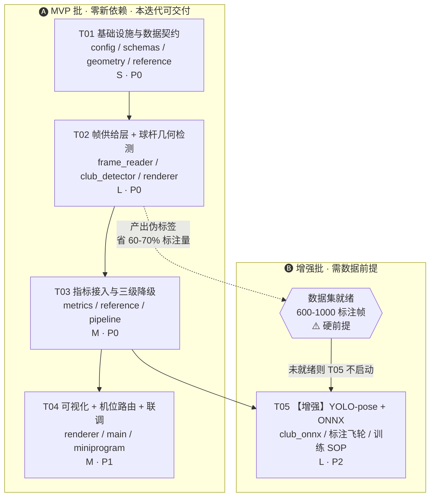

# 球杆检测（Club Detection）技术方案与架构评审

> 作者：高见远（架构师） ｜ 版本：v1.0 ｜ 状态：待主理人 / PM 决策
> 范围：为 `swing_plane`（挥杆平面）等侧面机位指标提供**真实球杆几何量**，替代「引导腕–肩连线」代理。
> 本文不修改任何源文件，仅为设计与任务分解。

---

## 0. 总体结论（一句话）

**球杆检测可行，但业界没有可直接下载的"球杆检测模型"——推荐"路径 A（手腕锚定 ROI + Hough 杆身拟合 + 帧差杆头互补）先上 MVP，零新依赖、CPU 增量 < 1 秒、可立刻交付带三级降级的侧面 `swing_plane`；同时把路径 A 复用为半自动标注引擎，攒够数据后再演进到路径 B（YOLOv8-pose → ONNX Runtime）"；`pose_landmarker.task` 与球杆检测完全无关，姿态层维持 MediaPipe legacy，不迁移。**

---

## 1. 关键澄清：`pose_landmarker.task` 帮不上球杆检测

必须先纠正一个高成本的误解，避免用户白折腾：

| 事实 | 说明 |
|---|---|
| MediaPipe Pose Landmarker（BlazePose GHUM）的**模型输出头是固定的 33×(x, y, z, visibility, presence)** | 33 个槽位在模型结构里就写死了，全部是人体解剖点（鼻/眼/耳/肩/肘/腕/手指/髋/膝/踝/脚），**没有第 34 个槽位留给球杆** |
| `lite` / `full` / `heavy` 三个 variant 只是骨干网宽度不同 | 是**精度 vs 速度**的权衡，不会多出任何新的检测目标 |
| 训练数据里没有"球杆"这个类别 | 即使球杆在画面里，模型也只会把它当背景 |

**结论：下载 `pose_landmarker.task` 对球杆检测的贡献 = 0。** 用户能访问外网这件事，真正的价值不在于"下 `.task`"，而在于：
1. 能下载 **YOLOv8/v11 的 COCO 预训练权重**（路径 B 的训练起点）；
2. 能访问 Roboflow Universe 等社区数据集（路径 B 的冷启动数据）；
3. 能在本地/Colab GPU 上跑训练（ECS 是 CPU-only，**绝对不要在 ECS 上训练**）。

### 1.1 关于"顺便把姿态层从 legacy 迁到 Tasks API"

**技术结论：不迁。** 主理人的判断正确，我从技术层面确认四条理由：

1. **模型是同一个。** legacy `mp.solutions.pose(model_complexity=1)` 与 Tasks API 的 `pose_landmarker_full.task` 是同一族 BlazePose GHUM 权重，33 点定义完全一致，**精度无实质差异**。迁移的收益为零。
2. **会引入部署资产管理负担。** 当前 legacy 的 `.tflite` 捆绑在 wheel 内部，**零外网依赖**是已验证的强优势（`pose_extractor.py` 的 docstring 已把这条写成硬约束）。Tasks API 要求外置 `.task` 文件 → 新增路径配置、镜像打包、版本漂移三类风险。
3. **会打翻已标定的阈值基线。** `config.py` 第 4 区那 20 多个经验阈值（`V_STILL` / `V_PEAK_MIN` / `IMPACT_Y_TOL` / `MIN_WRIST_TRAVEL` / `FALLBACK_RATIO` …）全部是在**当前姿态输出的数值分布**上标定出来的。Tasks API 的 VIDEO 模式需要显式喂单调时间戳，其内部平滑策略与 legacy 的 `smooth_landmarks=True` 行为不同 → 输出分布会漂移 → `segmenter` 与 `metrics` 需要**全量重新标定 + 回归**。这是纯成本、零收益的操作。
4. **迁移的正确触发条件目前一条都不满足。** 应当迁移当且仅当出现：(a) 需要多人检测；(b) 有 GPU 可用、想用 GPU delegate；(c) 需要 Tasks 独有的新特性；(d) mediapipe 必须升到 legacy 已被移除的版本。

> **建议**：把这条记入技术债台账 `docs/ADR-001-club-detection.md`，写明"维持 legacy + 上述 4 个触发条件"，避免以后反复讨论。

---

## 2. 候选路径对比

### 2.1 对比总表

| 维度 | **A｜经典 CV 几何** | **B｜自训 YOLO-pose + ONNX** | **C｜运动最快非人体点** | **D｜找现成研究模型** |
|---|---|---|---|---|
| **可行性** | ⭐⭐⭐⭐ 高（依赖拍摄条件） | ⭐⭐⭐⭐⭐ 最高（有数据的前提下） | ⭐⭐ 单独用不可靠 | ⭐ 无可交付资产 |
| **是否需要新数据** | 否 | **是（硬前提，600–1000 标注帧）** | 否 | — |
| **是否需要新依赖** | 否（opencv 已在） | 是（`onnxruntime`，约 50MB） | 否 | — |
| **CPU 耗时（单帧，ECS 单核）** | 1.5 – 4 ms（400×400 ROI 内 Canny+HoughLinesP） | imgsz=320：25–45 ms<br>imgsz=640：80–150 ms | 0.8 – 2 ms（absdiff + 形态学 + 连通域） | — |
| **CPU 耗时（整任务增量）** | 稀疏 8–40 帧：**0.05–0.2 s**<br>稠密 480 帧：1–2 s | 挥杆窗口 120 帧 @320：**3–6 s**<br>@640：10–18 s<br>全片 480 帧 @640：40–70 s ❌ 挤爆预算 | 全片 480 帧：< 1 s | — |
| **内存增量** | ≈ 0 | RSS **+120–250 MB / session**（2 并发 → +250–500 MB） | ≈ 0 | — |
| **与现有管线耦合度** | **低**：直接吃 `FrameLandmarks.norm[15/16]`（手腕）作锚点，与 `metrics` 同一坐标系 | 中：新增独立推理模块 + 模型资产 + session 生命周期管理 | 低 | — |
| **鲁棒性短板** | 杂乱背景 / 低对比 / 杆头被身体遮挡 / **下杆高速段运动模糊使直线消失** | 需覆盖训练分布外的场景（新球场、逆光、异型杆） | 极易跟丢；背景有人走动即失效 | — |
| **主要风险** | 拍摄条件依赖强，需写入拍摄指引 | **数据获取是唯一且致命的前提**；训练需 GPU；ECS 内存吃紧 | 单独作主方案会大量误检 | 交付不确定性极高 |
| **推荐度** | ⭐⭐⭐⭐⭐ **MVP 首选** | ⭐⭐⭐⭐ **增强批（有数据才启动）** | ⭐⭐⭐ **作为 A 的互补分支，不单独使用** | ⭐ 不推荐作交付路径 |

### 2.2 路径 D 补充说明（诚实交代学术现状）

- 学术界确有球杆追踪研究（如基于 Hough / 粒子滤波 / 端到端回归的 golf club tracking），也有 **GolfDB**（挥杆事件分类）、**SwingNet** 等公开工作——但**它们标注的是人体与挥杆事件，不是球杆关键点**。
- Roboflow Universe 上有零星社区 "golf club" 数据集，**多为 bbox 而非 2 关键点，且大量是静态商品图/展示图而非挥杆帧**，域差距大。
- **可用但仅作加速项**：拿社区数据做预训练底座，再用自有挥杆数据微调（路径 B 的冷启动）。
- **不存在**可直接下载即用的 `.task` / ONNX 球杆检测资产。**不推荐把路径 D 列入交付计划。**

---

## 3. 推荐方案

### 3.1 推荐组合：`A + C 互补` 做 MVP → 用 A 产伪标签 → `B` 做增强

```
阶段一（MVP，本迭代可交付）
  路径 A（Hough 杆身）为主 + 路径 C（帧差杆头）为辅，按帧速度自动切换分支
  → 侧面机位 swing_plane 系列指标上线，带三级降级
  → 零新依赖、零模型资产、CPU 增量 < 1s

阶段二（数据飞轮，与阶段一并行，不阻塞交付）
  用阶段一的检测器在【理想拍摄条件】样本上跑伪标签 → 人工修正 → 数据集 v1

阶段三（增强，需数据到位后启动）
  YOLOv8n-pose（单类 club，2 关键点 grip_end / club_head）
  → GPU 训练 → 导出 ONNX → ECS 用 onnxruntime 推理
  → config.CLUB_MODE 从 "geom" 切到 "onnx"，管线不动
```

### 3.2 为什么 A 和 C 必须组合（这是本方案的核心论点）

两者的失效区间**恰好互补**：

| 挥杆区间 | 杆身状态 | Hough（A） | 帧差（C） |
|---|---|---|---|
| Address / Takeaway / Top（低速） | 杆身清晰锐利 | ✅ 强 | ❌ 弱（几乎无运动） |
| Downswing / Impact（高速，> 30 m/s 杆头） | **严重运动模糊，直线边缘被抹掉** | ❌ 弱 | ✅ 强（运动残影反而勾勒出杆的扫过区域） |
| Follow-through / Finish | 中速，常被身体遮挡 | ⚠️ 中 | ⚠️ 中 |

实现上以 `SwingSignals.speed`（已有的手腕速度信号）为门控：`speed < V_STILL*3` 走 Hough 分支，否则走帧差分支，两者结果统一进时序滤波器。**这个 speed 信号现成就有，`segmenter.build_signals()` 已产出，零额外成本。**

### 3.3 为什么路径 A 是路径 B 的"标注引擎"（推荐 A→B 演进的最强论据）

手工标注 600–1000 帧的球杆 2 关键点，按每帧 15–25 秒算是 **4–7 人时**，且枯燥易错。而路径 A 在**良好光照 + 简单背景**的样本上准确率相当高，可以：

1. 用路径 A 批量跑出伪标签，直接导出 YOLO-pose txt 格式；
2. 人工只做**修正**而非从零标注（每帧 3–5 秒）；
3. 训练 v1 → 用 v1 在困难样本上预标 → 再修正 → v2。

**保守估计可砍掉 60–70% 的标注工作量。** 这意味着即使最终目标是路径 B，先做路径 A 也不是浪费——它是路径 B 的必要基础设施。

---

## 4. 管线集成设计

### 4.1 插入位置：`segmenter` 之后、`metrics` 之前

```
step1 校验     probe_video / check_brightness
step2 姿态     pose_extractor.extract          ← 第 1 趟全量解码
step3 切分     segmenter.segment_swing
      ┌──────────────────────────────────────────────────────┐
step4 │ ★ frame_reader.grab(video, 目标帧号集合)  ← 第 2 趟解码 │
      │ ★ club_detector.detect(frames_bgr, landmarks, signals)│
      │   metrics.build_context(..., club=club_track)          │
      │   metrics.compute_phase_metrics / compute_global       │
      │   renderer.render_events(..., frames_bgr, club)  ← 复用上面已解码的帧│
      └──────────────────────────────────────────────────────┘
```

#### ⚠️ 关键设计决策：新增 `frame_reader.py`，把解码趟数控制在 2 趟不变

**问题**：`pose_extractor.extract()` 逐帧解码后**只保留 33 点、丢弃像素**；`renderer.render_events()` 又独立做了第 2 趟解码。球杆检测需要像素，天真做法会引入**第 3 趟解码**（10s / 1080p 视频约 +2–5 s）。

**方案**：抽出 `backend/app/frame_reader.py`，提供 `grab_frames(video_path, frame_indices) -> Dict[int, np.ndarray]`——把 `renderer.render_events()` 里那段"顺序 grab / 命中才 retrieve"的逻辑上提为公共工具，由 `club_detector` 和 `renderer` **共享同一次解码结果**。

**收益**：
- 解码趟数 **2 趟不变**，球杆检测的 I/O 成本 = 0；
- 顺带消除 `renderer` 里的重复逻辑，降低圈复杂度；
- `renderer` 从"自己开 VideoCapture"变成"接收帧字典"，**可测试性大幅提升**（现有 `test_pipeline_e2e.py` 需要真视频，改造后可注入合成帧）。

**帧号集合怎么定**：
- **稀疏模式（MVP 默认）**：8 个事件帧 + 每个事件帧前后各 1 帧（用于时序一致性校验）= 最多 24 帧。
- **窗口模式（swing_plane 需要轨迹拟合时）**：额外补 `[Top, Impact]` 区间等间隔 24 帧。合计 ≤ 48 帧，Hough 成本仍 < 0.2 s。

> 备选方案（**不推荐**）：给 `pose_extractor.extract()` 加 `frame_sink` 回调，在第 1 趟解码时顺带做球杆检测。虽然更省，但会把球杆逻辑塞进那个已经明确声明"只做姿态"的模块，破坏单一职责，且被迫对全部 480 帧做检测（浪费）。**不采纳。**

### 4.2 `club_detector.py` 算法设计（路径 A + C）

```
输入：{frame_index: BGR图}, List[FrameLandmarks], SwingSignals, VideoMeta, CameraView
输出：ClubTrack（每帧 grip / head 像素坐标 + confidence）
```

**Step 1｜握把锚点（免费，已有数据）**
`grip_px = midpoint(wrist_L_px, wrist_R_px)`，来自 `norm[15]` / `norm[16]`，换算方式复用 `metrics._img_pt()` 的口径。

**Step 2｜杆长先验（⚠️ 侧面机位不能用 S_px，这是本次评审的重要发现）**

现有 `metrics.image_shoulder_width_px()` 用**图像肩宽**作标尺。但 **DTL（侧面）机位下双肩几乎与相机光轴共线，投影肩宽被严重压缩**，全片都压缩 → 现有那个"< 0.6×90分位就回落"的守卫也救不了（因为 90 分位本身就是压缩值）。

**必须新增 DTL 专用标尺：图像身高**
```
body_height_px = |y(NOSE) − y(midpoint(L_ANKLE, R_ANKLE))| （Address 帧）
club_len_px ≈ (0.52 ~ 0.66) × body_height_px
```
（依据：成人身高 1.75 m 时，7 号铁 ≈ 0.94 m → 0.54×身高；一号木 ≈ 1.14 m → 0.65×身高。）

face-on 机位仍可用 `S_px`，换算为 `club_len_px ≈ (2.0 ~ 2.8) × S_px`（肩宽 ≈ 0.25×身高）。

**Step 3｜ROI 构造（时序预测收窄搜索区）**
- Address 帧：以 grip 为顶点，向下方开 `1.2 × club_len_px` 的扇形（±45°）。
- 后续帧：搜索方向 = 上一帧杆身方向 + 手腕速度方向 的一阶预测，扇形收窄到 ±25°。**时序预测是鲁棒性的最大来源，务必实现，不要写成逐帧独立检测。**

**Step 4｜杆身检测（Hough 分支，低速段）**
```
ROI 灰度 → CLAHE 对比度增强 → Canny → HoughLinesP(
    minLineLength = 0.35 × club_len_px,
    maxLineGap    = 0.10 × club_len_px )
```
候选线段筛选（4 道过滤，缺一不可）：
1. 线段延长线到 `grip_px` 的垂距 < `0.08 × club_len_px`（杆身必过握把）；
2. 方向与时序预测夹角 < 25°；
3. **排除与人体骨架段近似共线者**（肩-肘、肘-腕、髋-膝、膝-踝）——否则手臂和腿会被当成杆身，这是最高频的误检来源；
4. **排除落在人体粗掩膜内部者**——用 `geometry.SKELETON_EDGES` 连成多边形后膨胀得到粗掩膜，**零成本**。
   > 不建议开 `POSE_KW["enable_segmentation"]=True` 拿精细掩膜：会让 MediaPipe 单帧推理耗时 +15% 左右（全片 480 帧约 +3–5 s），性价比不划算。

最优线段 = argmax(线段长度 × 平均边缘强度 × 时序一致性)。

**Step 5｜杆头定位**
沿最优杆身方向从 `grip_px` 外推 `club_len_px`，在落点 `0.15 × club_len_px` 邻域内做局部精修（找亮度峰 / 边缘端点——杆头多为金属高光）。

**Step 6｜帧差分支（高速段，路径 C）**
`speed[i] >= 3 × V_STILL` 时启用：
```
absdiff(frame[i], frame[i-1]) → 阈值化 → 形态学闭运算
→ 扣除人体粗掩膜（膨胀后）
→ 保留距 grip_px 在 [0.4, 1.3] × club_len_px 环带内的连通域
→ 取面积最大者的质心作为 clubhead 候选，grip→候选 连线即杆身方向
```

**Step 7｜时序平滑与置信度**
- 对 `(grip, head)` 序列做插值 + 滑动平均，**直接复用 `pose_extractor.moving_average()` 与 `_interpolate_missing()` 的实现套路**，保持代码风格一致；
- 每帧 `confidence ∈ [0,1] = f(投票得分, 与预测方向的一致性, 边缘强度)`；
- `ClubTrack.overall_confidence` = 关键帧（①④⑤⑥）confidence 的中位数——这是降级策略的判据。

### 4.3 双机位：正面与侧面的杆面倾角**定义不同**

**必须明确：`swing_plane` 是侧面（DTL）专属指标，正面（face-on）无法定义。** PDD v2.0 已经这样划分，从物理上完全正确，理由如下。

#### 物理含义与近似假设（必须写进免责声明）

真实的"挥杆平面"是**三维空间中一个近似包含杆身运动轨迹的平面**。单目 2D 视频没有相机标定，**无法恢复真实三维平面**。可行的是"投影角近似"：

- **DTL 机位下，相机光轴大致沿目标线方向 → 挥杆平面近似 edge-on（侧看成一条线）→ 平面的二维投影角 ≈ 真实平面倾角。** 这正是所有高尔夫教学都从 DTL 机位量平面角的原因。
- **face-on 机位下，挥杆平面几乎正对相机（face-on）→ 投影成一个大椭圆弧，倾角信息完全丢失。** 强行从正面算"平面角"没有物理意义。

**四条必须显式声明的近似假设：**
1. 结果是**投影角**，非真实空间角；无相机标定，不可宣称绝对精度。
2. 假设 DTL 机位光轴与目标线夹角 < 15°。**经验：机位每偏离 10–15°，角度误差约 3–8°。**
3. 需要"地平线"参考。DTL 下双踝前后重叠，**不能用踝连线定地平线** → **改用图像水平线，即强制要求"手机保持水平、不倾斜、不俯拍"**，这条必须写进小程序拍摄指引，并建议在结果图上画一条淡色水平参考线让用户自查。
4. 本方案检测的是**杆头质心的投影位置**，与**杆面角度（open/closed face）无关**。杆面角需要更高分辨率 + 杆面朝向检测，**明确排除在本方案范围外**，避免产品侧过度承诺。

#### 指标定义建议（侧面机位）

| key | 阶段 | 定义 | 参考区间（建议，待 PM 与教练确认） |
|---|---|---|---|
| `shaft_angle_address` | ① Address | 杆身线与图像水平线夹角（原始平面 / base plane） | 50–62°（铁杆） |
| `shaft_plane_dev_top` | ④ Top | 顶点杆身延长线相对 base plane 线的偏离；正 = over plane / across the line，负 = laid off | −8 ~ +8° |
| **`swing_plane`** | ⑤ Downswing | 下杆段杆头轨迹拟合直线的倾角 相对 base plane 的偏差（负 = shallow，正 = steep / over the top） | −5 ~ +10° |
| `shaft_lean_impact` | ⑥ Impact | 击球瞬间杆身相对铅垂线前倾角（前压量） | +5 ~ +15°（铁杆） |

**正面机位可选补充（非本次 MVP 必需）**：`clubhead_arc_width`（顶点杆头到脊柱轴的水平距 / 肩宽，衡量上杆宽度）。

### 4.4 数据结构改动清单

#### `schemas.py`（新增）
```python
class CameraView(str, Enum):
    FACE_ON = "face_on"
    DOWN_THE_LINE = "down_the_line"

class MetricSource(str, Enum):
    MEASURED  = "measured"   # 球杆真实检测
    PROXY     = "proxy"      # 代理估算（腕-肩连线）
    REFERENCE = "reference"  # 现有 _sanitize 的 ref_mid 兜底

@dataclass
class ClubDetection:            # 单帧
    frame_index: int
    grip:  Optional[np.ndarray]  # (2,) 像素坐标
    head:  Optional[np.ndarray]  # (2,) 像素坐标
    confidence: float            # 0~1
    method: str                  # "hough" | "flowdiff" | "onnx" | "interp"

@dataclass
class ClubTrack:                # 全片
    detections: Dict[int, ClubDetection]
    club_len_px: float
    overall_confidence: float
    available: bool
```

#### `schemas.py`（修改）
- `StageMetric` 新增：`estimated: bool = False`、`source: MetricSource = MEASURED`、`confidence: Optional[float] = None`
  （与现有 `PhaseResult.estimated` 语义对齐，前端复用同一个"估算"角标组件）
- `VideoMeta` 新增：`camera_view: CameraView = FACE_ON`

#### `reference.py`（修改）
- `MetricSpec` 新增两个字段：
  - `views: FrozenSet[CameraView] = {FACE_ON, DTL}` —— 该指标适用的机位
  - **`allow_drop: bool = False`** —— 计算失败时是否允许**整项剔除**而不是填 `ref_mid`

#### `metrics.py`（修改）
- `MetricContext` 新增：`club: Optional[ClubTrack] = None`、`view: CameraView`、`body_height_px: float`
- 新增 `m_shaft_angle_address` / `m_shaft_plane_dev_top` / `m_swing_plane` / `m_shaft_lean_impact`
- **`_sanitize()` 必须为 `allow_drop=True` 的指标豁免"填 ref_mid"行为**（见 §4.5，这是产品级的坑）
- `build_context()` 签名扩展

#### `geometry.py`（新增纯函数）
`line_angle_from_horizontal()` / `point_line_distance()` / `project_along()` / `angle_between_lines()` / `fit_line_2d()` / `body_height_px()` / `skeleton_polygon_mask()`

#### `renderer.py`（修改，**建议做，显著提升结果可读性**）
- 新增 `_draw_club(img, detection)`：画杆身线段（亮黄 `(0, 220, 255)`，线宽 3）+ 杆头实心圆（半径 6，白描边）
- 检测置信度低时改画**虚线**并在标签追加 `~`（如 `#5 f88 1.47s ~club`），让用户一眼看出这张是估算
- 建议在 DTL 机位额外画一条淡色水平参考线（自查手机是否倾斜）
- **入参改为接收已解码帧字典**（配合 §4.1 的 `frame_reader`）

#### `pipeline.py`（修改）
- 插入球杆检测环节；进度重新分段
- ⚠️ **`TaskStatusView.step` 保持 1–4 不变**（前端 4 步进度条是既有契约，加第 5 步会破坏 UI）。球杆检测并入 **step 4 的前半段**，只改 `message` 为"正在检测球杆..."。建议分段：
  ```
  step1  0 → 8     step2  8 → 58    step3  58 → 70
  step4  70 → 78 检测球杆 → 88 指标 → 96 渲染 → 100
  ```

#### `main.py`（修改）
- 上传接口新增可选参数 `view: "face_on" | "down_the_line" | "auto"`（默认 `auto`）

#### 附赠：机位自动判定（路径 A 的免费副产品，双特征投票）
1. **画幅先验（弱）**：`width > height`（横持）→ 倾向 DTL；竖持 → 倾向 face-on。
2. **肩宽压缩比（强）**：Address 帧 `图像肩宽 / 图像身高`。face-on 约 0.22–0.28；DTL 因双肩前后重叠会掉到 **< 0.13**。
两特征一致则采信，冲突时以用户显式选择优先，`auto` 且冲突则回落 face-on 并加 warning。

### 4.5 失败兜底：三级降级策略

现有机制盘点：`SwingEvent.estimated` → `PhaseResult.estimated`；`_sanitize()` 遇 NaN 填 `spec.ref_mid` + `ctx.warn()`；`ctx.warnings` → `AnalysisResult.warnings`。

> ### 🔴 评审发现（重要）：现有 `_sanitize` 的"填 ref_mid"行为对 `swing_plane` 有害
> `metrics._sanitize()` 目前遇 NaN 会填参考区间中值，于是 `reference.judge()` 必然返回 `NORMAL`。
> 对已跑通的 23 个指标这是合理兜底（它们的失败概率极低）。但 `swing_plane` 的失败概率**本质上就高**（遮挡/模糊/机位不对），一旦沿用该行为，**用户会看到一个绿色的"正常"假值**——这是会直接伤害产品信任的坑，必须豁免。

**三级降级（按 `ClubTrack.overall_confidence` 判定）：**

| 级别 | 触发条件 | 行为 | 前端表现 |
|---|---|---|---|
| **L0 measured** | `conf ≥ CLUB_CONF_MIN`（建议 0.55） | 用真实球杆几何量计算 | 正常显示，参与评分 |
| **L1 proxy** | `0.25 ≤ conf < 0.55`，或球杆缺失但腕/肩关键点齐全 | **回退「引导腕–肩连线倾角」代理**（PM 原 S 级方案）；参考区间**放宽 ±5°**；`estimated=True`、`source=PROXY` | 显示值 + **"估算"角标** + tooltip 说明物理含义打折；**不参与总分**或降权 |
| **L2 unavailable** | `conf < 0.25`，或机位判定为 face-on（`swing_plane` 不适用） | **整项从该阶段 metrics 列表中剔除**（`allow_drop=True` 生效），并追加 `warnings`：「球杆识别不清，本次未给出挥杆平面数据，建议在光线充足、背景简洁的环境下重拍侧面机位」 | 该项**不出现**在指标列表；warnings 区显示提示 |

**降级绝不失败整个任务。** 球杆检测的任何异常都必须被 `club_detector` 内部吞掉并返回 `ClubTrack(available=False)`，**禁止抛 `AnalysisError`**——挥杆分析的主链路（23 个已有指标）不能被一个增量特性拖垮。这条要写成模块级硬约束。

---

## 5. 依赖与任务分解

### 5.1 依赖包

| 包 | 版本 | 批次 | 说明 |
|---|---|---|---|
| `opencv-python-headless` | 已装 | MVP | Canny / HoughLinesP / CLAHE / absdiff **全部已有，无需新增** |
| `numpy` | 1.26.4 已装 | MVP | 锁定不动 |
| **`onnxruntime`** | `>=1.17,<2` | 增强 | 仅路径 B 需要；走清华镜像；约 50 MB |
| ~~`ultralytics`~~ / ~~`torch`~~ | — | **不装到 ECS** | **仅训练机（本地/Colab GPU）使用**。torch CPU wheel > 200 MB，会吃爆 ECS 磁盘与内存，且推理只需 ONNX |

> **MVP 批次的新增依赖数 = 0。** 这是推荐路径 A 先行的关键工程理由。

**ONNX 部署注意事项（增强批必读）：**
- Session **必须做模块级单例 + lazy init**，否则每个任务重复加载模型 + 分配 arena。
- 设 `intra_op_num_threads = 1~2`。当前 `MAX_CONCURRENT_TASKS = 2`，两个任务各开满线程会导致 CPU 争抢反而更慢。
- 开启 ONNX 后**建议把 `MAX_CONCURRENT_TASKS` 降到 1**，或在 session 外加互斥锁。
- 全片跑 ONNX（480 帧 @640 ≈ 40–70 s）会挤爆 `TASK_TIMEOUT_SEC = 120` 的预算（MediaPipe 本身已占 15–30 s）→ **只在挥杆窗口跑，采样至 ≤ 120 帧**。

### 5.2 任务列表（5 个任务，按依赖排序）

#### 🅐 MVP 批（路径 A + C，本迭代可交付）

---

**T01｜基础设施与数据契约** — 工作量 **S** — 优先级 P0 — 依赖：无

| 项 | 内容 |
|---|---|
| **改动文件** | `backend/app/config.py`（新增第 8 区「球杆检测参数」）<br>`backend/app/schemas.py`（`CameraView` / `MetricSource` / `ClubDetection` / `ClubTrack`；`StageMetric` 加 `estimated`/`source`/`confidence`；`VideoMeta` 加 `camera_view`）<br>`backend/app/geometry.py`（7 个新纯函数）<br>`backend/app/reference.py`（`MetricSpec` 加 `views` / `allow_drop`） |
| **新文件** | `docs/ADR-001-club-detection.md`（记录：维持 legacy 的决策 + 4 个迁移触发条件 + 单目投影角的近似假设） |
| **验收** | 全部新增为**向后兼容默认值**，现有 23 指标与全部单测**零回归**；`pytest backend/tests` 全绿 |

**新增 config 常量清单**：
`CLUB_ENABLED` / `CLUB_MODE`("geom"\|"onnx"\|"off") / `CLUB_LEN_RATIO_DTL`(0.52, 0.66) / `CLUB_LEN_RATIO_FACEON`(2.0, 2.8) / `CLUB_ROI_FAN_DEG`(45, 25) / `CLUB_HOUGH_MIN_LEN_RATIO`(0.35) / `CLUB_HOUGH_MAX_GAP_RATIO`(0.10) / `CLUB_GRIP_DIST_RATIO`(0.08) / `CLUB_DIR_TOL_DEG`(25) / `CLUB_CONF_MIN`(0.55) / `CLUB_CONF_PROXY_MIN`(0.25) / `CLUB_SPEED_SWITCH`(3.0×V_STILL) / `CLUB_COLOR`(0,220,255) / `CLUB_THICKNESS`(3) / `CLUB_ONNX_PATH` / `CLUB_ONNX_IMGSZ`(320) / `VIEW_SHOULDER_RATIO_DTL`(0.13) / 新 warning 文案

---

**T02｜帧供给层重构 + 球杆几何检测核心** — 工作量 **L** — 优先级 P0 — 依赖：T01

| 项 | 内容 |
|---|---|
| **新文件** | `backend/app/frame_reader.py`（`grab_frames()` 公共工具，从 renderer 上提）<br>`backend/app/club_detector.py`（路径 A Hough 分支 + 路径 C 帧差分支 + 时序预测 + 平滑 + 置信度）<br>`backend/tests/test_club_detector.py`（合成用例：画一条已知角度的直线，验证回归角度误差 < 2°；含全遮挡/纯黑/无杆的降级用例） |
| **改动文件** | `backend/app/renderer.py`（改为消费 `frame_reader` 产出，不再自己开 VideoCapture）<br>`backend/tests/test_pipeline_e2e.py`（适配新签名） |
| **验收** | 解码趟数**保持 2 趟**（用日志或计数断言）；48 帧检测耗时 < 0.5 s；`club_detector` **任何异常都不外抛**，统一返回 `available=False` |

---

**T03｜指标接入与三级降级** — 工作量 **M** — 优先级 P0 — 依赖：T01, T02

| 项 | 内容 |
|---|---|
| **改动文件** | `backend/app/metrics.py`（`MetricContext` 扩展；4 个 `m_shaft_*` / `m_swing_plane` 函数；**`_sanitize` 为 `allow_drop` 豁免填中值**；`compute_phase_metrics` 支持整项剔除；`build_context` 扩展）<br>`backend/app/reference.py`（新增 4 条 `MetricSpec`，`views={DTL}`, `allow_drop=True`）<br>`backend/app/pipeline.py`（插入球杆检测；进度重分段；**`step` 保持 ≤ 4**）<br>`backend/tests/test_reference_metrics.py`（补三级降级用例） |
| **验收** | L0/L1/L2 三条路径各有单测；face-on 视频**不出现** `swing_plane` 项且不报错；导入期自检（`METRIC_FUNCS` vs `all_metric_keys()`）通过 |

> ⚠️ 工程师注意：`metrics.py` 底部有**导入期自检**——`reference` 里出现的每个 key 必须在 `METRIC_FUNCS` 里有实现，否则 `import app.metrics` 直接 `RuntimeError`。加 spec 和加 func 必须同一个 commit。

---

**T04｜可视化、机位路由与端到端联调** — 工作量 **M** — 优先级 P1 — 依赖：T03

| 项 | 内容 |
|---|---|
| **改动文件** | `backend/app/renderer.py`（`_draw_club()` 杆身线段 + 杆头点；低置信画虚线；DTL 画水平参考线）<br>`backend/app/main.py`（上传接口加 `view` 参数）<br>`backend/app/pose_extractor.py`（**仅新增**机位自动判定辅助函数，不动主流程）<br>`miniprogram/`（结果页 `estimated` 角标 + warnings 展示 + 拍摄指引补"手机保持水平/侧面机位"）<br>`docs/ARCHITECTURE.md`（新增 §11 球杆检测） |
| **验收** | 真实侧面挥杆视频端到端跑通，8 张结果图上杆身线段目视合理；总耗时相比现状增量 < 2 s |

---

#### 🅑 增强批（路径 B，**需数据到位后启动，不阻塞 MVP 交付**）

---

**T05｜YOLOv8-pose 球杆模型训练与 ONNX 推理接入** — 工作量 **L** — 优先级 P2 — 依赖：T03（可与 T04 并行）

| 项 | 内容 |
|---|---|
| **新文件** | `backend/app/club_onnx.py`（onnxruntime session 单例 + 前后处理 + NMS + 关键点解码）<br>`.tools/label/export_pseudo_labels.py`（用 T02 检测器批量导出 YOLO-pose txt 伪标签 — **标注飞轮**）<br>`.tools/train/club_pose.yaml` + `.tools/train/README.md`（训练配置与 SOP，明确"在 GPU 机器训练，不在 ECS"）<br>`backend/models/club_pose.onnx`（模型资产，走 git-lfs 或部署时单独下发） |
| **改动文件** | `backend/app/club_detector.py`（按 `CLUB_MODE` 路由 geom / onnx，**对外接口完全不变**）<br>`backend/requirements.txt`（+`onnxruntime>=1.17,<2`）<br>`backend/app/config.py`（ONNX 相关阈值 + 建议 `MAX_CONCURRENT_TASKS` 降至 1） |
| **数据前提** | 单类 `club`，2 关键点 `[grip_end, club_head]`，bbox = 两点外接框 padding 10%；**≥ 30 段挥杆、600–1000 标注帧**，需覆盖 正/侧机位 × 室内/室外/逆光 × 网笼/草地/墙面 × 铁杆/木杆 × 深浅色服装；train/val = 8:2 且**按视频切分**（同一段视频的帧不可跨集，否则指标虚高） |
| **训练** | yolov8n-pose，imgsz=640，epochs 100–150，T4 GPU 约 1–2 小时；导出 `yolo export format=onnx opset=12 simplify=True` |
| **验收** | ONNX 在 ECS 单核推理 ≤ 45 ms/帧（imgsz=320）；关键帧杆头像素误差中位数 < 0.05×身高；`CLUB_MODE` 一键回切 `geom` |

> ⚠️ **数据量提醒**：任务书里提到的"200–500 帧"我判断**偏少**。按每段挥杆抽 8–15 个有效帧算，200 帧只有约 15–25 段，且很可能来自同一场地同一套球杆 → 模型会严重过拟合到单一场景，在新用户视频上崩掉。**建议下限 600 帧 / 30 段以上，且必须跨场景。**

### 5.3 任务依赖图



### 5.4 文件清单汇总

**新增（7）**
```
backend/app/frame_reader.py          共享帧解码工具
backend/app/club_detector.py         球杆检测核心（geom / onnx 路由）
backend/app/club_onnx.py             【增强】ONNX 推理封装
backend/models/club_pose.onnx        【增强】模型资产
backend/tests/test_club_detector.py  单测
.tools/label/export_pseudo_labels.py 【增强】伪标签导出（标注飞轮）
.tools/train/club_pose.yaml + README 【增强】训练 SOP
docs/ADR-001-club-detection.md       架构决策记录
```

**修改（11）**
```
backend/app/config.py            +第 8 区球杆参数（约 18 个常量）
backend/app/schemas.py           +CameraView/MetricSource/ClubDetection/ClubTrack；StageMetric/VideoMeta 扩展
backend/app/geometry.py          +7 个纯几何函数
backend/app/reference.py         MetricSpec +views/+allow_drop；+4 条 swing_plane 系列 spec
backend/app/metrics.py           +club 上下文；+4 个指标函数；_sanitize 豁免逻辑
backend/app/pipeline.py          插入检测环节；进度重分段（step 仍 ≤4）
backend/app/renderer.py          消费 frame_reader；+_draw_club；+水平参考线
backend/app/main.py              上传接口 +view 参数
backend/app/pose_extractor.py    +机位自动判定辅助函数（不动主流程）
backend/requirements.txt         【增强】+onnxruntime
miniprogram/（结果页 + 拍摄指引）  estimated 角标、warnings、侧面机位与手机水平的引导
docs/ARCHITECTURE.md             +§11
```

---

## 6. 待明确事项（决策阻塞项，请主理人 / 用户逐条回复）

| # | 问题 | 为什么关键 | 我的默认建议 |
|---|---|---|---|
| **Q1** 🔴 | **能否提供标注数据集？**（≥ 30 段挥杆 / 600–1000 帧，含 grip-end + club-head 两点，跨场景） | **路径 B 的硬前提。** 不能提供 → T05 直接取消，只交付路径 A | 先按"暂不提供"规划：**MVP 只做路径 A**；同时 T02 内置伪标签导出能力，为将来留门 |
| **Q2** 🔴 | **ECS 规格：vCPU 数 与 可用内存上限？** | 决定能否跑 ONNX：单 session RSS +120–250 MB，叠加 MediaPipe 常驻 250–450 MB，`MAX_CONCURRENT_TASKS=2` 时峰值可能超 1 GB。**2 GB 机器上路径 B 有 OOM 风险** | 若内存 < 4 GB → 开 ONNX 时必须把 `MAX_CONCURRENT_TASKS` 降到 1；路径 A 无此问题 |
| **Q3** 🟡 | **球杆检测覆盖哪些机位？**（仅侧面 / 仅正面 / 两者） | `swing_plane` **物理上只在侧面成立**。若只为 swing_plane，**仅做侧面即可，工作量省 30%+** | **MVP 只做侧面（DTL）**；正面机位的 `clubhead_arc_width` 等留作后续可选项 |
| **Q4** 🟡 | **swing_plane 的精度要求？**（业余参考 ±5–8° / 教练级 ±2°） | 教练级精度**单目无标定相机做不到**，需双目或标定板。若定教练级，方案要重做 | 定位为**业余参考级（±5–8°）**，并在免责声明明确"投影角估算，非真实空间角" |
| **Q5** 🟢 | **要不要借机把姿态层从 legacy 迁到 Tasks API？** | 见 §1.1 | **不迁**（技术层面已确认，理由 4 条）。写入 ADR-001，附 4 个未来触发条件 |
| **Q6** 🟡 | **PDD 的"每阶段 4 个指标"版式是否允许被打破？** | 侧面机位加 `swing_plane` 系列后，某阶段会变成 5 项。是**替换掉某个现有侧面指标**，还是允许 5 项？ | 请 PM 定。**MVP 建议只在 ⑤ Downswing 加 1 项 `swing_plane`**，替换掉侧面版里价值较低的一项，保持 4 项版式 |
| **Q7** 🟡 | **双机位维度改造（`METRIC_SPECS` 加 `CameraView` 维度）由谁排期？** | 这是比球杆检测更底层的结构改动，属于 PDD v2.0 范围。**MVP 用 `MetricSpec.views` 字段过滤即可最小侵入落地，不需要全量重构** | MVP 走最小侵入；全量双机位表重构单独立项，**不并入本次球杆检测范围** |
| **Q8** 🟢 | **能否提供 3–5 段真实侧面机位挥杆样本视频？**（不需标注） | 路径 A 的 Hough / 帧差阈值必须在真实数据上调参，纯合成用例调不出可用参数 | **这是 T02 的实际启动前提**，比 Q1 更紧急。哪怕只有 3 段也够冷启动 |

---

## 7. 风险登记

| 风险 | 等级 | 缓解 |
|---|---|---|
| 路径 A 在杂乱背景/低光下失效率高 | 高 | 三级降级（§4.5）+ 强化拍摄指引 + 结果图画杆身让用户自查；`CLUB_ENABLED=False` 可一键关停 |
| `S_px` 标尺在 DTL 机位失真 | **高（已识别）** | 改用 `body_height_px`（§4.2 Step 2），并在 `image_shoulder_width_px` 加 DTL 分支或明确不在 DTL 使用 |
| `_sanitize` 填中值导致假"正常" | **高（已识别）** | `allow_drop=True` 豁免（§4.5） |
| 引入第 3 趟解码拖慢管线 | 中 | `frame_reader` 共享解码，趟数保持 2（§4.1） |
| ONNX 内存/线程争抢 | 中 | session 单例 + `intra_op_num_threads=1~2` + `MAX_CONCURRENT_TASKS` 降至 1 |
| 路径 B 数据集不足导致过拟合 | 中 | 数据下限提到 600 帧 / 30 段；按视频切分 train/val；伪标签飞轮降低标注成本 |
| 球杆检测异常拖垮主链路 | 中 | 模块级硬约束：**`club_detector` 禁止外抛异常**，统一返回 `available=False` |
| 前端 4 步进度条契约被破坏 | 低 | `step` 保持 ≤ 4，只改 `message`（§4.4） |
