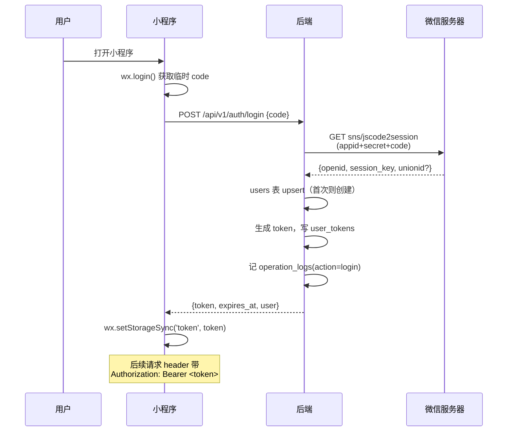

# 微信登录 + 操作记录 实施方案

> 状态：**已评审通过，待实施**（尚未写任何代码）
> 日期：2026-09-05
> 前置依赖：MySQL `golf` 库（`001_init` 已建表，但后端**尚未接入**）

---

## 〇、已确认决策（2026-09-05 评审）

| # | 决策项 | 结论 |
|---|--------|------|
| 1 | **登录时机** | **静默预登录 + 点击时保活 + 失败兜底** —— `onLaunch` 异步预登录；点击「开始分析」时 `ensureLogin()`（token 通常已就绪，零延迟）；任一环节失败一律匿名放行 |
| 2 | **用户信息** | **openid + 用户主动填头像昵称**（2026-09-05 变更） —— 原「仅 openid」已推翻；用微信官方「头像昵称填写能力」（`chooseAvatar` + `nickname` input）。仍**不做手机号绑定** |
| 3 | **HTTPS 现状** | **尚未具备**（HTTP 裸 IP）→ **HTTPS + 备案域名升级为并行 P0**，本方案 M0-M2 只能在开发环境验证 |
| 4 | **操作记录用途** | **日志 + 历史页面都要** —— 日志与任务归属（`tasks.openid`）本期落地，「我的历史」页面排 **M3** |
| 5 | **导航结构** | **tabBar 双 tab**（首页 + 我的）—— 从当前「单入口 + 线性流程」改为双入口；需改 3 处跳转 API |
| 6 | **默认头像**（未设置时） | **首字色块** —— 昵称首字 + `sha256(openid)` 哈希出的确定性配色，纯 WXSS 渲染，零图片资源 |
| 7 | **默认昵称**（未设置时） | **`"球手" + 用户编号`**（如"球手 0007"）—— 用 `users.id` 补零 4 位，绝对唯一 |
| 8 | **修改频率限制** | 头像 **10 次/天** + 昵称 **5 次/天** |
| 9 | **内容安全检测** | **只依赖微信组件内置检测**（基础库 2.24.4+）—— 砍掉服务端 `access_token` 整套，M2.5 工作量减半 |

### 🔴 由决策 9 带来的硬前置：隐私保护指引（有审核等待期）

2023-09-15 起，微信强制要求：**未在《小程序用户隐私保护指引》中声明「用户信息」的，
`chooseAvatar` / `nickname` input 直接禁用**（报
`chooseAvatar:fail api scope is not declared in the privacy agreement`）。

**这是本次方案唯一的外部依赖 + 异步审核项，必须立刻启动**（详见 §7.0）。

### 由决策 2 变更带来的新增范围（原「零 UI」作废）

| 新增 | 说明 |
|------|------|
| 头像上传接口 | `POST /api/v1/user/avatar`（multipart） |
| 头像存储与访问 | 落 `DATA_DIR/avatars/`，复用现有 `/static` 挂载 |
| 资料更新接口 | `POST /api/v1/user/profile`（昵称 + 频率限制） |
| 默认值兜底 | `GET /auth/me` 返回时兜底填充（**不入库**，见 §3.6） |
| 前端资料区 | 「我的」页头像按钮 + 昵称输入框 |

> **已砍掉**（原方案有，决策 9 后删除）：~~`access_token` 管理~~
> （2h 过期 / 每日次数上限 / 并发互踢 / 多进程需集中缓存）、
> ~~服务端 `msgSecCheck` / `imgSecCheck`~~ —— 微信组件已内置，详见 §3.5.3。

> 数据库**无需改表**：`users.nickname` / `avatar_url` 列在 `002_auth.sql` 中已存在，
> 当初保留这两列正好承接本次变更。

### ⚠️ 微信能力边界（易踩坑，务必按现行规则）

| 接口 | 状态 | 说明 |
|------|------|------|
| `wx.getUserProfile` | ❌ **已废弃** | 2022-10 起对所有小程序返回匿名数据（灰色头像 + "微信用户"），**不能用于获取真实头像昵称** |
| `wx.getUserInfo` | ❌ 不可用 | 2021-04 起不再弹窗，只返回匿名数据 |
| `<button open-type="chooseAvatar">` | ✅ **现行方案** | 用户主动点击 → 选微信头像/相册/拍照 → 回调 `e.detail.avatarUrl` |
| `<input type="nickname">` | ✅ **现行方案** | 用户聚焦时键盘上方出现「用微信昵称」快捷填充 |

**三个必须知道的技术细节**：

1. **`chooseAvatar` 返回的是微信临时文件路径**（如 `http://tmp/xxx.png`），
   **有效期短且会失效** —— 必须立即上传到自己服务器，不能直接存这个路径
2. **两个能力都需基础库 2.21.2+**（`app.json` 无需额外配置，但需在真机验证）
3. **它们不是"授权弹窗"** —— 用户点击按钮即触发，无需同意任何 scope，
   这与废弃的 `getUserProfile` 有本质区别

> 平台限制未变的部分：`getPhoneNumber` 仍需**企业主体 + 按次付费**，维持不做。

### 由决策 3 派生的约束（重要）

**本期所有验证只能在开发者工具 + 真机调试下完成**（勾选「不校验合法域名」）。
方案设计必须保证：

- HTTPS 就绪前，代码合入 main **不影响现有线上行为**（登录失败静默降级为匿名）
- `api.js` 的 `BASE_URL` 切换做成**单点配置**，HTTPS 就绪后改一处即可
- M3（「我的历史」页面）**必须等 HTTPS 就绪后再启动**，否则页面在正式版打不开

---

## 一、现状（代码级事实）

| 位置 | 现状 |
|------|------|
| `miniprogram/app.js:21` | `onLaunch` 只有结果缓存恢复，**无登录逻辑** |
| `miniprogram/app.js:10-19` | `globalData` 仅有 taskId / result / lastVideo / cameraView，无用户态 |
| `miniprogram/utils/api.js:13` | `BASE_URL = 'http://127.0.0.1:8000'` —— HTTP 裸 IP |
| `miniprogram/utils/api.js:93` | `request()` 固定 header 只有 `content-type`，**无 token** |
| `miniprogram/utils/api.js:124` | `uploadVideo()` 用 `wx.uploadFile`，**无 token** |
| `miniprogram/app.json:2-6` | 3 个页面（index / analyzing / result），**无登录页、无「我的」页** |
| `backend/app/main.py:39` | `API_PREFIX = "/api/v1"` |
| `backend/app/main.py:207` | `create_task` 入参无用户标识 |
| `backend/app/config.py` | **无任何微信配置** |
| `backend/app/task_store.py:32` | `TaskStore` = 内存 `dict` + `Lock` |
| `miniprogram/project.config.json:51` | appid = `wxa165d2626b823c37` |
| `deploy/mysql/001_init.sql` | `tasks.openid VARCHAR(64) NULL` **已预留**（但后端未回填） |

后端现有 7 个路由（均为双路径注册）：`GET /health`、`POST /task/create`、
`GET /task/status/{id}`、`GET /task/result/{id}`、`GET /task/{id}/frame/{idx}`、
`GET /task/{id}/phase_metrics/{phase}/{idx}`。

---

## 二、目标与非目标

### 目标

1. 用户通过微信身份登录，获得稳定用户标识（`openid`）
2. 分析任务归属到用户
3. 记录用户关键操作（登录 / 上传 / 查看结果 / 微调帧 等）供追溯与分析

### 非目标（评审已确认不做）

- ❌ **手机号绑定** —— 需企业主体 + 按次付费（见 §7.2）
- ❌ 会员 / 付费 / 配额体系
- ❌ 多端账号打通（需开放平台 unionid）
- ❌ 头像裁剪 / 滤镜等编辑能力 —— 仅做压缩，不做自定义编辑

### 后续可选（M3，已确认排期）

- ✅ 「我的」页 + 历史分析列表（见 §八 M3）

---

## 三、总体设计

### 3.1 登录时序



### 3.2 自建登录态（关键安全决策）

**不使用 `session_key` 作为登录态 token** —— `session_key` 可用于解密敏感
数据，一旦下发客户端等于泄露。后端只用它解密（本期不用），**永不出网**。

后端生成 `secrets.token_urlsafe(32)` 随机串作为 token：

| 项 | 方案 |
|----|------|
| 生成 | `secrets.token_urlsafe(32)`（256 bit 熵） |
| 落库 | **存 SHA-256 哈希**，不存明文（库被拖走也无法冒用） |
| 有效期 | 30 天，`expires_at` 落库 |
| 校验 | 每次请求 hash 后查 `user_tokens`（M1 直查库；M2 加内存缓存） |
| 失效 | `revoked=1` 主动踢下线（登出 / 封禁） |
| 续期 | 每次成功校验滑动续期 `last_seen_at`；过期返回 401，前端重新 `wx.login` |

**为什么不用 JWT**：JWT 无法主动失效。MVP 需要「禁用用户立即生效」能力，
且 JWT 引入密钥管理。30 天有效期的服务端 token 更简单可控。

### 3.3 匿名兼容（重要）

现有任务均无 `openid`。方案：

- **登录失败不阻断主流程** —— 微信接口抖动 / 未备案域名下，用户仍能上传分析
- 未登录时 `openid = NULL`，任务照常创建（`tasks.openid` 已可为 NULL）
- 操作日志**照样记录**（`openid` 为 NULL），保证不丢数据
- 后续若补登录，可按 `task_id` 回补归属（需额外接口，本期不做）

这条直接决定了：**登录是增强项，不是硬门槛**。避免微信侧任何异常拖垮核心分析链路
（与项目既有「硬约束：任何失败不能破坏主链路」哲学一致）。

### 3.4 登录时机：预取 + 保活 + 兜底

评审中考虑过「点击『开始分析』时才登录」（即按需登录），经权衡**不采用**：

| 考量 | 结论 |
|------|------|
| 点击后再登录 | ❌ 在最关键的转化动作上增加 200~500ms 网络等待 |
| 登录失败阻断上传 | ❌ 微信接口抖动会让核心功能直接不可用 |
| 登录失败放行 | ❌ 那「要求登录」形同虚设，只剩延迟成本 |
| **越晚登录，孤儿任务越多** | ⚠️ 无 `openid` 的任务不进「我的」历史，用户会困惑「分析过但历史里没有」 |

> **澄清**：`wx.login()` 本身**完全静默、不弹窗**，用户无感知。
> 「要求用户登录」在仅取 openid 的前提下，用户端体验与不登录**完全一致** ——
> 它只是调用时机问题，不是授权问题。真正需要用户点头的是头像昵称/手机号
> （已于决策 2 排除）。

**采用方案（三段式）**：

```
① onLaunch      : 静默预登录（异步、不阻塞 UI、失败静默忽略）
② 点击「开始分析」: await ensureLogin()
                   - token 已就绪 → 立即 resolve（零延迟，占绝大多数）
                   - token 失效   → 现场补登 1 次
③ 仍失败         : 匿名上传放行，绝不阻断
```

**插入点**：`miniprogram/pages/index/index.js:229` `onSubmit()` 开头，
上传前 `await` 一次 `ensureLogin()`，并 `.catch(() => null)` 兜底。

**为什么必须放在点击事件里而非 onLaunch 阻塞**：
`onLaunch` 的登录是「尽力而为」，不能保证在用户点按钮前完成（弱网下可能未回）。
点击事件里再确认一次，才能把归属覆盖率推到接近 100%。

**token 归属覆盖率目标**：≥ 99%（仅微信服务不可用或极端弱网时降级为匿名）。

### 3.5 头像昵称获取（用户主动模式）

#### 交互流程

```
「我的」页资料区
  ├─ 头像：<button open-type="chooseAvatar">  → onChooseAvatar(e)
  │         e.detail.avatarUrl（临时路径）→ wx.uploadFile → 后端存盘 → 返回 URL
  └─ 昵称：<input type="nickname">            → bindblur → 后端校验 → 入库
```

#### 头像上传链路（关键：临时路径必须落地）

```
wxfile://tmp/xxx.png          ← chooseAvatar 回调（临时，会失效）
                              ※ 此步前微信已完成内容安全检测；违规则无回调（见 3.5.3）
   ↓ wx.uploadFile
POST /api/v1/user/avatar      ← multipart，需带 token
   ↓ ① 频率校验（≤10 次/天）
   ↓ ② 大小校验（≤1MB）
   ↓ ③ 格式白名单（png/jpg/jpeg，按 magic bytes 判断，不信扩展名）
   ↓ ④ 压缩 + 转存 DATA_DIR/avatars/{openid_sha256前16}.png
   ↓ ⑤ 更新 users.avatar_url + avatar_updated_at
   ↓ ⑥ 记 operation_logs(action=update_avatar)
返回 {avatar_url: ".../static/avatars/xxx.png?v={updated_at_ts}"}
      ↑ 带版本号穿透前端缓存（见 §3.6）
```

**存储设计**：

| 项 | 方案 |
|----|------|
| 路径 | `DATA_DIR/avatars/{sha256(openid)[:16]}.png` |
| 覆盖写 | 固定文件名，换头像直接覆盖 —— **避免旧文件堆积，无需清理任务** |
| 访问 | 复用现有 `/static` 挂载（`main.py:127`），URL 由 `PUBLIC_BASE_URL` 拼（`pipeline.py:86` 同款逻辑） |
| 格式 | 统一转 PNG 并压缩到 ≤256×256（头像展示尺寸远小于此） |

#### 3.5.3 内容安全检测：只依赖微信组件内置（决策 9）

**关键事实**：基础库 **2.24.4+** 起，微信的头像昵称填写组件**已内置接入
`mediaCheckAsync` / `msgSecCheck`**，检测在微信侧完成。

因此**服务端不再自建 `access_token` + `msgSecCheck` / `imgSecCheck`**。
原方案中的这套（2h 过期 / 每日次数上限 / 并发互踢 / 多进程需集中缓存）**全部删除**，
M2.5 工作量减半。

| 层 | 检测方 | 失败表现 | 我们的处理 |
|----|--------|---------|-----------|
| 头像 | 微信组件 | **不触发 `bindchooseavatar` 事件** | 用户点了没反应 → **必须主动提示**（见下方 UX 坑） |
| 昵称 | 微信组件 | `onBlur` 时异步检测，**清空输入内容** | 前端按"值为空"处理，提示重新填写 |

**服务端仍要做的基础校验**（不涉及内容安全，仅防异常输入）：

| 校验项 | 规则 |
|--------|------|
| 头像大小 | ≤ 1MB（`imgSecCheck` 硬限制，且头像无需高清） |
| 头像格式 | 白名单 png / jpg / jpeg（**按 magic bytes 判断，不信扩展名**） |
| 昵称长度 | 1~32 字符（微信昵称上限 32，含 emoji 按 1 字符计） |
| 昵称字符 | 拒绝纯空白、控制字符 |

> ⚠️ **UX 坑（必须处理）**：头像违规时微信是**静默不回调**，不会给任何错误。
> 若不处理，用户点击选择头像后毫无反应，会认为是 bug。
> 应对：点击后启动 **3 秒超时定时器**，超时仍未收到 `bindchooseavatar`
> 则提示「该图片未通过安全检测，请更换一张」。

> **合规边界说明**：客户端检测理论上可被绕过（直接调 API 上传）。
> 当前头像昵称**仅在本人「我的」页展示，无社区 / 评论 / 分享等 UGC 传播场景**，
> 风险可控。若将来引入 UGC 传播功能，需补服务端 `imgSecCheck` 兜底（见 §7.3）。

#### 3.5.4 已删除的设计（勿重做）

| 原设计 | 删除理由 |
|--------|---------|
| `access_token` 全局缓存 + 并发锁 | 微信组件已内置检测，服务端不再调用安全检测接口 |
| 服务端 `msgSecCheck` / `imgSecCheck` | 同上；且引入「检测接口调用失败 → 阻断保存」的可用性风险 |
| 多进程集中缓存改造 | 依赖 `access_token`，一并消失 |

> 这条变更同时消除了一类**可用性风险**：原方案中「检测接口调用失败也必须阻断保存」
> 意味着微信安全接口一抖，用户就改不了昵称。现在检测失败由微信组件静默处理，
> 服务端链路更短更稳。

#### 时机设计

| 选项 | 结论 |
|------|------|
| 登录后立即弹窗强制填 | ❌ 打断核心体验（`onLaunch` 静默登录，弹窗会突兀） |
| **首次进入「我的」页时引导** | ✅ **推荐** —— 用户已有"这是我的地盘"的心智 |
| 纯自愿不引导 | ⚠️ 覆盖率低，多数用户不会主动填 |

引导做成**可跳过的一次性提示条**（非模态），不强制。

### 3.6 默认值与可修改性（决策 6 / 7 / 8）

#### 核心约束：微信能给的默认值为空

后端首次登录时**拿不到任何真实头像昵称**——微信不会主动推送，两个能力都必须用户点。
所以默认值不是"从微信取一个"，而是**我们自己造一个**。

#### 三层降级

| 层 | 头像 | 昵称 |
|----|------|------|
| 用户已设置 | 显示真实头像图 | 显示用户填的 |
| 已登录未设置 | 首字色块（纯 WXSS） | `"球手" + 用户编号` |
| 未登录 | 灰色占位 | "未登录" |

头像与昵称**独立降级**，用户可能只设置其中一个。

#### 默认头像：首字色块（零图片资源）

- 取昵称首字：中文取第 1 个字 / 英文取首字母大写 / emoji 直接显示 / 空则显示默认图标
- 配色由 `openid` 确定性哈希得出，**同一用户每次一致**：

```python
hue = int(hashlib.sha256(openid.encode()).hexdigest()[:4], 16) % 360
# 深色主题：中饱和度、中等亮度，避免过亮刺眼或过暗看不清
bg = f"hsl({hue}, 55%, 45%)"
```

> **为什么不用图片**：`image` 组件虽支持 SVG，但 SVG 在小程序中不支持百分比单位、
> 不支持 `<style>` 元素，且 WebView / Skyline 渲染有差异。纯 WXSS 圆形色块
> 完全规避这些坑，且零网络请求、零包体积。

#### 默认昵称：`"球手" + users.id`

格式：`"球手 " + f"{user_id:04d}"` → 如 **"球手 0007"**

| 候选 | 评价 |
|------|------|
| **`"球手" + id`** ✅ | 绝对唯一、短、有编号感。代价：早期用户能从编号看出用户量 |
| `"球手" + openid 后 4 位` | 不暴露用户量，但仅 65536 种组合，约 300 用户时 50% 概率重复 |
| 随机高尔夫风昵称 | 有趣但**必须入库**（不可复现），且需维护词库 |

#### 关键设计：默认值**不入库**

`users.nickname` / `avatar_url` **保持空字符串**，由 `GET /auth/me` 返回时兜底填充：

```json
{
  "openid_masked": "oXxx...8F3A",
  "nickname": "球手 0007",
  "avatar_url": null,
  "avatar_text": "球",
  "avatar_color": "hsl(203, 55%, 45%)",
  "is_default_nickname": true
}
```

| 字段 | 用途 |
|------|------|
| `avatar_url` | 真实头像 URL；`null` 表示未设置 → 前端渲染色块 |
| `avatar_text` / `avatar_color` | 色块内容，后端算好，前端只渲染 |
| `is_default_nickname` | 是否仍是默认值 → 用于引导「完善资料」 |

**不入库的三个理由**：

1. 空值本身是有效信息（"用户没设置过"），入库即丢失该语义
2. 将来换默认规则（如改配色算法、改前缀）**无需洗数据**
3. 用 `nickname_updated_at IS NULL` 即可判断"是否用户自己设置的"，**无需加列**

#### 可修改性与频率限制（决策 8）

| 项 | 规则 | 超限提示 |
|----|------|---------|
| 头像 | **10 次/天**，覆盖写不产生垃圾文件 | "今日更换次数已用完，明天再来" |
| 昵称 | **5 次/天**，防刷与防频繁改名 | "今日修改次数已用完" |

判定依据：`users.avatar_updated_at` / `nickname_updated_at` 是否为今日 + 当日计数。
MVP 阶段计数可存内存（单 worker）或复用 `operation_logs` 当日 count 查询，
**推荐后者**——无需额外状态，且天然持久化。

#### 两个实施细节

1. **头像缓存穿透** —— 覆盖写导致 URL 不变，`<image>` 会命中缓存不刷新。
   URL 需带版本号：`{PUBLIC_BASE_URL}/static/avatars/{hash16}.png?v={updated_at_ts}`
2. **`chooseAvatar` 必须用 `<button>`** —— 不能是 `<image>` 或 `<view>`，
   且需清除 button 默认样式（边框、背景、圆角、`::after` 伪元素）

---

## 四、数据库设计（新增 3 张表）

> 命名与约定沿用 `001_init.sql`：全小写下划线 / InnoDB / utf8mb4 / 无物理外键

### 4.1 `users` —— 用户表

```sql
CREATE TABLE users (
    id              BIGINT UNSIGNED NOT NULL AUTO_INCREMENT,
    openid          VARCHAR(64)     NOT NULL                COMMENT '小程序内唯一标识',
    unionid         VARCHAR(64)     NULL                    COMMENT '开放平台唯一标识(需绑定)',
    -- nickname/avatar_url 保持空串表示"用户未设置"，默认值由 GET /auth/me 兜底返回（见 §3.6）
    nickname        VARCHAR(128)    NOT NULL DEFAULT ''     COMMENT '用户设置的昵称; 空串=未设置(接口兜底"球手 0007")',
    avatar_url      VARCHAR(512)    NOT NULL DEFAULT ''     COMMENT '头像URL; 空串=未设置(前端渲染首字色块)',
    gender          TINYINT         NOT NULL DEFAULT 0      COMMENT '0未知 1男 2女',
    country         VARCHAR(64)     NOT NULL DEFAULT '',
    province        VARCHAR(64)     NOT NULL DEFAULT '',
    city            VARCHAR(64)     NOT NULL DEFAULT '',
    language        VARCHAR(16)     NOT NULL DEFAULT '',
    status          TINYINT         NOT NULL DEFAULT 1      COMMENT '1正常 0禁用',
    login_count     INT UNSIGNED    NOT NULL DEFAULT 0,
    last_login_at   DATETIME(3)     NULL,
    last_login_ip   VARCHAR(45)     NULL,
    nickname_updated_at DATETIME(3) NULL   COMMENT '最近改昵称时间(频率限制/审计用)',
    avatar_updated_at   DATETIME(3) NULL   COMMENT '最近换头像时间(频率限制/审计用)',
    created_at      DATETIME(3)     NOT NULL DEFAULT CURRENT_TIMESTAMP(3),
    updated_at      DATETIME(3)     NOT NULL DEFAULT CURRENT_TIMESTAMP(3) ON UPDATE CURRENT_TIMESTAMP(3),
    PRIMARY KEY (id),
    UNIQUE KEY uk_openid (openid),
    KEY idx_unionid (unionid)
) ENGINE=InnoDB DEFAULT CHARSET=utf8mb4 COLLATE=utf8mb4_0900_ai_ci COMMENT='微信用户';
```

### 4.2 `user_tokens` —— 登录态表

```sql
CREATE TABLE user_tokens (
    id              BIGINT UNSIGNED NOT NULL AUTO_INCREMENT,
    token_hash      CHAR(64)        NOT NULL                COMMENT 'SHA-256(token), 不存明文',
    openid          VARCHAR(64)     NOT NULL,
    session_key     VARCHAR(128)    NULL                    COMMENT '微信会话密钥, 绝不下发客户端',
    expires_at      DATETIME(3)     NOT NULL,
    last_seen_at    DATETIME(3)     NULL,
    revoked         TINYINT(1)      NOT NULL DEFAULT 0,
    created_ip      VARCHAR(45)     NULL,
    user_agent      VARCHAR(512)    NULL,
    created_at      DATETIME(3)     NOT NULL DEFAULT CURRENT_TIMESTAMP(3),
    PRIMARY KEY (id),
    UNIQUE KEY uk_token_hash (token_hash),
    KEY idx_openid (openid),
    KEY idx_expires (expires_at)
) ENGINE=InnoDB DEFAULT CHARSET=utf8mb4 COLLATE=utf8mb4_0900_ai_ci COMMENT='登录态';
```

### 4.3 `operation_logs` —— 操作记录表

```sql
CREATE TABLE operation_logs (
    id              BIGINT UNSIGNED NOT NULL AUTO_INCREMENT,
    openid          VARCHAR(64)     NULL                    COMMENT 'NULL=匿名操作',
    task_id         VARCHAR(32)     NULL                    COMMENT '关联任务(无则 NULL)',
    action          VARCHAR(32)     NOT NULL                COMMENT 'login|upload|view_result|...',
    action_name     VARCHAR(64)     NOT NULL DEFAULT ''     COMMENT '中文名(运营看板用)',
    detail          JSON            NULL                    COMMENT '结构化上下文',
    result          VARCHAR(16)     NOT NULL DEFAULT 'success' COMMENT 'success|fail',
    fail_reason     VARCHAR(255)    NULL,
    ip              VARCHAR(45)     NULL                    COMMENT 'IPv6 兼容长度',
    user_agent      VARCHAR(512)    NULL,
    duration_ms     INT             NULL                    COMMENT '耗时(分析类操作)',
    created_at      DATETIME(3)     NOT NULL DEFAULT CURRENT_TIMESTAMP(3),
    PRIMARY KEY (id),
    KEY idx_openid_created (openid, created_at),
    KEY idx_task (task_id),
    KEY idx_action (action),
    KEY idx_created (created_at)
) ENGINE=InnoDB DEFAULT CHARSET=utf8mb4 COLLATE=utf8mb4_0900_ai_ci COMMENT='用户操作记录';
```

### 4.4 记录的 action 清单

| action | 触发点 | detail 内容 |
|--------|--------|-------------|
| `login` | `POST /auth/login` | `{is_new_user}` |
| `upload` | `POST /task/create` | `{camera_view, file_size, file_ext}` |
| `view_result` | `GET /task/result/{id}` | `{camera_view, frame_count}` |
| `view_frame` | `GET /task/{id}/frame/{idx}` | `{frame_index}` |
| `adjust_frame` | `GET /task/{id}/phase_metrics/{phase}/{idx}` | `{phase, frame_index}` |
| `update_avatar` | `POST /user/avatar` | `{size, passed}` |
| `update_nickname` | `POST /user/profile` | `{length, passed}` |
| `delete_task` | （如有删除接口） | `{}` |

**不记录**高频轮询 `GET /task/status/{id}`（1.5s 一次，量太大且无分析价值）。

---

## 五、后端改造

### 5.1 新增配置（`app/config.py`）

```python
# 微信登录
WX_APPID: Final[str] = os.getenv("GOLF_WX_APPID", "")
WX_SECRET: Final[str] = os.getenv("GOLF_WX_SECRET", "")   # 敏感! 只走环境变量
WX_LOGIN_ENABLED: Final[bool] = os.getenv("GOLF_WX_LOGIN", "1") == "1"
TOKEN_TTL_DAYS: Final[int] = 30

# 数据库（登录功能是首个真正使用 MySQL 的功能）
DB_HOST / DB_PORT / DB_USER / DB_PASSWORD / DB_NAME  # 密码走 GOLF_DB_PASSWORD
```

**`WX_SECRET` 属敏感凭据，禁止硬编码，禁止入 git。**

### 5.2 新增文件

| 文件 | 职责 |
|------|------|
| `app/db.py` | 连接池（`pool_pre_ping=True`）+ `execute()` / `fetchone()` 封装 |
| `app/auth.py` | `wx_login(code)` / `issue_token()` / `verify_token()` / `get_current_openid()` |
| `app/audit.py` | `log_operation()` 写 `operation_logs` |
| `app/user_service.py` | 头像存盘/压缩/覆盖写 + 资料更新 + **默认值兜底**（`build_profile_view()`）+ 频率限制 |
| ~~`app/wx_api.py`~~ | **已取消**（决策 9）—— 原用于 `access_token` + 服务端安全检测，现由微信组件内置完成 |

### 5.3 新增 / 改造路由

| 路由 | 变化 | 认证 |
|------|------|------|
| `POST /api/v1/auth/login` | **新增**。入参 `{code}` → `{token, expires_at, user}` | 无需 |
| `POST /api/v1/auth/logout` | **新增**。撤销当前 token | 可选 |
| `GET /api/v1/auth/me` | **新增**。返回用户资料 + **默认值兜底**（`nickname` / `avatar_text` / `avatar_color` / `is_default_nickname`） | **必须** |
| `POST /api/v1/user/avatar` | **新增**。multipart 上传头像 → 频率+大小+格式校验 → 覆盖写存盘 → 返回带 `?v=` 的 URL | **必须** |
| `POST /api/v1/user/profile` | **新增**。更新昵称 → 长度校验 + 频率限制（5 次/天） | **必须** |
| `POST /api/v1/user/profile` | **新增**。更新昵称 → 文本安全检测 → 入库 | **必须** |
| `POST /api/v1/task/create` | **改造**。解析 token → 回填 `tasks.openid`（无 token 则 NULL） | 可选 |
| `GET /api/v1/task/result/{id}` | **改造**。记录 `view_result` | 可选 |
| `GET /api/v1/task/{id}/phase_metrics/...` | **改造**。记录 `adjust_frame` | 可选 |

> **认证语义分两档**（与 §3.3 匿名兼容一致）：
> - **可选**：无 token 也能用，有 token 则记录归属
> - **必须**：无 token / token 失效 → 返回 401，前端触发重新登录
>
> 只有「用户自己的资料」类接口是**必须** —— 这类操作没有匿名语义，
> 不登录就无从归属，所以不做降级。

### 5.4 认证中间件

用 Starlette `Middleware` 或依赖函数实现**可选认证**（与 §3.3 匿名兼容一致）：

```python
async def optional_openid(request) -> Optional[str]:
    """解析 Authorization 头；无 / 无效 / 过期一律返回 None，不抛异常。"""
```

**关键**：绝不能因为 token 校验失败就让主流程 500。

### 5.5 已有接口的兼容性

- 统一响应包 `{code, data, message}` 不变
- 需新增错误码：`401` 语义码（内部 `4003`）→ 前端触发重新登录
- 现有 7 个路由的 PDD 错误码映射不变

---

## 六、前端改造

| 文件 | 改动 |
|------|------|
| `miniprogram/app.js` | `onLaunch` 加 `silentLogin()`；`globalData` 加 `token` / `userInfo` |
| `miniprogram/utils/api.js` | `request()` 与 `uploadVideo()` 统一注入 `Authorization` 头；新增 `login()` / `logout()` / `getMe()`；401 自动重登后重试一次 |
| `miniprogram/utils/auth.js` | **新增**。登录态管理（wx.login 封装、token 存储、失效重登、并发去重） |
| `miniprogram/app.json` | 注册 `pages/mine/mine` + 新增 `tabBar` 配置（M3，见 §八） |
| `miniprogram/pages/mine/*` | **新增**「我的」页（M3）：**资料区（chooseAvatar 按钮 + nickname input）** + 历史列表 + 未登录降级态 |
| `miniprogram/pages/mine/profile.wxml` | 头像用 `<button open-type="chooseAvatar" bindchooseavatar>`；昵称用 `<input type="nickname">` |
| `miniprogram/pages/analyzing/analyzing.js` | **198 / 203 行**：回首页 `redirectTo`/`reLaunch` → `switchTab`（tabBar 兼容，见 §八） |
| `miniprogram/pages/result/result.js` | **1196 行**：回首页 `redirectTo` → `switchTab`（同上） |
| `miniprogram/pages/index/index` | **229 行 `onSubmit()`**：上传前 `await ensureLogin()`，`.catch(() => null)` 兜底（§3.4）；tabBar 化后检查初始化逻辑是否需在 `onShow` 重置 |

### 6.0 资料区实现要点（M2.5）

**头像（必须用 `<button>`，不能用 `<image>` / `<view>`）**

```xml
<button class="avatar-btn" open-type="chooseAvatar" bindchooseavatar="onChooseAvatar">
  <image wx:if="{{avatarUrl}}" src="{{avatarUrl}}" class="avatar" />
  <view wx:else class="avatar-fallback" style="background:{{avatarColor}}">{{avatarText}}</view>
</button>
```

```css
/* 必须清除 button 默认样式，否则头像位置错乱 */
.avatar-btn::after { border: none; }
.avatar-btn { padding: 0; margin: 0; background: transparent; line-height: 1; border-radius: 50%; }
```

**昵称（必须用 `type="nickname"`，微信才会在键盘上方显示微信昵称）**

```xml
<input type="nickname" value="{{nickname}}" bindblur="onNicknameBlur" placeholder="点击填写昵称" />
```

**三个必踩的坑**

| 坑 | 表现 | 处理 |
|----|------|------|
| 头像违规**静默不回调** | 用户点了选择头像，界面毫无反应 | 点击后启动 **3 秒定时器**，超时未收到 `bindchooseavatar` → 提示「该图片未通过安全检测，请更换一张」 |
| 昵称被异步清空 | `onBlur` 时微信异步检测，违规则**清空内容** | `onNicknameBlur` 中若 `value` 为空且原值非空 → 提示重新填写，**不要提交空值** |
| 头像缓存不刷新 | 覆盖写导致 URL 不变，`<image>` 命中缓存 | 后端返回 URL 带 `?v={updated_at_ts}`；前端也需同步更新 `avatarUrl` |

> 开发者工具中 `input` 由 web 组件模拟，**不能还原真机表现**（键盘昵称栏、
> 异步检测清空等）—— 资料区功能**必须真机调试**，不能只在工具里验证。

### 6.1 并发去重（易踩的坑）

`onLaunch` + 首页 `onLoad` 可能同时触发登录。`wx.login` 的 code **只能用一次**，
并发调用会导致其中一个失败。必须用**单例 Promise**：

```js
let loginPromise = null;
function ensureLogin() {
  if (!loginPromise) {
    loginPromise = doLogin().finally(() => { loginPromise = null; });
  }
  return loginPromise;
}
```

---

## 七、风险与阻塞

### 7.0 🔴 P0（新增，外部依赖 + 异步审核）：隐私保护指引未配置

**这是 M2.5 的硬前置，且有审核等待期，必须立刻启动。**

2023-09-15 起微信强制要求：仅在平台《小程序用户隐私保护指引》中**声明了所处理的
用户个人信息**，才可调用对应的隐私接口/组件。未声明 → **接口直接禁用**。

| 项 | 说明 |
|----|------|
| 影响范围 | `chooseAvatar` / `<input type="nickname">` 全部不可用 |
| 报错 | `chooseAvatar:fail api scope is not declared in the privacy agreement` |
| 配置路径 | 微信公众平台 → 设置 → 服务内容声明 → 用户隐私保护指引 → 更新 |
| 必填项 | 勾选「用户信息」，并声明收集**头像**与**昵称**及其使用目的 |
| 审核 | **异步，通常 1~3 个工作日** |
| 提审 | 小程序版本提审页面需勾选「涉及用户隐私采集」声明项 |

**对代码的影响：可以零改动。** 不注册 `wx.onNeedPrivacyAuthorization` 监听时，
微信会使用**官方统一隐私弹窗自动适配**——用户首次点选头像时自动弹出，
**一次同意即覆盖隐私指引中声明的所有项**（无需每个功能分别弹窗）。

> 因此 MVP 不做自定义隐私弹窗。若将来需要自定义样式，再引入
> `wx.onNeedPrivacyAuthorization` + `wx.requirePrivacyAuthorize`。

**行动项**：M0 启动当天即提交隐私指引审核，避免开发完成后卡在审核上。

### 7.1 🔴 P0（已确认现状）：HTTPS 尚未具备

评审确认当前仍是 HTTP 裸 IP，无备案域名。

| 环境 | 能否用 HTTP 裸 IP |
|------|------------------|
| 开发者工具（勾「不校验合法域名」） | ✅ 可以 — **本期唯一可验证环境** |
| 真机调试 | ✅ 可以 |
| **体验版 / 正式版** | ❌ **100% 被拦截** |

微信要求小程序请求的后端域名必须：**已备案 + HTTPS + 在微信后台配置为 request 合法域名**。

**应对策略（已纳入设计）**：

1. **代码可合入 main** —— 登录失败静默降级为匿名（§3.3），HTTP 环境下线上行为不变，
   不会出现「加了登录反而用不了」的回归
2. **`BASE_URL` 单点配置** —— `api.js:13` 抽成可切换常量，HTTPS 就绪后改一处
3. **M1/M2 验收在开发环境完成** —— 依赖开发者工具「不校验合法域名」
4. **HTTPS 列为并行 P0** —— 与本项目既有 P0 阻塞是同一个问题，
   **不解决则本方案价值停留在「数据已就绪，等通道打通」**
5. **M3 门禁** —— 「我的历史」页面等 HTTPS 就绪后再启动

### 7.2 🟡 手机号获取需企业主体

`<button open-type="getPhoneNumber">` 要求：
- 小程序主体为**企业 / 组织**（个人主体不可用）
- 该功能**按次付费**（新注册小程序有 1000 次免费额度）

需确认本项目主体类型。个人主体 → 手机号功能直接砍掉。

### 7.3 🟡 头像昵称依赖用户主动填写（覆盖率不确定）

已确定采用 `chooseAvatar` + `nickname` input（见 §3.5）。**平台限制已解除**，
但转为**用户意愿风险**——多数用户不会主动填，因此**默认值兜底是必需项而非可选项**
（设计见 §3.6）。

| 风险 | 应对 |
|------|------|
| 用户不填 → `nickname` / `avatar_url` 为空 | **已解决**：默认昵称"球手 0007" + 首字色块（§3.6），不入库、接口兜底 |
| 基础库 2.21.2+（安全检测需 2.24.4+） | 上线前在真机验证；低版本降级为不可修改 |
| 头像违规时微信**静默不回调** | 3 秒超时后主动提示「未通过安全检测，请更换」（§3.5.3） |
| ~~内容安全检测接口失败阻断保存~~ | **已消除**（决策 9）：检测由微信组件完成，服务端无此依赖 |
| ~~`access_token` 单点~~ | **已消除**（决策 9）：不再需要该票据 |
| 服务端检测缺失的合规边界 | 当前无 UGC 传播场景（仅本人可见）；**引入社区/分享前必须补服务端检测** |

### 7.4 🟡 MySQL 尚未接入后端

登录是**第一个真正需要 MySQL 的功能**，因此必须先完成：
`app/db.py` 连接池 → 配置 → 连通性验证。

（`tasks` 表已建但后端未接，属于同一批工作，见 `deploy/mysql/README.md` §7）

### 7.5 🟢 session_key 会过期

用户长时间不活跃、或重新 `wx.login` 都会导致旧 `session_key` 失效。
本期不依赖它，仅存储备用，风险可控。

### 7.6 🟢 微信接口限流

`jscode2session` 有频率限制（约 1 万次/分钟，非官方文档值）。
静默登录在每次冷启动触发，量很小，风险低。但需**缓存 openid 对应关系**，
避免同一 code 重复请求（code 只能用一次，重复会报 `40163`）。

---

## 八、分期计划

| 阶段 | 内容 | 产出 | 依赖 |
|------|------|------|------|
| **M0** 基建 | MySQL 连接池 + `app/db.py` + 3 张新表 DDL + 微信配置 | 后端能读写库 | 无 |
| **M1** 登录 | `/auth/login|logout|me` + 前端静默登录 + token 透传 + 401 重登 | 用户有稳定 openid | M0 |
| **M2** 操作记录 | `operation_logs` 埋点 + `tasks.openid` 回填 | 全链路可追溯 | M1 |
| **M2.5** 头像昵称 | 头像上传接口（`POST /user/avatar`）+ 昵称接口（`POST /user/profile`）+ 频率限制 + 「我的」页资料区 + 默认值兜底 | 用户能设置头像昵称；未设置时有合理默认展示 | M2 + **隐私指引审核通过** |
| **M3** 我的页面 | tabBar 双 tab + 「我的」页历史列表 + 3 处跳转 API 改造 | 用户能看到自己的历史分析 | M2.5 + HTTPS |

> **M0 的 DDL 可先执行并验证**（与登录代码解耦，无风险）。
> **M2.5 有隐私指引门禁**：指引未审核通过，`chooseAvatar` / `nickname` 直接禁用。
> **M3 有 HTTPS 门禁**：正式版下页面请求会被拦截，HTTPS 未就绪前不启动。

### 门禁总览

```
M0 建表+连接池 ──→ M1 登录 ──→ M2 操作记录 ──→ M2.5 头像昵称 ──→ M3 我的页面
                      │                            │                  │
                 需要 AppSecret              隐私指引审核通过        HTTPS 就绪
                                            （异步 1~3 天）        （正式版唯一路径）
                                                  ↑
                                        建议 M0 当天就提交审核
```

### M3 补充设计（历史页面）

- 接口：`GET /api/v1/tasks/mine?page=1&size=20` → 按 `openid` 查 `tasks` 左连
  `task_phases` 取 impact 帧缩略图
- 未登录：`openid IS NULL` 的任务**不出现在历史里**（匿名任务不归属任何人）
- 索引：需为 `tasks` 加 `KEY idx_openid_created (openid, created_at)` —— 已存在于
  `001_init.sql`（`idx_openid_created`），**无需额外 DDL**

### M3 导航设计：tabBar 双 tab（2026-09-05 评审确认）

用微信原生 `tabBar`，底部两个 tab。当前 `app.json` **无 tabBar 配置**，
属从零新增。

**app.json 配置**

```json
"tabBar": {
  "color": "#8A8F98",
  "selectedColor": "#1D9E75",
  "backgroundColor": "#0E1116",
  "borderStyle": "black",
  "list": [
    { "pagePath": "pages/index/index", "text": "首页",
      "iconPath": "assets/icons/tab_home.png",
      "selectedIconPath": "assets/icons/tab_home_on.png" },
    { "pagePath": "pages/mine/mine", "text": "我的",
      "iconPath": "assets/icons/tab_mine.png",
      "selectedIconPath": "assets/icons/tab_mine_on.png" }
  ]
}
```

配色沿用现有深色主题（`navigationBarBackgroundColor: #0E1116`），
选中色用项目已有的绿色系（与 `#1D9E75` 一致）。

**图标需求**：4 个 png，81×81px，透明底，两套（未选中灰色 / 选中绿色）。
现有 `assets/icons/` 只有 4 个业务图标（golfer、机位），**需新生成**。

#### ⚠️ 兼容性改造：3 处跳转 API 必改

`index` 一旦成为 tabBar 页面，`redirectTo` / `navigateTo` / `reLaunch`
**均无法跳转到它**（报 `can not navigateTo a tabbar page`）：

| 位置 | 现状 | 改为 |
|------|------|------|
| `miniprogram/pages/analyzing/analyzing.js:198` | `wx.redirectTo({url:'/pages/index/index'})` | `wx.switchTab(...)` |
| `miniprogram/pages/analyzing/analyzing.js:203` | `wx.reLaunch({url:'/pages/index/index'})` | `wx.switchTab(...)` |
| `miniprogram/pages/result/result.js:1196` | `wx.redirectTo({url:'/pages/index/index'})` | `wx.switchTab(...)` |

**改造安全**：这三处 url 都**不带 query 参数**，而 `switchTab` 不支持传参 ——
恰好兼容，无需调整传参方式。

#### ⚠️ 生命周期差异

tabBar 页面 `onLoad` **只执行一次**，切回来走 `onShow`。需检查
`pages/index/index.js` 的初始化逻辑：涉及「上传状态重置 / 机位选择重置」的
部分要确认放在 `onShow`，否则从「我的」切回首页会残留上次状态。

#### 「我的」页面结构

| 区块 | 内容 |
|------|------|
| 用户信息 | 头像占位 + 昵称（微信返回"微信用户"）+ openid 后 4 位 |
| 历史分析 | 列表：缩略图 + 时间 + 机位标签 + 节奏比等 1~2 个关键指标 |
| 降级态 | 登录失败时显示「暂未登录」+ 说明，**不阻断使用** |

**顺序**（用户未明确时按此默认）：先完成 M0-M2（建表 → 登录 → 操作记录），
再搭「我的」页。好处是页面做好时已有真实历史数据可展示，避免二次返工。

---

## 九、验收标准

| # | 验收项 | 方法 |
|---|--------|------|
| 1 | 静默登录成功 | 开发者工具清缓存启动，`users` 表新增 1 行，`user_tokens` 新增 1 行 |
| 2 | openid 正确 | 与微信返回一致，`uk_openid` 唯一约束不冲突 |
| 3 | 重复登录不重复建用户 | 同一用户二次登录 `users` 仍 1 行，`login_count` +1 |
| 4 | token 透传 | 上传任务后 `tasks.openid` 被正确回填 |
| 5 | 匿名兼容 | 不带 token 上传，任务正常创建，`openid` 为 NULL |
| 6 | 401 自动重登 | 手动失效 token 后调用接口，前端自动重登并重试成功 |
| 7 | 操作记录完整 | 上传 + 查看结果 + 微调帧，`operation_logs` 各 1 行 |
| 8 | 主链路不被拖垮 | MySQL 宕机时，分析功能仍可用（登录/记录静默失败） |
| 9 | 零回归 | 现有 535 个测试全部通过 |
| 10 | **登录失败仍可上传** | 模拟 `/auth/login` 返回 500，点击「开始分析」仍能正常上传，`tasks.openid` 为 NULL，**不弹任何阻断提示** |
| 11 | **点击时零延迟** | 已预登录状态下，`ensureLogin()` 从缓存立即 resolve，点击到开始上传无肉眼可感延迟 |
| 12 | **归属覆盖率** | 连续 20 次正常分析中，`tasks.openid` 非空比例 ≥ 95%（弱网/异常才降级） |
| 13 | **头像上传成功** | `chooseAvatar` 选图后上传，`users.avatar_url` 更新，URL 经 `/static` 可访问 |
| 14 | **头像覆盖不堆积** | 连续换 3 次头像，`DATA_DIR/avatars/` 下**仍只有 1 个文件** |
| 15 | ~~安全检测生效~~ | **已移除**（决策 9）：改由微信组件内置检测，服务端无此环节 |
| 16 | ~~`access_token` 缓存~~ | **已移除**（决策 9）：不再需要该票据 |
| 17 | **未填资料有默认展示** | 新用户未设头像昵称时，`GET /auth/me` 返回 `nickname="球手 0007"`、`avatar_url=null` + `avatar_text`/`avatar_color`，「我的」页正常渲染，不报错 |
| 18 | **默认值不入库** | 未设置时 `users.nickname=''`、`avatar_url=''`，且 `nickname_updated_at IS NULL` |
| 19 | **默认色确定性** | 同一 `openid` 多次调用 `/auth/me`，`avatar_color` 恒定不变 |
| 20 | **头像缓存可穿透** | 换头像后新 URL 带 `?v=` 时间戳，「我的」页立即显示新图（非缓存旧图） |
| 21 | **频率限制生效** | 当日换头像第 11 次被拒并提示；改昵称第 6 次被拒 |
| 22 | **头像违规有提示** | 用违规图测试，3 秒内出现「未通过安全检测，请更换」提示（不出现"点了没反应"） |
| 23 | **隐私指引未配置时的表现** | 未配置指引时点选头像报 `scope is not declared`；配置审核通过后功能恢复（门禁验证） |

---

## 十、下一步（待你确认后开始）

### 🔴 需要你立刻去做（卡审核，不依赖代码）

| # | 行动 | 说明 |
|---|------|------|
| 1 | **提交《小程序用户隐私保护指引》审核** | 微信公众平台 → 设置 → 服务内容声明 → 用户隐私保护指引 → 勾选「用户信息」并声明收集**头像**与**昵称** → 提交审核。**异步 1~3 个工作日**，未通过则 M2.5 的 `chooseAvatar` / `nickname` 直接禁用（见 §7.0） |

> 这条**优先级高于所有开发任务**——它有审核等待期，晚一天提交就晚一天能验证。
> 建议 M0 启动当天就提交。

### 立即可做（M0，无风险、可独立验证）

1. 执行 `users` / `user_tokens` / `operation_logs` 三张表 DDL（新建 `002_auth.sql`）
2. 后端接入 MySQL：`app/db.py` 连接池 + `config.py` 增 `DB_*` 配置
3. 连通性冒烟验证

> M0 的 DDL 与登录代码解耦，**即使后续方案调整也不浪费**。

### 需要你提供的信息（阻塞 M1）

| # | 需要什么 | 用途 |
|---|---------|------|
| 1 | **小程序 AppSecret** | `jscode2session` 换取 `openid` + `session_key`。在微信公众平台 → 开发管理 → 开发设置获取；**属敏感凭据，只走环境变量，不进 git** |
| 2 | 小程序**主体类型**（个人 / 企业） | 仅用于确认 §7.2 手机号方案已排除，不影响 M0-M2.5 |

> ~~AppSecret 用于 `cgi-bin/token` 取 `access_token`~~ —— **已不需要**（决策 9）。
> ~~昵称修改频率限制待确认~~ —— **已确认为头像 10 次/天 + 昵称 5 次/天**（决策 8）。

### 实施顺序建议

```
(并行) 提交隐私指引审核 ──────────────── 1~3 天 ─────────┐
                                                          ↓
M0 建表+连接池 → M1 登录 → M2 操作记录 → M2.5 头像昵称 → M3 我的页面
                     ↑                                        ↑
                需 AppSecret                              HTTPS 就绪
```

> AppSecret 现在**只服务一条链路**（`jscode2session`）——原用于
> `cgi-bin/token` 取 `access_token` 的用途已随决策 9 取消。
